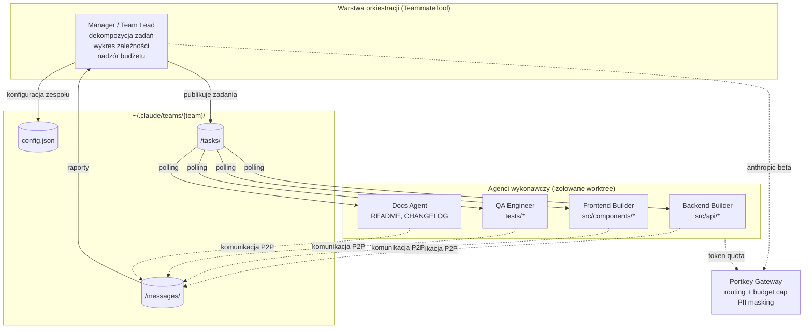
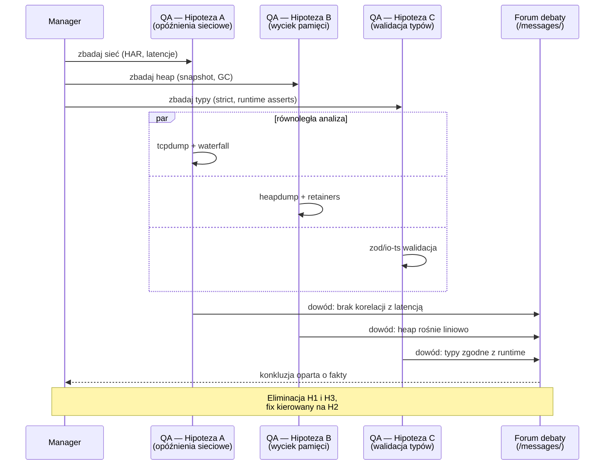
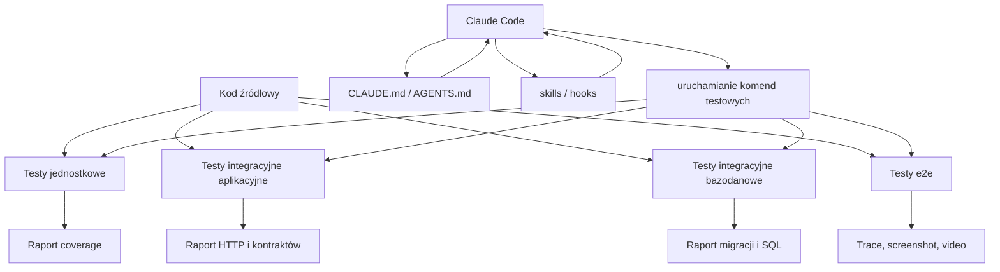
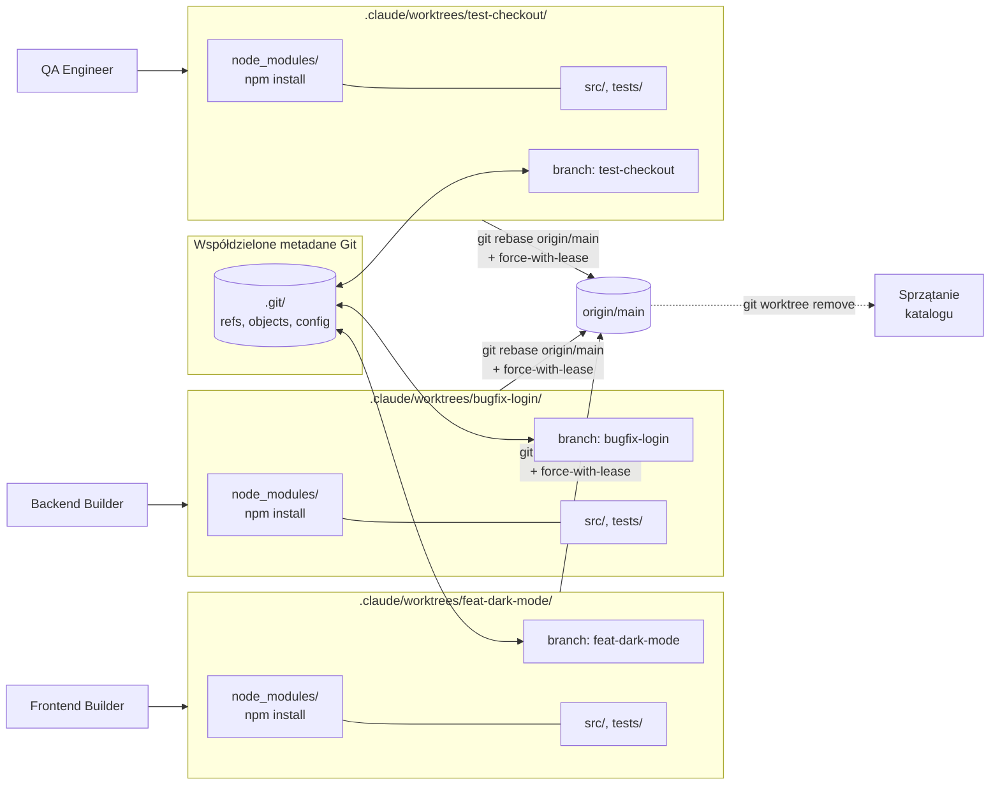
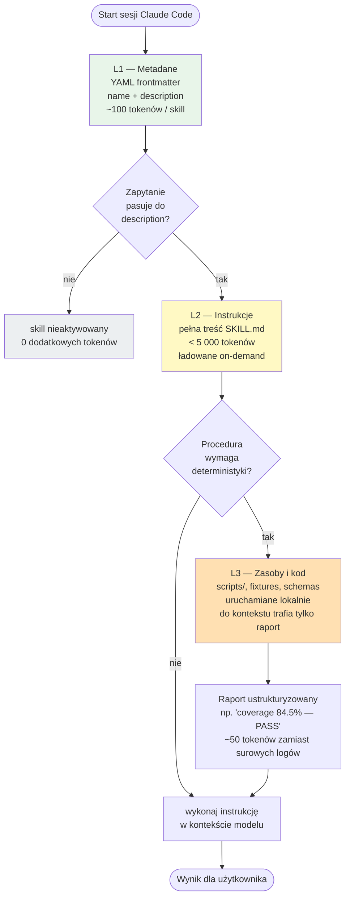
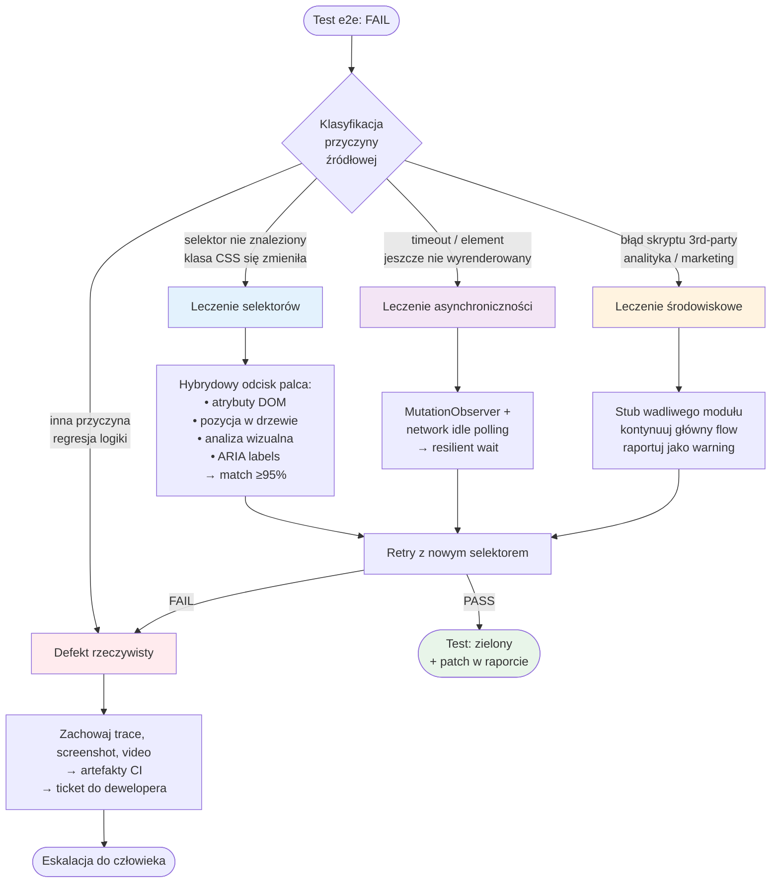
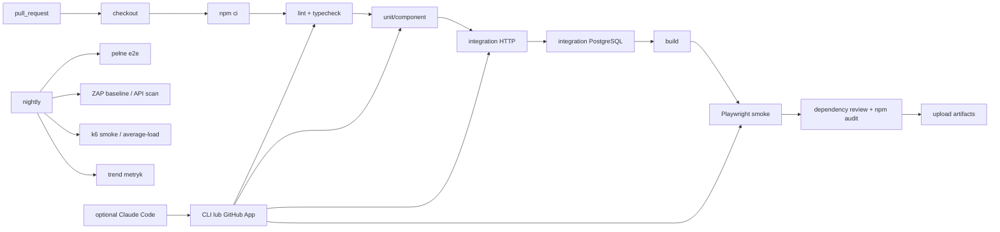

# Wieloagentowa metodyka testów QA w Claude Code dla aplikacji React / Next.js / Node.js / PostgreSQL

> **Typ:** methodology (paper metodologiczny) · **Status:** kanoniczny · **Aktualizacja:** 2026-05-26
> **Rola w korpusie `DOC/`:** baza metodyczna dla skilla `dev/qa-architect` — referencyjna architektura testów, dobór narzędzi, kontrakt wykonawczy dla Claude Code, harmonogram pilotażu.

## Streszczenie

Niniejsze opracowanie konsoliduje dwa dotychczas niezależne wątki: (i) teoretyczny opis paradygmatu wieloagentowego (Claude Code Swarm) wraz z mechanizmami orkiestracji, izolacji środowiskowej i autonomicznego samoleczenia testów oraz (ii) krytyczną rewizję tej narracji w odniesieniu do konkretnego stacku produkcyjnego — React, Next.js, Node.js i PostgreSQL. Praca proponuje **referencyjną architekturę testów** opartą na klasycznej piramidzie z dwiema modyfikacjami (kompozyt UI w warstwie komponentowej, obowiązkowa warstwa integracji z rzeczywistym PostgreSQL), **referencyjny dobór narzędzi** (Vitest lub Jest, React Testing Library, Supertest, MSW, Playwright, Testcontainers, k6, ZAP) oraz **lekki kontrakt wykonawczy dla Claude Code** złożony z plików `AGENTS.md`/`CLAUDE.md`, niestandardowych umiejętności (Agent Skills), hooków i workflowów CI/CD. Praca pokazuje, że Claude Code w roli „magicznego generatora testów" prowadzi do regresji jakości; właściwym pozycjonowaniem jest **rama egzekucyjna**, która czyta wersjonowane reguły repozytorium, uruchamia narzędzia i produkuje audytowalne artefakty. Dla zachowań krytycznie zależnych od wersji frameworka (asynchroniczne Server Components w Next.js, transakcyjność PostgreSQL) wskazujemy konkretne warstwy testów, na których muszą być pokryte. Praca zawiera tabele porównawcze narzędzi, macierz odpowiedzialności warstw, referencyjne konfiguracje, wzorce implementacyjne, harmonogram pilotażu 4-tygodniowego, listę ryzyk oraz dwie checklisty kontrolne (PR, testy).

## Słowa kluczowe

Claude Code · wieloagentowy QA · swarm · Agent Skills · TeammateTool · git worktree · Next.js · Vitest · Jest · React Testing Library · Playwright · Cypress · Supertest · MSW · Testcontainers · PostgreSQL · samoleczenie testów · Model Context Protocol (MCP) · GitHub Actions · CI/CD · OWASP · k6 · ZAP.

---

## 1. Wprowadzenie

Ewolucja systemów sztucznej inteligencji doprowadziła do ukształtowania nowego paradygmatu w inżynierii jakości oprogramowania, zastępując sekwencyjne, pojedyncze asystenty kodowania dynamicznymi, wyspecjalizowanymi rojami agentów [1]. Wdrożenie wieloagentowej architektury w środowisku Claude Code umożliwia równoległą weryfikację kodu, bezkolizyjne testowanie wielowarstwowe oraz automatyczne samoleczenie skryptów testowych [1]. Wprowadzenie tych mechanizmów wymaga jednak precyzyjnie zdefiniowanej struktury operacyjnej, ścisłego zarządzania okienkiem kontekstowym oraz zaawansowanych zabezpieczeń przed niekontrolowanym wzrostem kosztów przetwarzania API [1].

Równocześnie z tą szeroką, organizacyjną warstwą istnieje zupełnie inny problem: **konkretny stos technologiczny ma swoje wersjozależne ograniczenia**, których model językowy nie jest w stanie poprawnie opisać „z pamięci". Asynchroniczne Server Components w Next.js, semantyka transakcyjna PostgreSQL czy konwencje selektorów semantycznych Testing Library to przykłady wiedzy, której musi pilnować repozytorium — nie chat. Niniejsze opracowanie integruje te dwa wątki w jedną metodykę: warstwa „swarmowa" stanowi ramę operacyjną, ale jakość wyników zależy od jakości instrukcji projektowych, zakresu kontekstu oraz automatycznych bramek po każdej zmianie [Anthropic, Claude Code best practices].

Cel pracy jest trojaki: (1) opisać paradygmat wieloagentowego QA w Claude Code w sposób umożliwiający jego krytyczną ocenę, (2) zaproponować konkretną, stosowalną metodykę testów dla stacku React / Next.js / Node.js / PostgreSQL, (3) wskazać minimalny, audytowalny kontrakt wykonawczy dla Claude Code w roli ramy QA, a nie generatora kodu.

---

## 2. Stan wiedzy: paradygmat wieloagentowego QA w Claude Code

### 2.1. Degradacja kontekstu i potrzeba dekompozycji

Tradycyjne podejście do automatyzacji testów za pomocą jednego agenta napotykało barierę skali wynikającą z natury dużych modeli językowych [1]. W miarę postępu sesji i gromadzenia historii interakcji, okno kontekstowe ulega gwałtownemu rozszerzeniu [1]. Zjawisko to prowadzi do tzw. **degradacji kontekstowej**, w której model traci zdolność koncentracji na bezpośrednim zadaniu testowym, a wcześniejsze kroki walidacji ulegają zatarciu [1].

Rozwiązaniem tego problemu jest rozproszenie obciążenia na sieć niezależnych jednostek, z których każda operuje we własnym, odizolowanym oknie kontekstowym o wąskim zakresie odpowiedzialności [1]. W architekturze tej **agent wiodący** (Manager lub Team Lead) nie koduje bezpośrednio, lecz pełni rolę koordynatora, który analizuje architekturę systemu, dzieli zadania na niezależne pakiety i powołuje wyspecjalizowane agenty wykonawcze [2].

Wzrost liczby agentów generuje jednak wysoki narzut zasobowy [2]. Badania operacyjne wykazują, że uruchomienie roju wiąże się z konsumpcją tokenów wyższą od czterech do nawet piętnastu razy w stosunku do sesji jednoagentowej [2]. W celu zapewnienia rentowności ekonomicznej i pełnej kontroli zarządczej, procesy testowe roju są integrowane z zaawansowanymi bramami pośredniczącymi [4].

Wykorzystanie gatewaya takiego jak Portkey umożliwia routing zapytań poprzez dedykowany interfejs, precyzyjne śledzenie kosztów na poziomie konkretnego dewelopera lub zadania, a także wdrażanie filtrów bezpieczeństwa, w tym maskowania danych wrażliwych (PII) przed przesłaniem ich do dostawcy modelu [4]. Gwarantuje to stabilność operacyjną przy skomplikowanych weryfikacjach wielowarstwowych [2].

Wprowadzenie mechanizmu Portkey wymaga optymalnego skonfigurowania nagłówków, w szczególności przekazywania parametru `anthropic-beta` (niezbędnego do obsługi zaawansowanych funkcji i umiejętności) za pomocą struktury konfiguracyjnej oraz określenia limitów budżetowych [4]:

```json
{
  "provider": "@anthropic-prod",
  "forward_headers": ["anthropic-beta"]
}
```

Dzięki temu system może wymusić twarde ograniczenia kosztowe (np. maksymalny wydatek do 500 USD miesięcznie lub limit 10 milionów tokenów tygodniowo), automatycznie blokując dalsze zapytania roju i wysyłając powiadomienia do administratorów w momencie przekroczenia progu bezpieczeństwa [4].

### 2.2. Architektura roju: TeammateTool, podział ról i orkiestracja zadań

Serce komunikacji i zarządzania wewnątrz roju stanowi dedykowany interfejs orkiestracyjny **TeammateTool** [2]. Udostępnia on trzynaście niskopoziomowych operacji, które umożliwiają agentom realizację pełnego cyklu wytwórczego i walidacyjnego [2]. Koordynacja ta odbywa się asynchronicznie poprzez system plików, gdzie konfiguracje zespołów są przechowywane w lokalizacji `~/.claude/teams/{team-name}/config.json`, wiadomości wewnętrzne trafiają do katalogu `/messages/`, a stany zadań są rejestrowane w `/tasks/` [1].

Podział ról w roju testowym musi odzwierciedlać strukturę profesjonalnego zespołu inżynierskiego, gdzie każda jednostka posiada unikalny zakres kompetencji [2].

| Rola agentowa | Zakres odpowiedzialności i narzędzia | Główny cel operacyjny |
|---|---|---|
| **Manager** [2] | Dekompozycja wymagań, tworzenie wykresu zależności zadań, nadzór nad budżetem, orkiestracja za pomocą TeammateTool. | Zapewnienie spójności integracyjnej i koordynacja pracy roju bez bezpośredniej modyfikacji kodu. |
| **Backend Builder** [2] | Modyfikacja logiki biznesowej, optymalizacja zapytań bazodanowych, implementacja API (lokalizacja zmian: `src/api/*`). | Dostarczenie stabilnych punktów końcowych gotowych do walidacji integracyjnej. |
| **Frontend Builder** [2] | Tworzenie komponentów interfejsu użytkownika, zarządzanie stanem aplikacji (lokalizacja zmian: `src/components/*`). | Zapewnienie zgodności interfejsu z makietami i standardami dostępności. |
| **QA Engineer** [2] | Tworzenie scenariuszy testowych, generowanie asercji, automatyzacja E2E za pomocą Puppeteer/Playwright (lokalizacja zmian: `tests/*`). | Weryfikacja jakościowa dostarczonych zmian przed scaleniem ich z gałęzią główną. |
| **Docs Agent** [2] | Generowanie dokumentacji technicznej, tworzenie plików README i notatek o wydaniach. | Utrzymanie aktualności bazy wiedzy projektowej po każdej udanej integracji. |

**Schemat organizacyjny roju i komunikacji asynchronicznej przez system plików:**



### 2.3. Wybór silnika orkiestracji

Wybór odpowiedniego silnika orkiestracji wpływa na efektywność wykonywania testów QA [10]. W zależności od charakterystyki projektu, inżynierowie QA mogą wybierać spośród kilku wiodących systemów wieloagentowych dostępnych w ekosystemie Claude Code [10].

| Silnik orkiestracji | Model zarządzania | Charakterystyka i przepływ pracy QA |
|---|---|---|
| **Agent Teams** [1] | Scentralizowany (Lead-Worker) | Wbudowany mechanizm Claude Code. Lider tworzy współdzieloną listę zadań, a agenci QA pobierają zadania asynchronicznie, komunikując się peer-to-peer przez skrzynki odbiorcze. |
| **Gas Town** [11] | Hierarchiczny (Mayor) | Agent o statusie „burmistrza" dekomponuje złożone testy regresyjne na mikro-zadania, zarządzając wersjonowaniem i eliminując konflikty w dużych strukturach. |
| **Multiclaude** [11] | Autonomiczny (Brownian Ratchet) | Nastawiony na maksymalną automatyzację. W trybie „singleplayer" każda zmiana, która pomyślnie przejdzie automatyczne testy CI, jest bezwarunkowo scalana z gałęzią główną. |
| **Nimbalyst** [10] | Wizualny Kanban | Środowisko łączące tablicę Kanban z interaktywnymi edytorami kodu, makiet oraz schematów Prisma. Agent QA może jednocześnie analizować strukturę bazy danych i wizualne przebiegi interfejsu. |
| **Claude Squad** [10] | Terminalowy (tmux wrapper) | Lekki, tekstowy interfejs przeznaczony dla deweloperów preferujących pracę bezpośrednio w konsoli. |

### 2.4. Konkurencyjne hipotezy w debugowaniu

W procesie QA niezwykle ważne jest unikanie pułapek poznawczych [1]. Podczas debugowania złożonych awarii zaleca się stosowanie metody **konkurencyjnych hipotez** [1]. Zamiast sekwencyjnego badania problemu, które sprzyja błędowi zakotwiczenia (koncentracji na pierwszej roboczej teorii), Manager powołuje kilku agentów QA jednocześnie [1]. Każdy z nich bada inną przyczynę usterki (np. jeden analizuje opóźnienia sieciowe, drugi wycieki pamięci, trzeci walidację typów), a następnie agenty prowadzą ze sobą **debatę opartą na faktach** w celu wykluczenia błędnych założeń i szybkiego dotarcia do źródła błędu [1].



---

## 3. Krytyczna rewizja koncepcji roju w kontekście stosu React / Next.js

### 3.1. Ograniczenia narracji „swarmowej"

Zrewidowany materiał wejściowy (Sekcja 2 niniejszej pracy) jest wartościowy jako szkic warstwy organizacyjnej wokół Claude Code — szczególnie tam, gdzie dotyka pracy w worktree, automatyzacji, wieloetapowego QA i egzekwowania standardów — ale **nie dostarcza jeszcze spójnej, stosowalnej metodyki testów dla konkretnego stosu** React / Next.js / Node.js / PostgreSQL. Brakuje w nim przede wszystkim:

- rozstrzygnięcia doboru runnerów testowych,
- jasnego podziału odpowiedzialności między testami jednostkowymi, integracyjnymi i e2e,
- polityki mockowania,
- zarządzania realną bazą PostgreSQL,
- zwięzłej integracji z CI, artefaktami i metrykami jakości.

W praktyce paradygmat swarmowy należy więc potraktować jako **dobrą warstwę operacyjną dla Claude Code, ale nie jako gotowy standard testowy**. Anthropic wprost podkreśla, że Claude Code jest środowiskiem agentycznym, a jego efektywność degraduje się wraz z przepełnianiem kontekstu; równolegle zaleca używanie zwięzłych zasad w `CLAUDE.md`, skills ładowanych tylko wtedy, gdy są potrzebne, oraz hooków do automatyzacji powtarzalnych operacji [Claude Code Best Practices]. Stąd wynik praktyczny: zamiast rozbudowanego, nieprzezroczystego orchestration layer lepiej wdrożyć **lekki, repozytoryjny kontrakt wykonawczy**.

### 3.2. Założenia robocze dla docelowej metodyki

W przypadku Next.js warstwę agentową trzeba wzmocnić plikami dostosowanymi do wersji frameworka. Oficjalna dokumentacja Next.js opisuje mechanizm `AGENTS.md`, który kieruje agentów do **wersjonowanej dokumentacji bundlowanej razem z pakietem `next`**, oraz integrację `CLAUDE.md` poprzez prosty import `@AGENTS.md` [Next.js — AI agents docs]. To rozwiązanie jest szczególnie ważne przy planowaniu testów, bo część zachowań i ograniczeń — zwłaszcza wokół App Router, Route Handlers i testowania komponentów serwerowych — jest ściśle zależna od aktualnej wersji dokumentacji, a nie od wiedzy „z pamięci modelu".

Niniejsza praca przyjmuje następujące **założenia robocze**:

1. brak ograniczeń wersji narzędziowych,
2. TypeScript jako język bazowy,
3. GitHub Actions jako domyślny system CI,
4. `node-postgres` jako referencyjna warstwa dostępu do bazy po stronie Node.js,
5. struktura repozytorium dopuszcza zarówno monorepo, jak i pojedyncze repo aplikacyjne.

Tam, gdzie istnieje kilka sensownych ścieżek, wskazujemy **profil preferowany** oraz **ścieżkę alternatywną**. Wybory te są rekomendacjami projektowymi, a nie twierdzeniem, że alternatywy są technicznie błędne.

---

## 4. Docelowa architektura testów

### 4.1. Piramida testów z dwiema modyfikacjami

Dla analizowanego stacku najlepsza jest klasyczna piramida testów, ale z dwiema modyfikacjami:

**Modyfikacja 1.** Warstwa „komponentowa" frontendu nie jest czysto jednostkowa, lecz opiera się na testach komponentów renderowanych w DOM i obsługiwanych semantycznie, zgodnie z filozofią Testing Library.

**Modyfikacja 2.** Osobną, obowiązkową warstwę stanowią testy integracyjne z rzeczywistym PostgreSQL, bo semantyka transakcji, izolacji i zapytań parametryzowanych jest elementem krytycznym, którego mocki nie odtwarzają wiernie.

Testing Library i React Testing Library wprost rekomendują testy podobne do realnego użycia i odradzają testowanie detali implementacyjnych [Testing Library — Guiding Principles]; Playwright z kolei rekomenduje weryfikowanie zachowania widocznego dla użytkownika oraz izolację testów [Playwright Best Practices]. PostgreSQL dokumentuje znaczenie transakcji i poziomów izolacji [PostgreSQL Docs — Transactions], a `node-postgres` wymaga używania tego samego klienta w obrębie transakcji [node-postgres Docs].

### 4.2. Macierz odpowiedzialności warstw

| Warstwa | Główny cel | Domyślne narzędzia | Kiedy uruchamiać |
|---|---|---|---|
| Jednostkowa | logika domenowa, helpery, walidatory, hooks, komponenty synchroniczne | Vitest lub Jest, React Testing Library, DOM Testing Library | lokalnie, pre-commit, każdy PR |
| Integracyjna aplikacyjna | route handlers, API Node, serwisy, repozytoria, integracja z cache i konfiguracją | Vitest lub Jest, Supertest, MSW, Testcontainers | każdy PR |
| Integracyjna bazodanowa | zapytania SQL, migracje, constraints, transakcje, współbieżność krytyczna | Testcontainers, Docker Compose, PostgreSQL | każdy PR dla pakietów backend/db; pełny zestaw nightly |
| E2E | krytyczne ścieżki biznesowe, autoryzacja, routing, rendering, regresja funkcjonalna | Playwright jako domyślne; Cypress opcjonalnie | smoke na PR, pełny zestaw przed release |
| Regresyjna | utrzymanie zachowania po zmianach i refaktoryzacjach | wszystkie warstwy + retry/trace/reporting | każdy PR i release |
| Wydajnościowa | czasy odpowiedzi, degradacja pod obciążeniem, smoke/stress/soak | k6, opcjonalnie Playwright browser/k6 browser | nightly, pre-release |
| Bezpieczeństwa | supply chain, nagłówki, autz/autn, skany pasywne/aktywne | npm audit, dependency review, ZAP, Playwright smoke security | każdy PR + nightly/staging |

Szczególnie ważne jest rozróżnienie przypadków, które **nie powinny** kończyć się testem jednostkowym. Oficjalne przewodniki Next.js dla Jest i Vitest jednoznacznie wskazują, że **asynchroniczne Server Components nie są obecnie wspierane** w tych runnerach w sposób rekomendowany, dlatego ich weryfikacja powinna przechodzić do e2e [Next.js Testing — Jest, Vitest]. W praktyce oznacza to, że testy jednostkowe dla Next.js powinny obejmować komponenty klienta, komponenty serwerowe synchroniczne, logikę domenową i route handlers, natomiast przypadki oparte o asynchroniczny rendering serwerowy lub złożony lifecycle routingu należy przesunąć do Playwrighta.



---

## 5. Izolacja środowiska pracy: Git Worktree

### 5.1. Algorytm tworzenia worktree

Praca wielu autonomicznych agentów na tym samym repozytorium w tym samym czasie rodzi wysokie ryzyko konfliktów scalania oraz nadpisywania plików [1]. Metodyka wieloagentowa Claude Code eliminuje ten problem poprzez wymuszenie pełnej izolacji przestrzeni roboczych za pomocą **mechanizmu Git Worktree** [2]. Flaga `-w` lub `--worktree` instruuje system do automatycznego utworzenia fizycznie odseparowanego katalogu dla każdego agenta, połączonego z dedykowaną gałęzią Git, lecz współdzielącego wspólne metadane w folderze `.git` [7].

Dla sprawnego przebiegu testów QA proces ten musi przebiegać według ściśle określonego algorytmu. Na początku gałąź główna (`main`) jest synchronizowana z serwerem zdalnym [7]. Następnie Manager inicjuje równoległe sesje za pomocą komend terminalowych, tworząc izolowane środowiska [13]:

```bash
# Inicjalizacja trzech równoległych strumieni testowych i deweloperskich
claude -w feat-dark-mode  "Zaimplementuj przełącznik trybu ciemnego i napisz testy"
claude -w bugfix-login    "Napraw wyciek pamięci w module logowania i dodaj testy integracyjne"
claude -w test-checkout   "Napisz testy pokrycia dla serwisu transakcyjnego"
```

Każda komenda powoduje utworzenie nowej gałęzi oraz katalogu roboczego w ukrytej strukturze `.claude/worktrees/{nazwa-zadania}/` [13]. Agenty przystępują do pracy w pełnej izolacji [2]. W każdym katalogu roboczym automatycznie uruchamiane są instalacje pakietów zależnych (np. `npm install` lub `pip install`), co zapobiega zanieczyszczeniu globalnego środowiska wykonawczego [5].



### 5.2. Procedura rebase i czyszczenia

Po zakończeniu prac i pomyślnym wykonaniu lokalnych testów jednostkowych, agent jest zobligowany do przeprowadzenia procedury rebasowania [7]:

```bash
git fetch origin
git rebase origin/main
git push origin --force-with-lease
```

Podejście to gwarantuje, że zmiany są nakładane na najbardziej aktualny stan kodu produkcyjnego, co minimalizuje ryzyko awarii po scaleniu [7]. Na koniec gałęzie robocze są usuwane poleceniem `git worktree remove`, utrzymując porządek w strukturze plików dewelopera [7].

### 5.3. Ryzyka jakościowe izolowanej pracy agentów

Należy pamiętać, że agenty wykazują tendencję do rozwiązywania problemów w sposób **jak najprostszy**, co w kontekście QA może prowadzić do powstawania długu technicznego [15]. Przykładowo, poproszony o zmianę koloru przycisku, agent może dopisać lokalny styl inline zamiast zmodyfikować globalny arkusz stylów [15]. Z tego powodu, przed zatwierdzeniem kodu i usunięciem worktree, wymagana jest manualna lub automatyczna weryfikacja różnic (diff) w odniesieniu do standardów projektowych zdefiniowanych w pliku `CLAUDE.md` [13].

---

## 6. Niestandardowe umiejętności (Agent Skills) jako rama wykonawcza

### 6.1. Progresywne ujawnianie informacji (3 poziomy)

Niestandardowe umiejętności (Agent Skills) w środowisku Claude Code to **zlokalizowane na dysku foldery** zawierające instrukcje, metadane oraz opcjonalne zasoby i skrypty wykonywalne [5]. W przeciwieństwie do tradycyjnych promptów systemowych, które są statycznie ładowane przy starcie sesji, umiejętności są odkrywane dynamicznie na podstawie dopasowania semantycznego zapytania do opisu w manifeście [5]. Standard ten, opublikowany jako otwarta specyfikacja na stronie agentskills.io i wspierany przez dedykowane biblioteki SDK, pozwala na rozbudowę możliwości walidacyjnych roju bez obciążania pamięci podręcznej modeli [5].

Wymóg optymalizacji okna kontekstowego jest realizowany za pomocą trójpoziomowej **architektury progresywnego ujawniania informacji** [5].

| Poziom ujawniania | Ładowane zasoby | Narzut tokenów i koszt | Opis mechanizmu |
|---|---|---|---|
| **L1 — Metadane** | YAML frontmatter (`name`, `description`) z pliku `SKILL.md`. | Minimalny (~100 tokenów na zarejestrowaną umiejętność). | Claude odczytuje wyłącznie podstawowe parametry przy starcie sesji, aby wiedzieć, czym dysponuje. |
| **L2 — Instrukcje** | Pełna treść Markdown pliku `SKILL.md`. | Średni (< 5 000 tokenów, ładowane tylko przy aktywacji). | Gdy zapytanie pasuje do opisu, model wykonuje polecenie Bash, wprowadzając pełną instrukcję do kontekstu. |
| **L3 — Zasoby i kod** | Skrypty narzędziowe, schematy JSON, bazy wiedzy. | Zmienny (konsumuje tokeny wyłącznie na podstawie zwracanych wyników). | Zewnętrzne skrypty i dokumentacja są uruchamiane lokalnie, a do modelu trafia jedynie ich raport wyjściowy. |



### 6.2. Implementacja referencyjna: `tdd-enforcer`

Wdrożenie kompleksowego podejścia testowego wymaga stworzenia lokalnej umiejętności QA w katalogu `.claude/skills/tdd-enforcer/` [5]. Umiejętność ta może opierać się na filozofii wtyczki obra, wymuszającej rygorystyczny proces TDD (Red-Green-Refactor) oraz systematyczne usuwanie błędów w oparciu o dowody [19]. Struktura pliku manifestu `SKILL.md` musi spełniać surowe kryteria składniowe [5]:

```md
---
name: tdd-enforcer
description: Wymusza rygorystyczny proces Red-Green-Refactor. Używaj zawsze przed napisaniem jakiegokolwiek kodu produkcyjnego oraz podczas weryfikacji regresji w zadaniach QA.
---

# Metodyka TDD Enforcer

## Procedura postępowania

1. Zidentyfikuj cel biznesowy i utwórz test jednostkowy reprezentujący błąd (Faza RED).
2. Uruchom test za pomocą `./scripts/run_tests.sh` i upewnij się, że kończy się niepowodzeniem.
3. Zaimplementuj minimalną ilość kodu niezbędną do zaliczenia testu (Faza GREEN).
4. Przeprowadź refaktoryzację kodu, dbając o czystość architektury i brak duplikacji (Faza REFACTOR).
5. Wywołaj deterministyczny skrypt walidacji pokrycia kodu zlokalizowany w sekcji zasobów.
```

Wykorzystanie **deterministycznych skryptów** wewnątrz folderu umiejętności (np. skryptu napisanego w języku Python w ścieżce `scripts/verify_coverage.py`) drastycznie zwiększa stabilność działania roju [5]. Zamiast polegać na zdolnościach modelu do interpretacji surowych logów z narzędzi pokrycia kodu, skrypt samodzielnie kalkuluje wskaźnik pokrycia i zwraca do okna kontekstowego Claude wyłącznie ustrukturyzowany komunikat walidacyjny (np. `Pokrycie wynosi 84.5% — Walidacja pomyślna`), co zapobiega halucynacjom oraz oszczędza zasoby tokenów dewelopera [5].

### 6.3. Kontrakt projektowy: `AGENTS.md`, `CLAUDE.md`, skills, hooks

Dla Claude Code zaleca się minimalny, ale rygorystyczny kontrakt projektowy:

```md
<!-- AGENTS.md -->
# Zasady dla agentów
Przed każdą zmianą w Next.js przeczytaj odpowiednią dokumentację w `node_modules/next/dist/docs/`.
Nie opieraj się na pamięci modelu, jeśli zachowanie frameworka jest wersjozależne.
```

```md
<!-- CLAUDE.md -->
@AGENTS.md

# Standard testów
- Preferuj testy zachowania użytkownika, nie detali implementacyjnych.
- `data-testid` stosuj tylko jako wyjątek.
- Dla route handlers i usług Node najpierw pisz test integracyjny.
- Dla zapytań SQL używaj prawdziwego PostgreSQL w Testcontainers.
- Dla zmian UI uruchom `npm run test:run && npm run test:e2e`.
- Przy niepowodzeniu zapisz raport, trace lub screenshot jako artefakt.
```

```json
{
  "hooks": {
    "Notification": [
      {
        "matcher": "",
        "hooks": [
          { "type": "command", "command": "./scripts/notify-qa.sh" }
        ]
      }
    ],
    "PreToolUse": [
      {
        "matcher": "Bash",
        "hooks": [
          { "type": "command", "command": "./scripts/policy-check.sh" }
        ]
      }
    ]
  }
}
```

```md
# .claude/skills/verify-tests/SKILL.md
---
name: verify-tests
description: Uruchom pełną procedurę jakości dla zmian w aplikacji webowej.
---

1. Uruchom lint, typecheck i testy jednostkowe.
2. Jeśli dotknięto `src/server`, uruchom testy integracyjne API.
3. Jeśli dotknięto `db/` lub repozytoriów SQL, uruchom testy z PostgreSQL.
4. Jeśli dotknięto `app/` lub `src/components`, uruchom Playwright smoke.
5. Zbierz raporty, coverage i artefakty błędów.
6. Przygotuj zwięzłe podsumowanie: co przeszło, co nie przeszło, co jest flaky.
```

Takie użycie Claude Code jest zgodne z oficjalnym modelem: `CLAUDE.md` dostarcza trwałych instrukcji, skills są ładowane wtedy, gdy są potrzebne, hooks uruchamiają komendy w punktach cyklu życia, a CLI i GitHub Actions umożliwiają uruchamianie zadań w trybie nieinteraktywnym [Anthropic — Claude Code Docs].

---

## 7. Dobór narzędzi i porównanie

### 7.1. Warstwa unit/component: Vitest vs Jest

Dla UI wybór jest prostszy: React Team rekomenduje migrację z `react-dom/test-utils` do `@testing-library/react`, a sama Testing Library konsekwentnie promuje testy semantyczne, z `getByRole` jako preferowanym sposobem wyszukiwania elementów i `data-testid` wyłącznie jako „escape hatch" [Testing Library Docs]. To jest dobra baza niezależnie od wybranego runnera.

Wybór runnera należy uzależnić od topologii repozytorium:

- **Vitest** jest silny tam, gdzie liczy się szybki feedback loop, zgodność z Vite i nowoczesne API z kompatybilnością wobec Jest; dokumentacja podkreśla współdzielenie pipeline transformacji z Vite, tryb watch domyślnie włączony, mocki/snapshoty/coverage oraz bardzo dobrą wydajność [Vitest Docs].
- **Jest** pozostaje jednak bardzo mocną opcją dla Next.js dzięki `next/jest`, które automatycznie konfiguruje transformacje, mocki assetów, ładowanie `.env` i współpracę z Next.js Compiler [Next.js — Jest Setup].

**Wniosek praktyczny:** w greenfield preferowałbym **Vitest dla pakietów bibliotecznych i usług Node**, ale dla pakietu `apps/web` w czystym Next.js równie sensowny jest **Jest z `next/jest`**, jeśli priorytetem jest redukcja ryzyka integracyjnego. Najgorszą opcją jest uruchamianie jednocześnie Jest i Vitest w tym samym pakiecie bez wyraźnego uzasadnienia organizacyjnego.

### 7.2. Warstwa e2e: Playwright vs Cypress

Dla e2e rekomenduję **Playwright** jako default. Oficjalna dokumentacja daje tu przewagę: natywna izolacja przez browser contexts, równoległość workerów, retry, Trace Viewer, wieloprojektowość dla przeglądarek i środowisk, a także wsparcie dla Chromium, Firefox i WebKit [Playwright Docs].

**Cypress** pozostaje świetnym narzędziem do interaktywnego debugowania, component testing i sieciowego stubbingu; ma też bardzo dobrą dokumentację CI i retry, a w wariancie Cloud oferuje analitykę flaky tests [Cypress Docs]. Dla organizacji, które chcą maksymalnie szerokiej zgodności cross-browser i bogatych artefaktów diagnostycznych, Playwright ma jednak lepszy profil bazowy.

### 7.3. Bezpieczeństwo, wydajność, supply chain

Dla bezpieczeństwa i wydajności rekomenduję narzędzia poza głównym łańcuchem funkcjonalnym:

- **k6** — zaprojektowane do testów load/performance, obejmuje klasyczne typy obciążeń (smoke, stress, soak, spike) i dobrze integruje się z CI/CD.
- **ZAP Baseline Scan** — bezpieczny, pasywny skan przeznaczony do CI, również przeciwko produkcji; pełniejsza automatyzacja ZAP powinna być uruchamiana na stagingu.
- **`npm audit` + GitHub Dependency Review** — w każdym PR, pozwalają zablokować wprowadzanie nowych podatnych zależności.

Jako tło priorytetyzacji ryzyk należy traktować **OWASP Top 10**.

### 7.4. Macierz porównawcza narzędzi

| Narzędzie | Rola | Najmocniejsze strony | Ograniczenia | Rekomendowany przypadek użycia |
|---|---|---|---|---|
| Vitest | unit/component | szybki watch, zgodność z API Jest, dobre coverage/reporting, dobra współpraca z nowoczesnym TS/ESM | w Next.js wymaga osobnej konfiguracji; async Server Components nadal poza strefą komfortu | biblioteki, usługi Node, logika domenowa, część frontendu |
| Jest | unit/component | dojrzały ekosystem; `next/jest` upraszcza integrację z Next.js i SWC | mniej „dev-first" niż Vitest; podobne ograniczenie dla async Server Components | pakiet `apps/web` w Next.js, projekty legacy, snapshoty |
| React Testing Library + DOM Testing Library | testy UI | semantyczne query, nacisk na zachowanie użytkownika, dobra dostępność | nie jest runnerem; nadużywanie `data-testid` psuje jakość testów | komponenty React, formularze, routing UI |
| Playwright | e2e | izolacja, parallelism, retries, traces, multi-browser, projects | większy koszt infrastrukturalny niż unit tests | krytyczne ścieżki biznesowe, smoke cross-browser, release gates |
| Cypress | e2e/component | świetny interaktywny debugging, component tests, łatwe stubbing/retries | mniej naturalny jako domyślne cross-browser release gate; część analityki w Cloud | component testing frontendu, debug trudnych flow |
| Supertest | integracja HTTP | prosty fluent API, działa z frameworkami Node, bez potrzeby ręcznego zarządzania portami | nie zastępuje testów e2e ani pełnej walidacji UX | route handlers i API serwisów Node |
| MSW | mockowanie HTTP | wspólna warstwa mocków dla Node i browser, „single source of truth", runtime overrides | nie nadaje się do zastępowania testów DB/SQL | mocki zewnętrznych API i scenariuszy błędowych |
| Testcontainers | realne zależności testowe | tymczasowe instancje prawdziwych usług, wysoka zgodność z produkcją | wolniejsze niż czyste mocki; wymaga Dockera | repozytoria SQL, integracje z Postgres, testy kontraktowe backendu |
| Docker Compose | środowisko lokalne/CI | prosty, deklaratywny standard dla usług pomocniczych | mniejsza izolacja per test niż Testcontainers | lokalne środowisko deweloperskie, wspólny setup CI |
| Claude Code | rama wykonawcza | czyta repo, uruchamia komendy, działa z hooks/skills/GitHub Actions | wymaga zwięzłych reguł i kontroli kontekstu | automatyzacja QA, review PR, wykonywanie procedur testowych |

---

## 8. Wzorce implementacyjne

### 8.1. Komponenty React (Testing Library)

Dla komponentów React rekomenduje się wzorzec **„render + interakcja + asercja semantyczna"**. Testing Library podkreśla, że testy powinny przypominać realne użycie, a `getByRole` z nazwą dostępną jest preferowanym selektorem. To nie jest detal stylistyczny — ma bezpośredni wpływ na trwałość testów i na jakość samej aplikacji pod względem dostępności.

```tsx
// src/components/LoginForm.tsx
import { useState } from 'react'

type Props = {
  onSubmit: (email: string, password: string) => Promise<void>
}

export function LoginForm({ onSubmit }: Props) {
  const [email, setEmail] = useState('')
  const [password, setPassword] = useState('')
  const [busy, setBusy] = useState(false)

  async function handleSubmit(e: React.FormEvent<HTMLFormElement>) {
    e.preventDefault()
    setBusy(true)
    try {
      await onSubmit(email, password)
    } finally {
      setBusy(false)
    }
  }

  return (
    <form onSubmit={handleSubmit} aria-label="formularz logowania">
      <label>
        Email
        <input
          type="email"
          value={email}
          onChange={(e) => setEmail(e.currentTarget.value)}
        />
      </label>

      <label>
        Hasło
        <input
          type="password"
          value={password}
          onChange={(e) => setPassword(e.currentTarget.value)}
        />
      </label>

      <button type="submit" disabled={busy}>
        {busy ? 'Logowanie…' : 'Zaloguj'}
      </button>
    </form>
  )
}
```

```tsx
// src/components/LoginForm.test.tsx
import { render, screen } from '@testing-library/react'
import userEvent from '@testing-library/user-event'
import { vi, test, expect } from 'vitest'
import { LoginForm } from './LoginForm'

test('wysyła formularz z poprawnymi danymi', async () => {
  const onSubmit = vi.fn().mockResolvedValue(undefined)
  const user = userEvent.setup()

  render(<LoginForm onSubmit={onSubmit} />)

  await user.type(screen.getByLabelText('Email'), 'anna@example.com')
  await user.type(screen.getByLabelText('Hasło'), 'tajnehaslo')
  await user.click(screen.getByRole('button', { name: 'Zaloguj' }))

  expect(onSubmit).toHaveBeenCalledWith('anna@example.com', 'tajnehaslo')
})
```

### 8.2. Route Handlers Next.js

Dla Route Handlers Next.js poleca się prosty model: **logika HTTP pozostaje cienka, logika biznesowa jest w serwisie**, a test route handlera weryfikuje kod odpowiedzi, payload i reakcję na błędy, bez stawiania pełnej aplikacji. To daje stabilny kompromis między unit a integration.

```ts
// app/api/users/route.ts
import { NextResponse } from 'next/server'
import { listUsers } from '@/server/users.service'

export async function GET() {
  const users = await listUsers()
  return NextResponse.json({ users }, { status: 200 })
}
```

```ts
// app/api/users/route.test.ts
import { vi, test, expect } from 'vitest'

vi.mock('@/server/users.service', () => ({
  listUsers: vi.fn().mockResolvedValue([{ id: 1, email: 'anna@example.com' }])
}))

import { GET } from './route'

test('zwraca listę użytkowników', async () => {
  const response = await GET()

  expect(response.status).toBe(200)
  await expect(response.json()).resolves.toEqual({
    users: [{ id: 1, email: 'anna@example.com' }]
  })
})
```

### 8.3. API Node z Supertest

Dla API Node poza Next.js lepszy jest **Supertest**, bo pozwala testować zachowanie serwera HTTP bez ręcznego zarządzania portami.

```ts
// services/api/src/app.ts
import express from 'express'

export function buildApp() {
  const app = express()
  app.use(express.json())

  app.post('/users', async (req, res) => {
    const { email } = req.body as { email?: string }

    if (!email) {
      return res.status(400).json({ error: 'email_required' })
    }

    return res.status(201).json({ id: 123, email })
  })

  return app
}
```

```ts
// services/api/tests/users.int.test.ts
import request from 'supertest'
import { describe, test, expect } from 'vitest'
import { buildApp } from '../src/app'

describe('POST /users', () => {
  test('zwraca 201 dla poprawnych danych', async () => {
    const app = buildApp()

    const response = await request(app)
      .post('/users')
      .send({ email: 'anna@example.com' })

    expect(response.status).toBe(201)
    expect(response.body.email).toBe('anna@example.com')
  })
})
```

### 8.4. Strategia mockowania (MSW)

Strategia mockowania powinna być **hierarchiczna**:

- **MSW** — granice sieciowe (zewnętrzne API, błędy transportowe, timeouty, kody 401/403/500, nietypowe payloady). Dokumentacja MSW promuje ideę jednej, współdzielonej warstwy mocków dla Node i przeglądarki oraz runtime overrides przez `.use()`, które świetnie pasują do testów per-scenariusz.
- **Test doubles na poziomie funkcji** — `vi.fn()`, `vi.spyOn()`, `jest.fn()` — lokalne i używane tylko tam, gdzie test faktycznie sprawdza własną logikę modułu, a nie integrację z granicą I/O.

```ts
// src/test/msw/handlers.ts
import { http, HttpResponse } from 'msw'

export const handlers = [
  http.get('https://identity.example.com/me', () => {
    return HttpResponse.json({ id: 'u-1', role: 'admin' })
  })
]
```

```ts
// src/test/setup-vitest.ts
import { beforeAll, afterAll, afterEach } from 'vitest'
import { setupServer } from 'msw/node'
import { handlers } from './msw/handlers'

export const server = setupServer(...handlers)

beforeAll(() => server.listen())
afterEach(() => server.resetHandlers())
afterAll(() => server.close())
```

```ts
// przykład override w pojedynczym teście
import { server } from '@/test/setup-vitest'
import { http, HttpResponse } from 'msw'

server.use(
  http.get('https://identity.example.com/me', () => {
    return HttpResponse.text('Unauthorized', { status: 401 })
  })
)
```

### 8.5. Baza testowa: Testcontainers + PostgreSQL

Kluczowy punkt sporny dotyczy bazy testowej. Dla warstwy SQL **nie rekomenduje się** zamiany PostgreSQL na in-memory substytut. Wynika to z faktu, że PostgreSQL ma własne reguły transakcyjne i izolacyjne, a `node-postgres` dodatkowo wymaga zachowania tego samego klienta w obrębie transakcji. Tam, gdzie test ma gwarantować poprawność zapytań, constraintów, migracji lub zachowania współbieżnego, właściwym środowiskiem jest prawdziwy Postgres uruchomiony przez Testcontainers albo Docker Compose.

```ts
// db/migrations/001_create_users.ts
import type { PoolClient } from 'pg'

export async function up(client: PoolClient): Promise<void> {
  await client.query(`
    CREATE TABLE IF NOT EXISTS app_user (
      id BIGSERIAL PRIMARY KEY,
      email TEXT NOT NULL UNIQUE,
      created_at TIMESTAMPTZ NOT NULL DEFAULT now()
    )
  `)
}

export async function down(client: PoolClient): Promise<void> {
  await client.query(`DROP TABLE IF EXISTS app_user`)
}
```

```ts
// services/api/src/db/users.repo.ts
import type { PoolClient } from 'pg'

export async function insertUser(client: PoolClient, email: string) {
  const query = {
    name: 'insert-user',
    text: `
      INSERT INTO app_user(email)
      VALUES ($1)
      RETURNING id, email
    `,
    values: [email]
  }

  const result = await client.query(query)
  return result.rows[0] as { id: string; email: string }
}
```

```ts
// services/api/tests/users.repo.int.test.ts
import { beforeAll, afterAll, beforeEach, afterEach, test, expect } from 'vitest'
import { PostgreSqlContainer } from '@testcontainers/postgresql'
import { Pool, PoolClient } from 'pg'
import { up } from '../../../db/migrations/001_create_users'
import { insertUser } from '../src/db/users.repo'

let container: PostgreSqlContainer
let pool: Pool
let client: PoolClient

beforeAll(async () => {
  container = await new PostgreSqlContainer('postgres:16-alpine').start()
  pool = new Pool({ connectionString: container.getConnectionUri() })

  const bootstrap = await pool.connect()
  try {
    await up(bootstrap)
  } finally {
    bootstrap.release()
  }
})

afterAll(async () => {
  await pool.end()
  await container.stop()
})

beforeEach(async () => {
  client = await pool.connect()
  await client.query('BEGIN')
})

afterEach(async () => {
  await client.query('ROLLBACK')
  client.release()
})

test('zapisuje użytkownika w PostgreSQL', async () => {
  const row = await insertUser(client, 'anna@example.com')
  expect(row.email).toBe('anna@example.com')
})
```

### 8.6. Środowisko lokalne: Docker Compose

Dla środowisk lokalnych i bazowego CI warto mimo wszystko zachować `docker-compose.test.yml`, bo Compose jest rekomendowanym, deklaratywnym standardem opisu usług, sieci i wolumenów. W praktyce **„Compose do prostego wspólnego środowiska"** i **„Testcontainers do izolacji per suite lub per test"** dobrze się uzupełniają.

```yaml
services:
  postgres:
    image: postgres:16-alpine
    environment:
      POSTGRES_DB: app_test
      POSTGRES_USER: app
      POSTGRES_PASSWORD: app
    ports:
      - "54329:5432"
    healthcheck:
      test: ["CMD-SHELL", "pg_isready -U app -d app_test"]
      interval: 5s
      timeout: 5s
      retries: 20
```

---

## 9. Samoleczenie testów (Self-Healing) i Model Context Protocol (MCP)

### 9.1. Typologia samoleczenia

Tradycyjne testy automatyczne interfejsu użytkownika charakteryzują się wysoką kruchością [3]. Refaktoryzacja kodu, zmiana klas CSS przez frameworki JavaScript czy minimalne przesunięcia elementów w strukturze DOM prowadzą do lawinowego zgłaszania **fałszywych alarmów** (false positives) [3]. Autonomiczne agenty testowe w Claude Code minimalizują ten problem poprzez implementację mechanizmów samoleczenia (self-healing) [3].

Podczas napotkania błędu, system wykonuje klasyfikację przyczyn źródłowych i aplikuje odpowiednią strategię naprawczą [22].

| Typ samoleczenia | Przyczyna błędu | Mechanizm naprawczy agenta |
|---|---|---|
| **Leczenie selektorów** [22] | Zmiana identyfikatorów ID, klas CSS lub XPath po stronie UI. | Budowanie hybrydowego odcisku palca elementu (profil właściwości technicznych, pozycjonowanie DOM, analiza wizualna, etykiety ARIA) i dopasowanie najlepszego kandydata z dokładnością do 95%. |
| **Leczenie asynchroniczności** [22] | Opóźnienia sieciowe, późne renderowanie komponentów przez silniki JS. | Analiza logów mutacji DOM oraz śledzenie pakietów sieciowych w celu zastąpienia sztywnych instrukcji oczekiwania dynamicznym odpytywaniem (resilient polling). |
| **Leczenie błędów środowiskowych** [22] | Awarie niezależnych skryptów trzecich (analityka, marketing), restarty serwerów stagingowych. | Izolacja awarii (stubbing wadliwych modułów), kontynuacja testów głównego przepływu biznesowego i raportowanie błędów pobocznych w logach końcowych. |



### 9.2. Rola Puppeteer/Playwright MCP

Aby testowanie samoleczące było w pełni efektywne, rój agentów musi korzystać ze standaryzowanych połączeń z zewnętrznym środowiskiem [17]. **Model Context Protocol (MCP)** dostarcza interfejs komunikacyjny, dając agentom bezpośredni dostęp do baz danych, repozytoriów kodu oraz narzędzi automatyzacji przeglądarek [17]. Podczas gdy MCP zapewnia fizyczne połączenie z narzędziem, **Umiejętności (Skills) dostarczają procedurę instruującą**, jak z tego narzędzia korzystać w kontekście testowym [17].

Kluczowym elementem weryfikacji E2E jest wykorzystanie serwera Puppeteer/Playwright MCP [9]. Doświadczenie uczy, że agenty bez wyraźnego nadzoru wykazują tendencję do **przedwczesnego deklarowania sukcesu** (tzw. „victory lapse") wyłącznie na podstawie faktu, że skompilowany kod nie wyrzucił błędów w konsoli [9].

Wdrożenie Puppeteer MCP zmusza agenta QA do uruchomienia lokalnego serwera deweloperskiego, otwarcia rzeczywistej instancji przeglądarki Chromium, przeprowadzenia pełnej ścieżki użytkownika (np. logowanie, dodanie produktu do koszyka, płatność) i wykonania asercji na widocznych elementach graficznych [9]. Pozwala to na wykrycie błędów niewidocznych z poziomu samej analizy kodu źródłowego [9].

---

## 10. Repozytorium i konfiguracja

### 10.1. Struktura katalogów

Zaleca się strukturę repozytorium, która oddziela kod aplikacyjny od infrastruktury testowej, ale **nie odrywa testów całkowicie od źródeł**. Dobre praktyki Next.js i Vitest/Jest pozwalają zarówno na konwencję `__tests__`, jak i kolokację testów. W praktyce warto zastosować **model mieszany**: testy jednostkowe blisko kodu, testy integracyjne i e2e w dedykowanych katalogach.

```text
repo/
├─ AGENTS.md
├─ CLAUDE.md
├─ .claude/
│  ├─ settings.json
│  └─ skills/
│     └─ verify-tests/
│        └─ SKILL.md
├─ apps/
│  └─ web/
│     ├─ app/
│     ├─ src/
│     │  ├─ components/
│     │  ├─ lib/
│     │  ├─ server/
│     │  └─ test/
│     │     ├─ msw/
│     │     ├─ fixtures/
│     │     └─ utils/
│     ├─ tests/
│     │  ├─ integration/
│     │  └─ e2e/
│     ├─ playwright.config.ts
│     ├─ vitest.config.ts
│     ├─ jest.config.ts
│     └─ next.config.ts
├─ services/
│  └─ api/
│     ├─ src/
│     └─ tests/
├─ db/
│  ├─ migrations/
│  ├─ seeds/
│  └─ fixtures/
└─ .github/
   └─ workflows/
```

### 10.2. Konwencje nazewnicze

Rekomendowane konwencje nazewnicze:

- `*.test.ts(x)` — unit/component,
- `*.int.test.ts` — integracyjne,
- `*.spec.ts` lub `*.e2e.spec.ts` — Playwright.

Dla plików testowych w UI obowiązuje **zasada semantycznych selektorów**: w pierwszej kolejności `getByRole`, potem `getByLabelText`, a `data-testid` wyłącznie wtedy, gdy semantyka jest niewystarczająca. To ułatwia odporność testów na refaktoryzacje i wspiera dostępność.

### 10.3. Konfiguracje referencyjne

Wybór „profilu preferowanego" zakłada Vitest jako domyślny runner lokalny; jeśli zespół wybierze Jest dla `apps/web`, należy utrzymać spójność i nie mnożyć runnerów bez potrzeby.

```json
{
  "name": "@acme/web",
  "private": true,
  "type": "module",
  "packageManager": "npm@11",
  "scripts": {
    "dev": "next dev",
    "build": "next build",
    "start": "next start",
    "lint": "eslint .",
    "typecheck": "tsc --noEmit",
    "test": "vitest",
    "test:run": "vitest run",
    "test:coverage": "vitest run --coverage.enabled",
    "test:unit": "vitest run src --exclude tests/**",
    "test:integration": "vitest run tests/integration",
    "test:e2e": "playwright test",
    "test:e2e:headed": "playwright test --headed",
    "test:changed": "jest --findRelatedTests",
    "test:api": "vitest run src/server tests/integration",
    "db:test:up": "docker compose -f docker-compose.test.yml up -d postgres",
    "db:test:down": "docker compose -f docker-compose.test.yml down -v"
  }
}
```

```json
{
  "compilerOptions": {
    "target": "ES2022",
    "lib": ["ES2022", "DOM", "DOM.Iterable"],
    "module": "ESNext",
    "moduleResolution": "Bundler",
    "jsx": "preserve",
    "strict": true,
    "noUncheckedIndexedAccess": true,
    "esModuleInterop": true,
    "isolatedModules": true,
    "skipLibCheck": true,
    "baseUrl": ".",
    "paths": {
      "@/*": ["src/*"],
      "@/test/*": ["src/test/*"],
      "@/db/*": ["../../db/*"]
    },
    "types": ["vitest/globals", "@testing-library/jest-dom"]
  },
  "include": ["**/*.ts", "**/*.tsx", "next-env.d.ts"],
  "exclude": ["node_modules", ".next", "dist", "coverage", "playwright-report"]
}
```

```ts
// next.config.ts
import type { NextConfig } from 'next'

const nextConfig: NextConfig = {
  reactStrictMode: true,
  poweredByHeader: false,
  compiler: {
    // Opcjonalnie: usuń testowe atrybuty z bundla produkcyjnego
    reactRemoveProperties: { properties: ['^data-testid$'] }
  },
  async headers() {
    return [
      {
        source: '/(.*)',
        headers: [
          { key: 'X-Frame-Options', value: 'DENY' },
          { key: 'X-Content-Type-Options', value: 'nosniff' },
          { key: 'Referrer-Policy', value: 'strict-origin-when-cross-origin' }
        ]
      }
    ]
  }
}

export default nextConfig
```

```ts
// vitest.config.ts
import { defineConfig } from 'vitest/config'
import react from '@vitejs/plugin-react'
import tsconfigPaths from 'vite-tsconfig-paths'

export default defineConfig({
  plugins: [tsconfigPaths(), react()],
  test: {
    environment: 'jsdom',
    setupFiles: ['./src/test/setup-vitest.ts'],
    include: ['src/**/*.test.ts', 'src/**/*.test.tsx', 'tests/**/*.test.ts'],
    reporters: ['default', 'junit', 'json'],
    outputFile: {
      junit: './reports/vitest.junit.xml',
      json: './reports/vitest.json'
    },
    coverage: {
      enabled: true,
      provider: 'v8',
      reporter: ['text', 'html', 'json-summary'],
      include: ['src/**/*.{ts,tsx}'],
      exclude: ['src/test/**', '**/*.d.ts']
    }
  }
})
```

```ts
// jest.config.ts
import type { Config } from 'jest'
import nextJest from 'next/jest.js'

const createJestConfig = nextJest({ dir: './' })

const config: Config = {
  coverageProvider: 'v8',
  testEnvironment: 'jsdom',
  setupFilesAfterEnv: ['<rootDir>/src/test/setup-jest.ts'],
  moduleNameMapper: {
    '^@/(.*)$': '<rootDir>/src/$1'
  },
  collectCoverage: true,
  collectCoverageFrom: ['src/**/*.{ts,tsx}', '!src/test/**', '!**/*.d.ts'],
  coverageReporters: ['text', 'lcov', 'json-summary']
}

export default createJestConfig(config)
```

> **Uwaga.** W nowoczesnym Next.js Babel jest **opcjonalny**, a domyślnie projekt działa na Next.js Compiler opartym o SWC; dodanie własnego `.babelrc` powoduje fallback do Babela dla transformacji plików. `next/jest` wykorzystuje konfigurację opartą o SWC i automatycznie konfiguruje mocki assetów oraz ładowanie `.env`.

---

## 11. Integracja CI/CD

### 11.1. Łańcuch jakościowy: PR, nightly, pre-release

Łańcuch CI powinien być **krótki na PR, pełniejszy na nightly i na release candidate**. GitHub oficjalnie rekomenduje `setup-node`, macierze wersji Node, artefakty i workflowy Node.js; `npm ci` jest przeznaczone do środowisk zautomatyzowanych i gwarantuje czystą instalację zgodną z lockfile. Dla repozytoriów npm `actions/setup-node` wspiera cache, również w monorepo przez `cache-dependency-path`.

Rekomendowany układ jakościowy:

- **Pull request:** lint, typecheck, unit/component, integracja HTTP, integracja z Postgres dla dotkniętych pakietów, Playwright smoke, dependency review, `npm audit` od poziomu `high` lub `critical`.
- **Nightly:** pełny zestaw Playwright, ZAP baseline przeciwko preview/staging, k6 smoke i average-load.
- **Pre-release:** k6 stress/soak, ZAP automation/full scan albo API scan dla OpenAPI/GraphQL, plus ręczny przegląd wyników flaky i regresji.



### 11.2. Headless mode i workflow GitHub Actions

Automatyzacja procesów QA w nowoczesnych zespołach deweloperskich opiera się na integracji narzędzi z potokami ciągłej integracji (CI/CD) [26]. Claude Code wspiera wykonywanie zadań w **trybie bezgłowym (headless)** za pomocą flagi `-p` (print/pipe), co umożliwia przesyłanie danych wejściowych i odbiór wyników bezpośrednio poprzez standardowe strumienie Unix [26]. Pozwala to na wdrożenie zaawansowanych potoków weryfikacyjnych, w tym integrację z frameworkiem Coder AI Tasks, który automatycznie wstrzykuje tokeny sesyjne użytkownika i adresy gatewaya do zmiennych środowiskowych maszyn wirtualnych deweloperów [29].

Przykładowy workflow GitHub Actions:

```yaml
name: quality-gate

on:
  pull_request:
  push:
    branches: [main]

jobs:
  test:
    runs-on: ubuntu-latest
    strategy:
      matrix:
        node: [22]
    steps:
      - uses: actions/checkout@v6

      - uses: actions/setup-node@v6
        with:
          node-version: ${{ matrix.node }}
          cache: npm

      - run: npm ci
      - run: npm run lint
      - run: npm run typecheck
      - run: npm run test:coverage

      - name: Build app
        run: npm run build

      - name: Install Playwright browsers
        run: npx playwright install --with-deps

      - name: Playwright smoke
        run: npm run test:e2e

      - name: Upload reports
        if: always()
        uses: actions/upload-artifact@v4
        with:
          name: reports
          path: |
            coverage/**
            reports/**
            playwright-report/**
            test-results/**
```

### 11.3. Integracja Claude Code w CI

#### Scenariusz 1: uruchomienie niestandardowej umiejętności QA spakowanej we wtyczce

Ten potok pobiera oficjalne repozytorium wtyczek i wywołuje zewnętrznie zdefiniowaną umiejętność do analizy pokrycia oraz bezpieczeństwa nowo otwartego Pull Request [30].

```yaml
name: QA Swarm Code Review (Plugin-Based)
on:
  pull_request:
    types: [opened, synchronize]

permissions:
  contents: write
  pull-requests: write
  issues: write

jobs:
  review-swarm:
    runs-on: ubuntu-latest
    steps:
      - name: Checkout Repository
        uses: actions/checkout@v4
        with:
          fetch-depth: 0

      - name: Run Claude Code Action
        uses: anthropics/claude-code-action@v1
        with:
          anthropic_api_key: ${{ secrets.ANTHROPIC_API_KEY }}
          plugin_marketplaces: "https://github.com/anthropics/claude-code.git"
          plugins: "code-review@claude-code-plugins"
          prompt: "/code-review:code-review ${{ github.repository }}/pull/${{ github.event.pull_request.number }}"
          claude_args: "--model claude-sonnet-4-6 --max-turns 10"
```

#### Scenariusz 2: uruchomienie lokalnej umiejętności QA przechowywanej w repozytorium projektu

Ten potok jest aktywowany komentarzem dewelopera w sekcji dyskusji Pull Request, wywołując niestandardową, lokalną umiejętność testową zapisaną w strukturze kodu projektu [30].

```yaml
name: Run Local Custom QA Skill
on:
  issue_comment:
    types: [created]

jobs:
  run-local-qa:
    runs-on: ubuntu-latest
    if: contains(github.event.comment.body, '@claude /run-local-tests')
    steps:
      - name: Checkout Repository
        uses: actions/checkout@v4

      - name: Setup Node.js Environment
        uses: actions/setup-node@v4
        with:
          node-version: '22'

      - name: Run Claude Code Action
        uses: anthropics/claude-code-action@v1
        with:
          anthropic_api_key: ${{ secrets.ANTHROPIC_API_KEY }}
          prompt: "/tdd-enforcer"
          claude_args: "--model claude-sonnet-4-6 --max-turns 8"
```

#### Scenariusz 3: Claude Code w trybie CLI jako bramka jakości

```yaml
name: claude-review

on:
  workflow_dispatch:

jobs:
  claude:
    runs-on: ubuntu-latest
    steps:
      - uses: actions/checkout@v6

      - name: Install Claude Code
        run: curl -fsSL https://claude.ai/install.sh | bash

      - name: Claude QA review
        env:
          ANTHROPIC_API_KEY: ${{ secrets.ANTHROPIC_API_KEY }}
        run: |
          claude -p \
            --permission-mode plan \
            --max-turns 6 \
            "Przejrzyj zmiany pod kątem testów, flake risks, braków coverage i zgodności z CLAUDE.md. Zwróć zwięzły raport."
```

Jeśli organizacja chce workflow oparty o komentarze `@claude`, prostszą drogą może być instalacja **GitHub App** opisywana przez Anthropic; jeśli priorytetem jest pełna jawność i przewidywalność, workflow CLI jest łatwiejszy do audytu.

---

## 12. Metryki, pilotaż, ryzyka

### 12.1. Wskaźnik efektywności kosztowej roju

W celu oceny opłacalności ekonomicznej wdrożenia roju, zespoły inżynierskie mogą stosować **wskaźnik efektywności kosztowej (E)**, zestawiający koszty czasowe i finansowe tradycyjnej sesji jednoagentowej z wieloagentowym rojem [2]:

```
        T_single · C_token
E  =  ─────────────────────────
       T_swarm · C_token · α_swarm
```

gdzie:

- `T_single`, `T_swarm` — czas niezbędny do pomyślnego zakończenia pełnego zestawu testów odpowiednio dla jednego agenta i roju,
- `C_token` — bazowy koszt jednostkowy tokenów,
- `α_swarm` — współczynnik narzutu komunikacyjnego roju (typowo 4–15) [2].

Mimo wysokiej wartości `α_swarm`, drastyczne skrócenie czasu weryfikacji (`T_swarm`) oraz wysoka odporność na błędy dzięki samoleczeniu sprawiają, że dla systemów o wysokiej złożoności wdrożenie roju wykazuje **dodatni zwrot z inwestycji** [2].

### 12.2. Grupy wskaźników jakości

W obszarze metryk rekomenduje się trzy grupy wskaźników:

1. **Pokrycie** — linie, gałęzie i funkcje, z preferencją dla V8 provider, który zarówno w Jest, jak i Vitest jest dobrze wspierany; Vitest domyślnie używa V8, a od wersji 3.2 raportuje pokrycie zgodne co do jakości z Istanbul.
2. **Stabilność** — współczynnik flaky tests, liczba retry, testy „quarantined", awarie zależne od środowiska.
3. **Czas** — całkowity czas suite, p50/p95 per test i per pakiet, czas build+test w PR, koszt nightly.

Playwright i Vitest/Jest wspierają reporterów JSON/JUnit; GitHub Artifacts pozwala przechowywać coverage, trace, screenshoty i raporty do późniejszej analizy.

### 12.3. Harmonogram pilotażu (4 tygodnie)

| Tydzień | Zakres prac |
|---|---|
| **Tydzień 1** | Utworzenie `AGENTS.md`, `CLAUDE.md`, bazowych skills i hooks; konfiguracja runnera unit oraz Playwright smoke; ustanowienie konwencji nazewniczych. |
| **Tydzień 2** | Uruchomienie integracyjnych testów API i PostgreSQL na Testcontainers; przygotowanie fixtures i migracji testowych. |
| **Tydzień 3** | Włączenie jakości w GitHub Actions, artefaktów, coverage i podstawowego supply-chain security. |
| **Tydzień 4** | Dołożenie ZAP baseline, k6 smoke, raportowania flaky i definicji progu akceptacji dla PR/release. |

Plan jest realistyczny, bo wykorzystuje mechanizmy natywnie wspierane przez dokumentowane narzędzia, a nie wymaga budowania własnej orkiestracji od zera.

### 12.4. Macierz ryzyk

| Kategoria ryzyka | Konkretne zagrożenia | Środek zaradczy |
|---|---|---|
| **Narzędziowe** | mieszanie Jest i Vitest w jednym pakiecie, nadmiar snapshotów, traktowanie Cypressa i Playwrighta jako równorzędnych „must-have" bez granic odpowiedzialności | jasna decyzja runnerowa per pakiet; snapshoty tylko dla danych ustrukturyzowanych; Playwright = release gate, Cypress = component/debug |
| **Semantyczne** | testowanie detali implementacyjnych, nadużywanie `data-testid`, zbyt agresywne mockowanie bazy | semantyczne query, ostry przegląd `data-testid` w review, Testcontainers dla SQL |
| **Operacyjne** | brak artefaktów z CI, brak klasyfikacji retry, zbyt długie suite, instrukcje Claude Code rozlane między chat a repo | artefakty obowiązkowe; retry-classification w raportach; `CLAUDE.md` jako jedyne źródło reguł |
| **Bezpieczeństwa** | brak CSP, brak dependency review, brak skanów DAST nawet pasywnych | nagłówki w `next.config.ts`, dependency review w każdym PR, ZAP baseline nightly |
| **Wydajnościowe** | pomiar dopiero przed releasem, bez trendów nocnych | k6 smoke nightly, trend metryk w czasie |

### 12.5. Checklisty kontrolne

#### Checklist PR

| Pytanie kontrolne | Kryterium akceptacji |
|---|---|
| Czy zmiana ma test na właściwej warstwie? | unit dla logiki, integration dla API/DB, e2e dla flow użytkownika |
| Czy test weryfikuje zachowanie, a nie implementation details? | semantyczne query, brak asercji na klasy CSS lub prywatny stan |
| Czy nowe zależności przeszły security gate? | dependency review i `npm audit` nie blokują merge |
| Czy błędy z CI mają artefakty? | coverage, trace, screenshot lub raport JSON/JUnit są zapisane |
| Czy instrukcje dla Claude Code są aktualne? | `CLAUDE.md` / skill pokrywają nową procedurę, jeśli jest powtarzalna |

#### Checklist testów

| Pytanie kontrolne | Kryterium akceptacji |
|---|---|
| Czy selektory są semantyczne? | `getByRole` / `getByLabelText` przed `data-testid` |
| Czy mocki są na właściwej granicy? | MSW dla HTTP, test doubles dla modułów lokalnych, realny Postgres dla SQL |
| Czy test jest izolowany? | brak współdzielonego stanu; rollback lub czysta instancja DB |
| Czy retry nie maskuje defektu? | test flaky jest raportowany, a nie tylko „naprawiany retry" |
| Czy czasy wykonania są proporcjonalne do wartości testu? | unit szybkie, integration umiarkowane, e2e ograniczone do krytycznych flow |

---

## 13. Dyskusja

### 13.1. Główne wnioski metodologiczne

Najważniejsze wnioski metodologiczne są cztery:

1. **Testy mają weryfikować zachowanie widoczne dla użytkownika**, a nie detale implementacyjne; dotyczy to zarówno Testing Library, jak i Playwrighta.
2. **Dla Next.js trzeba przyjąć ograniczenie**, że asynchroniczne Server Components nie są dziś kandydatem do klasycznych testów jednostkowych w Jest/Vitest i powinny być pokrywane testami e2e lub integracyjnymi wyższego poziomu.
3. **Dla logiki zależnej od SQL, transakcji i izolacji nie wolno polegać wyłącznie na mockach** — część testów musi iść na realnym PostgreSQL.
4. **Claude Code powinien działać nie jako „magiczny generator testów"**, lecz jako ściśle instrukcyjna **rama egzekucyjna**, która czyta wersjonowane zasady repozytorium, uruchamia narzędzia i produkuje artefakty możliwe do audytu.

### 13.2. Pozycjonowanie Claude Code w procesie QA

Implementacja wieloagentowej architektury testowania w Claude Code wymaga od kierownictwa działu QA przejścia **od myślenia o pisaniu testów do systemowego projektowania procesów walidacyjnych** [12]. Efektywność kosztowa i operacyjna wdrożenia zależy od optymalnego doboru wielkości zadań oraz precyzyjnego zarządzania ich podziałem [1]. Zadania zbyt małe generują wysoki narzut komunikacyjny, natomiast zadania zbyt obszerne prowadzą do bezcelowej, długotrwałej pracy agentów bez synchronizacji i weryfikacji pośrednich [1]. **Optymalny podział zakłada przypisanie od pięciu do sześciu odizolowanych mikro-zadań na jednego agenta QA** w roju [1].

Najpierw należy przeprowadzić **fazę planowania** przy użyciu dedykowanego polecenia `/plan` lub `/goal` [33]. Faza ta analizuje wyłącznie strukturę plików projektu, charakteryzuje się niskim kosztem tokenów i pozwala na manualną recenzję architektury testów przez człowieka przed uruchomieniem kosztownych agentów wykonawczych [33].

Dopiero po zatwierdzeniu planu przez inżyniera QA, Manager powinien powołać rój, dbając o ścisłe **przypisanie własności plików** do konkretnych agentów (np. agent QA modyfikuje wyłącznie katalog `tests/*`), co zapobiega powstawaniu konfliktów Git [1]. Metodyka ta, wspierana przez bezgłowe potoki CI/CD i deterministyczne skrypty walidacyjne w Agent Skills, pozwala na transformację działu QA w kierunku pełnej autonomii testowej przy zachowaniu absolutnej kontroli nad budżetem i spójnością kodu [4].

```mermaid
flowchart LR
    Req([Wymaganie QA]) --> Plan["/plan lub /goal<br/>tylko analiza struktury<br/>niski koszt tokenów"]

    Plan --> Review{Inżynier QA<br/>recenzuje plan}
    Review -->|odrzuca / poprawia| Plan
    Review -->|akceptuje| Decompose[Manager:<br/>dekompozycja na<br/>5–6 mikro-zadań<br/>na agenta]

    Decompose --> Assign[Przypisanie<br/>własności plików<br/>BE: src/api/*<br/>FE: src/components/*<br/>QA: tests/*]

    Assign --> Spawn[Powołanie roju<br/>w izolowanych worktree]

    Spawn --> Exec[Wykonanie zadań<br/>+ self-healing<br/>+ deterministyczne skrypty]

    Exec --> Gate{Bramki CI/CD<br/>headless mode -p}
    Gate -->|FAIL| Iter[Manager: nowa iteracja<br/>lub eskalacja]
    Iter --> Exec
    Gate -->|PASS| Merge[Rebase + force-with-lease<br/>scalenie do main]

    Merge --> Cleanup[git worktree remove<br/>+ raport metryk]
    Cleanup --> Done([Zmiana zmergowana<br/>+ artefakty audytowe])

    style Plan fill:#e3f2fd
    style Review fill:#fff9c4
    style Gate fill:#ffe0b2
    style Done fill:#e8f5e9
```



### 13.3. Ograniczenia opracowania

Ograniczenia tego opracowania są trzy:

1. **Brak doprecyzowania środowiska docelowego** — nie znamy menedżera pakietów, ORMa, systemu migracji ani sposobu hostingu, więc pokazano profil referencyjny oparty o `npm`, raw SQL i `node-postgres`.
2. **Brak uwzględnienia organizacyjnych wymogów zgodności** — np. obowiązkowych narzędzi SAST/DAST innych niż przykładowe, oficjalnie udokumentowane minimum (ZAP, `npm audit`, GitHub Dependency Review).
3. **Dokument wejściowy potraktowano jako inspirację operacyjną** dla warstwy Claude Code, ale nie jako źródło techniczne rozstrzygające zachowanie narzędzi; tam, gdzie trzeba było ustalić fakty o frameworkach i runnerach, pierwszeństwo miały dokumentacje oficjalne.

---

## 14. Wnioski

Wieloagentowy paradygmat QA w Claude Code (Sekcja 2) jest **dobrym językiem do opisu warstwy organizacyjnej**, ale niewystarczającym, by stanowić gotową metodykę testową dla stosu React / Next.js / Node.js / PostgreSQL. Praktyczne wdrożenie wymaga konkretnego doboru narzędzi (Sekcja 7), wzorców implementacyjnych (Sekcja 8), izolacji środowiskowej (Sekcja 5), kontraktu wykonawczego dla Claude Code (Sekcja 6.3) oraz dyscypliny CI/CD (Sekcja 11).

Rekomendowana architektura referencyjna dla nowego projektu jest następująca: **Vitest + React Testing Library + DOM Testing Library** dla testów jednostkowych i komponentowych, **Supertest** dla integracyjnych testów HTTP Node.js, **MSW** jako wspólna warstwa mocków sieciowych, **Playwright** jako domyślne narzędzie e2e oraz smoke cross-browser, **Testcontainers** lub **Docker Compose** dla testów integracyjnych z prawdziwym PostgreSQL, **GitHub Actions** jako domyślne CI oraz **Claude Code** jako warstwa wykonawcza i kontrolna, oparta o `CLAUDE.md`, `AGENTS.md`, skills, hooks oraz opcjonalne workflowy CLI lub GitHub App.

**Jest** traktujemy jako pełnoprawną alternatywę, szczególnie tam, gdzie projekt jest silnie związany z `next/jest` lub ma duży legacy footprint; **Cypress** rekomendujemy jako narzędzie uzupełniające — głównie do component testing i interaktywnego debugowania — a nie jako domyślny runner e2e dla greenfield.

Praca pokazuje, że **kluczowy moment decyzyjny** w organizacji QA opartej o AI nie znajduje się na poziomie wyboru frameworka testowego ani silnika orkiestracji, lecz w jakości **kontraktu wykonawczego** zapisanego w repozytorium. Bez `CLAUDE.md`/`AGENTS.md` egzekwujących semantyczne testy, granice mockowania i obowiązek pokrycia warstwy SQL — żaden rój agentów nie wytworzy stabilnej regresji.

---

## Bibliografia

### Źródła Sekcji 2 (paradygmat swarmowy) — cytowane jako [n]

1. *Claude Code Swarms* — AddyOsmani.com, dostęp: 2026-05-26 — https://addyosmani.com/blog/claude-code-agent-teams/
2. *Claude Swarm Mode Complete Guide: 5 Steps to Master the New Multi-Agent Architecture* — apiyi.com, dostęp: 2026-05-26 — https://help.apiyi.com/en/claude-code-swarm-mode-multi-agent-guide-en.html
3. *AI Agents for Software Testing: Automation & Self-Healing* — Virtuoso QA — https://www.virtuosoqa.com/post/agent-based-ai-reshaping-software-testing
4. *Claude Code with Anthropic* — Portkey Docs — https://docs.portkey.ai/docs/integrations/libraries/claude-code-anthropic
5. *Agent Skills — Overview* — Claude API Docs — https://platform.claude.com/docs/en/agents-and-tools/agent-skills/overview
6. *affaan-m/claude-swarm* — GitHub repo — https://github.com/affaan-m/claude-swarm
7. *Parallel Development with Claude Code and Git Worktrees* (Yee Fei) — https://medium.com/@ooi_yee_fei/parallel-ai-development-with-git-worktrees-f2524afc3e33
8. *Self-Healing Test Automation Explained* — Momentic — https://momentic.ai/blog/self-healing-test-automation-guide
9. *Effective harnesses for long-running agents* — Anthropic Engineering — https://www.anthropic.com/engineering/effective-harnesses-for-long-running-agents
10. *Best Multi-Agent Coding Tools for Claude Code and Codex Users* — Nimbalyst — https://nimbalyst.com/blog/best-multi-agent-coding-tools-2026/
11. *Multi-agent orchestration for Claude Code in 2026* — Shipyard — https://shipyard.build/blog/claude-code-multi-agent/
12. *Building a C compiler with a team of parallel Claudes* — Anthropic Engineering — https://www.anthropic.com/engineering/building-c-compiler
13. *The Claude Code Git Worktree Pattern: A Primer for Builders* — MindStudio — https://www.mindstudio.ai/blog/what-is-claude-code-git-worktree-pattern-parallel-feature-branches
14. *Introduction to Git Worktrees in Claude Code* — BetterStack Community — https://betterstack.com/community/guides/ai/git-worktrees-claude/
15. *Git Worktrees are a SuperPower for Agentic Dev* — r/ClaudeCode — https://www.reddit.com/r/ClaudeCode/comments/1pzczjn/git_worktrees_are_a_superpower_for_agentic_dev/
16. *Claude Code — Overview* — Claude Code Docs — https://code.claude.com/docs/en/overview
17. *Claude Skills vs MCP vs Agents: Key Differences* — Verdent Guides — https://www.verdent.ai/guides/claude-skills-vs-mcp-agents-comparison
18. *What are Skills?* — Claude Help Center — https://support.claude.com/en/articles/12512176-what-are-skills
19. *Understanding Claude Code's Full Stack: MCP, Skills, Subagents* — alexop.dev — https://alexop.dev/posts/understanding-claude-code-full-stack/
20. *What Is Self Healing Test Automation and How Does It Work?* — Autify — https://autify.com/blog/self-healing-test-automation
21. *Self-Healing Test Automation — Virtuoso QA* — https://www.virtuosoqa.com/post/agent-based-ai-reshaping-software-testing
22. *The 6 Types of AI Self-Healing in Test Automation* — QA Wolf — https://www.qawolf.com/blog/self-healing-test-automation-types
23. *Self-Healing Test Automation: Smarter Testing for Modern Apps* — Functionize — https://www.functionize.com/automated-testing/self-healing-test-automation
24. *Connect Claude Code to tools via MCP* — Claude Code Docs — https://code.claude.com/docs/en/mcp
25. *Agent Skills or MCP in the era of Claude Code?* — YouTube — https://www.youtube.com/watch?v=pvxNcQTcIy4
26. *Headless Mode and CI/CD — Tutorial* — SFEIR Institute — https://institute.sfeir.com/en/claude-code/claude-code-headless-mode-and-ci-cd/tutorial/
27. *Streamlined CI/CD Pipelines Using Claude Code & GitHub Actions* — Medium — https://medium.com/@itsmybestview/streamlined-ci-cd-pipelines-using-claude-code-github-actions-74be17e51499
28. *Headless Mode: Unleash AI in Your CI/CD Pipeline* — DEV Community — https://dev.to/rajeshroyal/headless-mode-unleash-ai-in-your-cicd-pipeline-1imm
29. *Claude Code | Coder Docs* — https://coder.com/docs/ai-coder/ai-gateway/clients/claude-code
30. *Claude Code GitHub Actions* — Claude Code Docs — https://code.claude.com/docs/en/github-actions
31. *Integrating Claude Code with GitHub Actions* — Steve Kinney — https://stevekinney.com/courses/ai-development/integrating-with-github-actions
32. *From Tasks to Swarms: Agent Teams in Claude Code* — alexop.dev — https://alexop.dev/posts/from-tasks-to-swarms-agent-teams-in-claude-code/
33. *My agentic coding setup: Claude Code, multi-agent orchestration* — Zyte — https://www.zyte.com/blog/my-agentic-coding-setup-claude-code-multi-agent-orchestration-and-how-i-actually-work/

### Dodatkowe źródła oficjalne (Sekcje 3–13)

**Claude Code (Anthropic).** Best Practices, Hooks, Skills, Memory, CLI, GitHub Actions, AGENTS.md/CLAUDE.md hierarchy.

**Next.js.** Testing Guide (Jest, Vitest, Playwright, Cypress), `next/jest` integration, Next.js Compiler vs Babel, AI Agents (`AGENTS.md`), App Router, Route Handlers, Server Components testing limitations.

**Playwright.** Best Practices, Locators (`getByRole` first), Browser Contexts, Parallelism & Workers, Retries, Trace Viewer, Projects (multi-browser, multi-env), Reporters (HTML, JUnit, JSON).

**Vitest.** Getting Started, Configuration, Coverage (V8 vs Istanbul), Reporters, Concurrency, Browser Mode (since v1.4), Mocks/Spies/Snapshots.

**Jest.** Configuration, Snapshots, `coverageProvider: 'v8'`, Mock Functions.

**Testing Library (DOM, React).** Guiding Principles, Query Priority, `getByRole` + accessible name, `data-testid` as escape hatch, migration from `react-dom/test-utils`.

**Supertest.** HTTP integration testing for Node servers without port management.

**MSW (Mock Service Worker).** Network-level mocking for Node + browser, `setupServer` / `setupWorker`, runtime `.use()` overrides.

**Testcontainers (Node, Postgres module).** `PostgreSqlContainer`, lifecycle management, deterministic ephemeral DB per suite/test.

**PostgreSQL & node-postgres.** Transactions, Isolation Levels, Parameterized Queries, Same-Client Transaction Requirement.

**Docker / Docker Compose.** Declarative service composition, healthchecks, volumes.

**GitHub Actions, npm.** `actions/checkout`, `actions/setup-node` with `cache: 'npm'`, `npm ci` for CI environments, `actions/upload-artifact`, Dependency Review Action, `npm audit`.

**Security & Performance.** OWASP Top 10, OWASP ZAP (Baseline Scan, API Scan, Automation Framework), k6 (smoke, load, stress, soak, spike test types), CSP and security headers (`X-Frame-Options`, `X-Content-Type-Options`, `Referrer-Policy`).

---

## Załącznik A — Słownik kluczowych pojęć

- **Agent Skills** — niestandardowe umiejętności Claude Code; lokalne foldery z manifestem `SKILL.md` i opcjonalnymi skryptami; ładowane progresywnie (L1/L2/L3).
- **TeammateTool** — interfejs orkiestracyjny roju w Claude Code; udostępnia 13 niskopoziomowych operacji.
- **MCP (Model Context Protocol)** — standaryzowany protokół łączenia agentów z zewnętrznymi narzędziami (DB, repo, przeglądarki).
- **Git Worktree** — mechanizm Git pozwalający na fizyczną izolację katalogów roboczych powiązanych z różnymi gałęziami przy współdzielonych metadanych `.git`.
- **`CLAUDE.md` / `AGENTS.md`** — wersjonowane pliki repozytorium definiujące trwałe instrukcje dla agentów AI; `CLAUDE.md` może importować `AGENTS.md` przez `@AGENTS.md`.
- **Self-healing** — autonomiczne mechanizmy naprawcze testów w odpowiedzi na zmiany selektorów, asynchroniczności lub błędy środowiskowe.
- **Headless mode (Claude Code)** — uruchamianie sesji w trybie nieinteraktywnym przez flagę `-p` (print/pipe), przeznaczone do CI/CD.
- **Testcontainers** — biblioteka do uruchamiania efemerycznych instancji prawdziwych usług (Postgres, Redis, Kafka itp.) w kontenerach Docker na potrzeby testów integracyjnych.

---

*Koniec dokumentu.*
