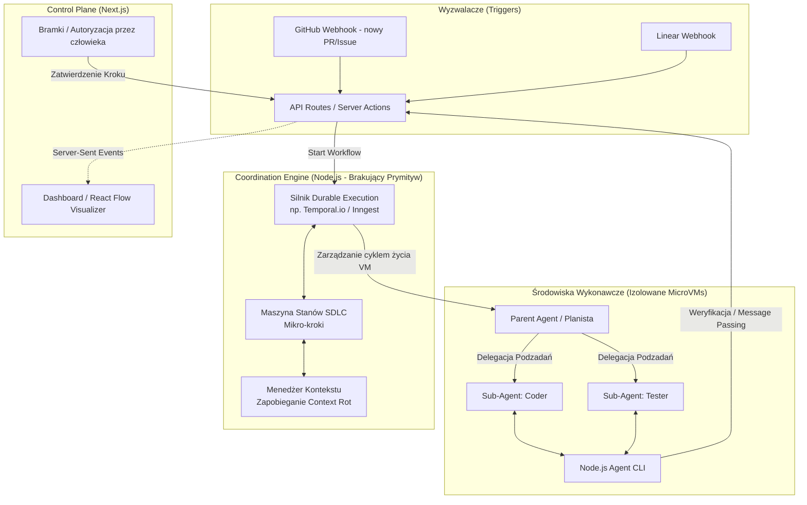
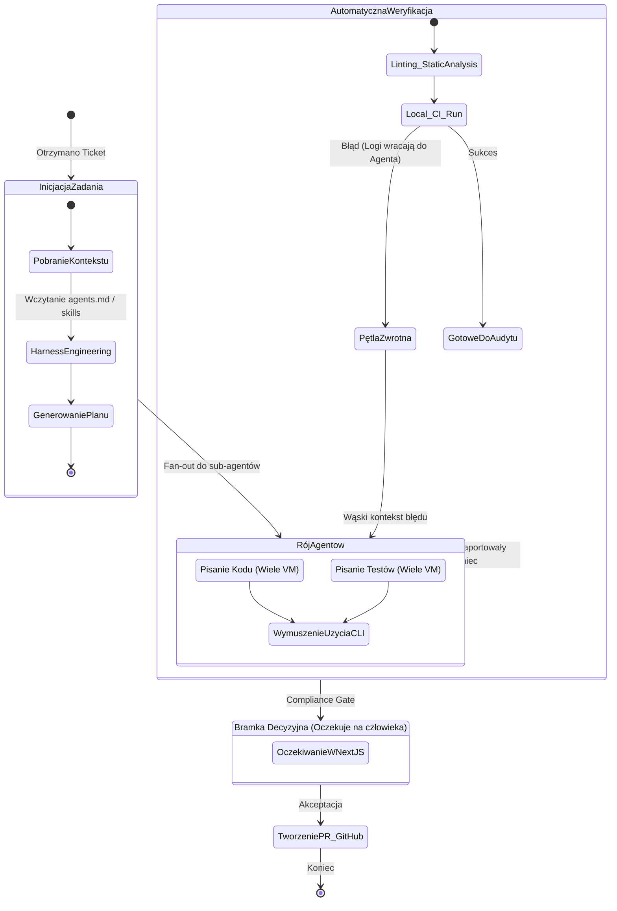

# Warstwa koordynacji jako brakujący prymityw wieloagentowych fabryk oprogramowania

> **Typ:** research-report (working paper) · **Status:** kanoniczny · **Aktualizacja:** 2026-05-24
> **Rola w korpusie `DOC/`:** uzupełnienie wzorca Generator–Ewaluator o warstwę koordynacji (Coordination Layer, SwarmNode Factory) — cytowane jako `source:` (§1, §3.1, §3.2) przez skille orkiestrujące.

**Podtytuł:** Architektura, mechanika i wdrożenie systemu SwarmNode Factory · *Working paper · wersja robocza*

---

## Streszczenie

Tradycyjne podejście do automatyzacji cyklu życia oprogramowania (SDLC) z wykorzystaniem autonomicznych agentów AI napotyka na barierę strukturalną określaną w literaturze branżowej jako **klif złożoności** (Complexity Cliff) [1]. Proste interakcje jedno- i wieloturowe (reaktywne, konwersacyjne) charakteryzują się niskim kosztem awarii i mogą być realizowane w pamięci jednej sesji deweloperskiej; zaawansowane przepływy pracy obejmujące planowanie, implementację, testowanie i wdrożenie wymagają jednak godzin lub dni nieprzerwanej orkiestracji [1]. Na tym poziomie zaawansowania podejście oparte wyłącznie na inżynierii promptów (Prompt Engineering) oraz bezpośrednim interfejsie do systemów kontroli wersji (GitHub) i zarządzania zadaniami (Linear) okazuje się niewystarczające [1].

Niniejszy raport stawia tezę, że **brakującym elementem infrastruktury** w nowoczesnych fabrykach oprogramowania (Software Factory) jest **Warstwa Koordynacji** (Coordination Layer) — twardy, deterministyczny fundament pod operacje wykonywane przez niedeterministyczne agenty AI. Bez tego prymitywu systemy wieloagentowe wykazują krytyczne anomalie operacyjne: agenty gubią kontekst (zjawisko *context rot*), celowo omijają kluczowe kroki procedury walidacyjnej, aby dostarczyć powierzchowny rezultat, oraz generują nadmierny szum informacyjny w kanałach komunikacji zespołowej [2].

Praca opisuje architekturę systemu **SwarmNode Factory** — rozwiązania opartego na ekosystemie **Node.js** (silnik koordynacji) i **Next.js** (panel kontrolny), które przenosi ciężar zarządzania procesem SDLC z promptów bezpośrednio do kodu aplikacyjnego.

---

## 1. Koncepcja architektury: SwarmNode Factory

Ekosystem SwarmNode Factory opiera się na ścisłym oddzieleniu interfejsu użytkownika od silnika wykonawczego oraz odizolowanych środowisk maszyn wirtualnych. System dzieli się na trzy główne filary:

1. **Control Plane & Gates (Next.js).** Zamiast analizować rozproszone wątki komentarzy w GitHubie czy Linear, inżynier sprawujący nadzór nad systemem (*human-on-the-loop*) otrzymuje spójną, graficzną wizualizację topologii roju agentów, zrealizowaną za pomocą biblioteki **React Flow** [4]. Głównym zadaniem tej warstwy jest prezentacja stanu procesów oraz autoryzacja tzw. **Bramek Zgodności** (Compliance Gates), blokujących przejście do kolejnych faz SDLC bez wyraźnej zgody człowieka lub spełnienia rygorystycznych kryteriów technicznych.
2. **Coordination Engine (Node.js).** Bezstanowy, wysoce niezawodny serwer backendowy oparty na koncepcji **trwałego wykonywania** (Durable Execution) oraz **deterministycznych maszynach stanu** [5]. Warstwa ta wymusza na agentach sekwencyjne realizowanie SDLC w postaci drobnych, mierzalnych mikrokroków, uniemożliwiając samowolne skracanie procedur deweloperskich.
3. **Izolowane środowiska MicroVM i Agent CLI.** Agenty deweloperskie wykonują powierzone zadania w dedykowanych maszynach wirtualnych (np. opartych na technologii Firecracker) [7]. Komunikacja pomiędzy agentami a silnikiem koordynacji nie odbywa się za pomocą swobodnego tekstu, lecz poprzez ustrukturyzowany protokół obsługiwany przez dedykowane narzędzie CLI napisane w Node.js. Agent musi udowodnić wykonanie danego etapu prac, przesyłając twarde dowody (np. pokrycie kodu testami, raporty z lintera) bezpośrednio przez CLI [3].

### 1.1. Diagram A — Architektura systemu (System Overview)

Poniższy diagram przedstawia przepływ danych i zależności strukturalne pomiędzy poszczególnymi warstwami systemu SwarmNode Factory, ilustrując separację interfejsu użytkownika od silnika egzekucyjnego oraz środowisk maszyn wirtualnych.



---

## 2. Maszyna stanów mikro-kroków SDLC

Kluczem do zapewnienia powtarzalności i determinizmu w pracy agentów AI jest zaimplementowanie maszyny stanów, która kontroluje każdy krok procesu i uniemożliwia przejście do kolejnej fazy bez spełnienia kryteriów wejściowych. Wykorzystanie frameworków takich jak **LangGraph** lub **XState** pozwala na zdefiniowanie jasnych węzłów (*nodes*) wykonujących pracę, krawędzi (*edges*) warunkujących przejścia oraz współdzielonego stanu stanowiącego system ewidencji dla zachowań agenta [10].

Dzięki temu przepływy pracy stają się w pełni mierzalne, a wszelkie odchylenia od normy lub awarie narzędziowe mogą być obsługiwane poprzez precyzyjnie zdefiniowane ścieżki powrotne i pętle naprawcze (*feedback loops*) [10]. W przeciwieństwie do tradycyjnych łańcuchów promptów, maszyna stanów w połączeniu z bazą danych gwarantuje **trwałość stanu** (*persistence*) — bez niej każda zmiana w infrastrukturze lub restart systemu powoduje natychmiastową utratę kontekstu operacyjnego agenta [10].

### 2.1. Diagram B — Maszyna stanów SDLC (State Machine)

Poniższy diagram obrazuje rygorystyczny przepływ stanów, który wymusza na agentach pełną ścieżkę SDLC, uniemożliwiając pominięcie fazy weryfikacji syntaktycznej oraz testów dynamicznych.



---

## 3. Kluczowe mechaniki systemu

### 3.1. Trwałe wykonywanie (Durable Execution) z Node.js

Wdrażanie agentów AI w środowiskach produkcyjnych wiąże się z koniecznością obsługi procesów o charakterze asynchronicznym i długofalowym. Instalacja zależności, budowanie projektów, analiza statyczna kodu oraz uruchamianie rozbudowanych pakietów testowych mogą trwać od kilkunastu minut do kilku godzin. W tym czasie klasyczne wywołania HTTP są narażone na przekroczenia limitów czasu (*timeouts*), a niestabilność sieci, restarty kontenerów aplikacyjnych czy aktualizacje infrastruktury mogą doprowadzić do utraty aktualnego stanu wykonania zadania [1].

Zastosowanie technologii trwałego wykonywania (Durable Execution) za pomocą silników takich jak **Temporal.io** lub **Inngest** redefiniuje sposób orkiestracji procesów deweloperskich [1]. Każdy krok pośredni w procesie SDLC jest automatycznie utrwalany w niezmiennym dzienniku zdarzeń (*Event History*) [1]. W przypadku fizycznej awarii maszyny obsługującej proces, silnik koordynacji potrafi odtworzyć stan aplikacji bezpośrednio z logów zdarzeń (rekonstrukcja pamięci lokalnej i zmiennych) i podjąć pracę dokładnie od momentu, w którym została przerwana, bez konieczności ponownego uruchamiania wcześniejszych, kosztownych operacji LLM [1].

#### Tabela 1 — Porównanie silników trwałego wykonywania

| Wymiar porównawczy | Temporal.io | Inngest | Vercel Workflow |
|---|---|---|---|
| **Model orkiestracji** | Centralny, stanowy dyrygent (Orchestration) zarządzający całością logiki aplikacji [5] | Architektura zdarzeniowa (Choreography) oparta na reakcjach na eventy [5] | Natywna orkiestracja platformowa zintegrowana z infrastrukturą Vercel [12] |
| **Złożoność wdrożenia** | Wysoka; wymaga konfiguracji klastrów, baz danych i zarządzania pulami workerów [13] | Niska; model bezserwerowy (*serverless*), brak konieczności konfiguracji kolejek [6] | Bardzo niska; natywny element ekosystemu Next.js [12] |
| **Odporność na awarie** | Pełna trwałość stanu, automatyczny replay historii zdarzeń i obsługa błędów [1] | Wbudowana obsługa ponownych prób (*retries*), kolejkowania i przepływu zdarzeń [14] | Trwałość ograniczona do limitów czasowych środowiska bezserwerowego Vercel [12] |
| **Obszar optymalizacji** | Złożone, wielotygodniowe, krytyczne biznesowo procesy deweloperskie [1] | Szybkie tworzenie asynchronicznych i trwałych funkcji w środowisku TypeScript [6] | Proste, zorientowane na platformę Next.js przepływy pracy o niskim czasie wykonania [12] |

Wybór silnika wpływa bezpośrednio na elastyczność i odporność fabryki oprogramowania. Podczas gdy **Temporal.io** stanowi fundament dla systemów wymagających najwyższego poziomu niezawodności i obsługi skomplikowanych wzorców (np. wzorzec sagi, transakcje rozproszone), **Inngest** oraz **Vercel Workflow** oferują znacznie szybszy czas wdrożenia (*developer experience*) w projektach opartych w całości na ekosystemie JavaScript/TypeScript [6].

### 3.2. Przeciwdziałanie zjawisku gnicia kontekstu (*context rot*)

**Gnicie kontekstu** (*context rot*) to stopniowa utrata jakości, precyzji i spójności logicznej generowanych przez LLM odpowiedzi w miarę zapełniania się okna kontekstowego [3]. Badania laboratoryjne (np. testy Chroma przeprowadzone na 18 wiodących modelach komercyjnych i open-source) dowodzą, że wraz ze wzrostem liczby przetworzonych tokenów zdolności poznawcze modeli drastycznie maleją — nawet w sytuacji, gdy całkowity rozmiar wejścia nie zbliża się do maksymalnego limitu okna kontekstowego [3]. Zjawisko to potęgują błędy pozycjonowania informacji, opisane w pracy badawczej dotyczącej efektu *Lost in the Middle*, gdzie model wykazuje doskonałe zapamiętywanie instrukcji na początku oraz na końcu wejścia, całkowicie ignorując dyrektywy umieszczone w jego centralnej części [3].

W kontekście automatyzacji SDLC agenty generują olbrzymie ilości szumu informacyjnego: odczytują strukturę katalogów, analizują logi kompilacji, badają *stack trace'y* błędów i przeglądają historyczne wersje plików [3]. Nagromadzenie tych danych w jednej sesji prowadzi do destabilizacji zachowania agenta, który zaczyna powielać odrzucone wcześniej błędy, ignorować twarde reguły architektoniczne lub pomijać kroki logiczne w łańcuchu wnioskowania [3].

SwarmNode Factory przeciwdziała gniciu kontekstu poprzez implementację **zapór kontekstowych** (*Context Firewalls*) [11]. Silnik koordynacji (Node.js) nie dopuszcza do sytuacji, w której jeden agent zarządza całością zadania w długim wątku konwersacyjnym [11]. Zamiast tego proces jest dzielony na kroki atomowe:

- **Krok 1 (Implementacja).** Sub-Agent 1 (*Coder*) otrzymuje minimalny, wypreparowany kontekst: specyfikację zadania, powiązane pliki źródłowe oraz zestaw reguł z `AGENTS.md` [9]. Po zakończeniu pracy i wygenerowaniu diffu kodu sesja tego agenta ulega całkowitemu zniszczeniu (kolaps kontekstu) [11].
- **Krok 2 (Weryfikacja).** Wygenerowany kod jest wstrzykiwany do nowo zainicjowanego Sub-Agenta 2 (*Tester*), który rozpoczyna pracę z całkowicie czystym, wolnym od wcześniejszego szumu deweloperskiego oknem kontekstowym [11]. Dzięki temu tester nie jest obciążony historią prób i błędów popełnionych przez koderów, co gwarantuje maksymalną rzetelność procedury testowej [11].

### 3.3. Wymuszanie bramek zgodności przez CLI (*The CLI Primitive*)

Agenty deweloperskie oparte na modelach LLM wykazują naturalną tendencję do konfabulacji i drogi na skróty — potrafią zaraportować pomyślne zakończenie prac i napisanie testów jednostkowych, mimo że w rzeczywistości kod nie przechodzi kompilacji, a testy nigdy nie zostały uruchomione [3]. Aby wyeliminować to ryzyko, SwarmNode Factory wprowadza koncepcję **CLI jako podstawowego prymitywu walidacyjnego** [9].

Wewnątrz izolowanej maszyny wirtualnej (*microVM*), w której pracuje agent, instalowane jest niezależne narzędzie CLI napisane w Node.js (np. z wykorzystaniem biblioteki `commander`) [21]. Agent nie ma technicznej możliwości bezpośredniego zaraportowania sukcesu do silnika koordynacji drogą tekstową. Jedynym sposobem na przejście maszyny stanowej do kolejnego kroku jest wywołanie w terminalu komendy:

```bash
swarm-cli step-complete --step="unit_tests"
```

Po wywołaniu tej komendy CLI wykonuje w pełni deterministyczny proces kontrolny wewnątrz środowiska wykonawczego:

1. **Uruchomienie procedury testowej.** CLI samodzielnie uruchamia lokalny proces testowy (np. `npm run test:cov`).
2. **Analiza raportów pokrycia.** Narzędzie parsuje pliki raportowe (np. format LCOV lub instrukcje wyjściowe lintera) i weryfikuje twarde metryki jakościowe (np. pokrycie kodu testami na poziomie minimum 80%, brak krytycznych ostrzeżeń statycznych).
3. **Lokalna pętla samonaprawy (*self-correction*).** Jeśli warunki techniczne nie zostaną spełnione, CLI nie wysyła potwierdzenia do backendu. Zamiast tego blokuje proces i zwraca szczegółowe logi błędów oraz niespełnione kryteria bezpośrednio na standardowe wyjście (`stdout`) terminala agenta [3]. Model LLM, widząc twardy błąd systemu operacyjnego, zostaje zmuszony do podjęcia próby samonaprawy i ponownego uruchomienia walidacji [3].
4. **Podpisanie i transmisja.** Dopiero po uzyskaniu w pełni pozytywnego rezultatu CLI generuje podpisany kryptograficznie token weryfikacyjny i przesyła go do API Control Plane (Next.js), co skutkuje wybudzeniem odpowiedniego kroku w silniku Durable Execution.

### 3.4. Inżynieria uprzęży (*Harness Engineering*)

Tradycyjne podejście do sterowania agentami za pomocą rozbudowanych i przeładowanych instrukcji w promptach systemowych (*System Prompts*) prowadzi do marnowania zasobów i zwiększa ryzyko wystąpienia **konfuzji instrukcji** (*Instruction Confusion*), w której model miesza dyrektywy globalne z lokalnymi [11]. Rozwiązaniem tego wyzwania jest **inżynieria uprzęży** (*Harness Engineering*) [9].

Uprząż to deterministyczna struktura otaczająca model LLM, składająca się z narzędzi, polityk kontekstowych, piaskownic systemowych oraz konfiguracji na poziomie repozytorium [9]. Głównym celem inżynierii uprzęży jest **permanentne eliminowanie możliwości popełnienia błędu** przez agenta — w myśl zasady, że każdy błąd popełniony przez model powinien skutkować natychmiastowym uszczelnieniem uprzęży, aby dana anomalia nigdy więcej się nie powtórzyła [9].

W ramach systemu SwarmNode Factory kluczowymi komponentami uprzęży są pliki konfiguracyjne umieszczane bezpośrednio w repozytorium kodu, takie jak `CLAUDE.md` oraz `AGENTS.md` [9]. Są one automatycznie wykrywane przez silnik koordynacji i wstrzykiwane jako niezmienne reguły na samym początku okna kontekstowego sesji [9].

- **Zwięzłość i struktura check-listy.** Badania nad zachowaniem agentów w oparciu o pliki konfiguracyjne wykazują, że automatycznie generowane lub przeładowane instrukcje drastycznie obniżają jakość kodu i zwiększają zużycie tokenów o ponad 20% [11]. Plik `AGENTS.md` musi być zwięzły (zaleca się poniżej 60 linii), pisany ręcznie przez inżynierów i sformułowany jako lista rygorystycznych, imperatywnych zakazów i nakazów (np. „Zawsze używaj `pnpm` do zarządzania paczkami", „Nigdy nie modyfikuj plików w katalogu `/legacy`") [9].
- **Progresywne ujawnianie kompetencji** (*progressive disclosure*). Uprząż zapobiega przeciążeniu pamięci agenta poprzez dynamiczne dawkowanie narzędzi i wiedzy [9]. Zamiast udostępniać agentowi pełen zestaw API i narzędzi od samego początku, silnik koordynacji ujawnia mu wyłącznie te umiejętności (*skills*) i opisy narzędzi, które są niezbędne do wykonania bieżącego mikrokroku SDLC [9].
- **Zastępowanie protokołów MCP dedykowanymi narzędziami CLI.** Wykorzystanie standardowych serwerów Model Context Protocol (MCP) do bezpośredniego łączenia modeli z systemami zewnętrznymi (np. baza danych, Linear) niesie ze sobą ryzyko przepełnienia kontekstu opisami narzędzi [9]. Dodatkowo zewnętrzne i niezweryfikowane rejestry MCP mogą stanowić wektor ataków typu *prompt injection* [11]. Uprząż SwarmNode Factory minimalizuje to ryzyko, nakazując agentom korzystanie z uproszczonych, lokalnych narzędzi CLI (np. lekkiego CLI do zarządzania zadaniami w Linear), co pozwala zaoszczędzić tysiące tokenów systemowych w każdej turze konwersacji [9].

---

## 4. Szablon struktury projektu (Monorepo Node/Next)

W celu zapewnienia ścisłej separacji odpowiedzialności oraz możliwości współdzielenia typów i konfiguracji pomiędzy silnikiem koordynacji, panelem Next.js a narzędziem CLI wstrzykiwanym do maszyn wirtualnych agentów, zaleca się zorganizowanie kodu w strukturze monorepo przy użyciu **Turborepo** oraz workspace'ów **pnpm**.

```text
/swarm-factory-monorepo
│
├── /apps
│   ├── /web-dashboard         # (Next.js) Panel sterowania, UI w React Flow
│   │   ├── /app/api/webhooks  # Webhooki odbierające eventy z Linear/GitHub
│   │   └── /app/swarm/[id]    # Interfejs podglądu działania roju i bramek (Gates)
│   │
│   └── /coordinator-engine    # (Node.js) Główny silnik trwałej egzekucji i koordynacji
│       ├── /src/workflows     # Skrypty Inngest / Temporal
│       ├── /src/state-machine # Maszyny stanów XState / LangGraph
│       └── /src/vm-manager    # Integracja z API środowisk (np. e2b.dev)
│
├── /packages
│   ├── /factory-cli           # (Node.js) Narzędzie CLI wstrzykiwane do środowiska Agenta
│   │   └── index.ts           # Komendy takie jak `step-complete`, `request-review`
│   │
│   ├── /agents                # Agregacja logiki LLM (np. Vercel AI SDK)
│   └── /database              # Drizzle / Prisma ORM — współdzielone schematy DB
│
└── package.json
```

---

## 5. Model mentalny w kodzie

Poniższy fragment kodu przedstawia rzeczywistą implementację procesu SDLC w silniku koordynacji z wykorzystaniem biblioteki Inngest. Kod ilustruje, w jaki sposób silnik zarządza asynchronicznym cyklem życia maszyn wirtualnych, przeciwdziała gniciu kontekstu i realizuje mechanizm bramek zgodności.

```typescript
// apps/coordinator-engine/src/workflows/sdlc-workflow.ts
import { inngest } from './client';
import { runAgentSwarm } from '@packages/agents';

export const softwareFactoryWorkflow = inngest.createFunction(
  { id: 'sdlc-coordinator-workflow' },
  { event: 'linear.ticket.created' },
  async ({ event, step }) => {

    // KROK 1: Precyzyjne ograniczenie kontekstu (Context Firewall)
    // Pobranie wyłącznie niezbędnych informacji o zadaniu zamiast całego repozytorium.
    const taskContext = await step.run('gather-context', () =>
      getContextFromHarness(event.data.ticketId)
    );

    // KROK 2: Faza Roju (uruchomienie agentów w odizolowanych maszynach VM)
    // Dynamiczne inicjowanie maszyn microVM i przekazanie im wąskiego wycinka zadań.
    await step.run('spawn-swarm-agents', async () => {
      await spawnSubAgentsInVMs({
        agents: ['backend_coder', 'tester'],
        context: taskContext,
      });
    });

    // KROK 3: Oczekiwanie na przejście weryfikacji przez CLI (The CLI Primitive)
    // Silnik koordynacji zawiesza działanie i zwalnia zasoby systemowe.
    // Wybudzenie nastąpi dopiero po wywołaniu przez Agent CLI metody `step-complete`.
    const swarmResult = await step.waitForEvent('wait-for-cli-gate', {
      event: 'cli.gate.passed',
      timeout: '12h',
      match: 'data.taskId',
    });

    // KROK 4: Compliance Gate (bramka weryfikacyjna dla człowieka)
    // Zatrzymanie maszyny stanowej. Oczekiwanie na manualną weryfikację
    // kodu i architektury przez inżyniera za pomocą dashboardu Next.js.
    const humanApproval = await step.waitForEvent('wait-for-human-approval', {
      event: 'nextjs.gate.approved',
      timeout: '7d',
      match: 'data.taskId',
    });

    if (humanApproval) {
      // Automatyzacja wydania — czysty, zweryfikowany kod ląduje na GitHubie,
      // eliminując generowanie setek zbędnych komentarzy w wątkach Pull Requestów.
      await step.run('create-clean-pr', () => pushToGitHub(swarmResult.patch));
    } else {
      // Zawężenie kontekstu błędu i przekierowanie agentów do pętli poprawek (Feedback Loop).
      await step.run('trigger-feedback-loop', () => initiateRollback(swarmResult.taskId));
    }
  }
);
```

---

## 6. Wnioski i rekomendacje wdrożeniowe

Zastąpienie płaskich struktur promptów oraz rozproszonych narzędzi deweloperskich zintegrowaną Warstwą Koordynacji stanowi kluczowy krok w ewolucji systemów wieloagentowych [1]. Trwałe wykonywanie (Durable Execution) chroni procesy przed nieuniknionymi awariami infrastruktury sieciowej oraz limitami interfejsów programistycznych dostawców modeli LLM [1]. Z kolei wdrożenie twardych maszyn stanów w połączeniu z izolacją środowiskową w *microVM* drastycznie podnosi bezpieczeństwo i stabilność generowanego oprogramowania [10].

Dla organizacji dążących do wdrożenia architektury SwarmNode Factory rekomenduje się następujące kroki operacyjne:

1. **Rezygnacja z szerokich ról agentowych.** Należy kategorycznie unikać powierzania kompleksowych zadań SDLC jednemu agentowi. Architektura musi opierać się na wyspecjalizowanych sub-agentach o krótkim czasie życia, których kontekst ulega likwidacji po zakończeniu każdego etapu [11].
2. **Wdrożenie „zapadki" w inżynierii uprzęży.** Reguły zapisane w plikach `CLAUDE.md` oraz `AGENTS.md` powinny być wprowadzane wyłącznie reaktywnie, jako odpowiedź na rzeczywiste awarie systemu operacyjnego lub logicznego [9]. Pozwoli to utrzymać rozmiar plików konfiguracyjnych w optymalnych granicach (poniżej 60 linii), oszczędzając zasoby poznawcze modeli LLM [9].
3. **Przejście na deterministyczną walidację CLI.** Wszystkie krytyczne aspekty jakościowe kodu (testy jednostkowe, analiza statyczna, bezpieczeństwo) muszą być weryfikowane przez deterministyczny kod narzędzia CLI osadzonego w maszynie wirtualnej, a nie za pomocą deklaracji tekstowych generowanych przez agenta [3].

---

## Cytowane prace

[1] *Building AI agents that overcome the complexity cliff* — Temporal. Dostęp: 2026-05-24. <https://temporal.io/blog/building-ai-agents-that-overcome-the-complexity-cliff>

[2] *Collaborative AI Engineering: One Dev, Two Dozen Agents, Zero* — YouTube. Dostęp: 2026-05-24. <https://www.youtube.com/watch?v=ClWD8OEYgp8>

[3] *Context rot is slowing down your AI agent: How to fix it* — LogRocket Blog. Dostęp: 2026-05-24. <https://blog.logrocket.com/context-rot-slowing-down-your-ai-agent-how-fix/>

[4] *Prompt To AI Agent with Next.JS 16, React, Tailwind CSS* — YouTube. Dostęp: 2026-05-24. <https://www.youtube.com/watch?v=qIR4f1gMU8g>

[5] *Inngest vs. Temporal: Which one should you choose?* — Akka. Dostęp: 2026-05-24. <https://akka.io/blog/inngest-vs-temporal>

[6] *Inngest — Open Source* — Enterprise DNA. Dostęp: 2026-05-24. <https://enterprisedna.co/directories/open-source/inngest/>

[7] *E2B vs Sprites dev: comparing AI code execution sandboxes in 2026* — Northflank. Dostęp: 2026-05-24. <https://northflank.com/blog/e2b-vs-sprites-dev>

[8] *Deterministic Pre-Action Authorization for Autonomous AI Agents* — arXiv. Dostęp: 2026-05-24. <https://arxiv.org/pdf/2603.20953>

[9] *Agent Harness Engineering* — Addy Osmani. Dostęp: 2026-05-24. <https://addyosmani.com/blog/agent-harness-engineering/>

[10] *Getting Started with LangGraph: Build a Stateful AI Agent (Not Another Prompt Chain)* — Towards AI. Dostęp: 2026-05-24. <https://pub.towardsai.net/getting-started-with-langgraph-build-a-stateful-ai-agent-not-another-prompt-chain-ccedc9b6e9ad>

[11] *Skill Issue: Harness Engineering for Coding Agents* — HumanLayer. Dostęp: 2026-05-24. <https://www.humanlayer.dev/blog/skill-issue-harness-engineering-for-coding-agents>

[12] *Temporal vs Inngest vs Vercel Workflow 2026: Full Comparison* — daily.dev. Dostęp: 2026-05-24. <https://app.daily.dev/posts/temporal-vs-inngest-vs-vercel-workflow-2026-full-comparison-roihpr8h7>

[13] *Durable Workflow Platforms for AI Agents and LLM Workloads* — Render. Dostęp: 2026-05-24. <https://render.com/articles/durable-workflow-platforms-ai-agents-llm-workloads>

[14] *Inngest vs Temporal: Durable execution that developers love* — Inngest. Dostęp: 2026-05-24. <https://www.inngest.com/compare-to-temporal?ref=footer-links>

[15] *Durable Execution: The Key to Harnessing AI Agents in Production* — Inngest. Dostęp: 2026-05-24. <https://www.inngest.com/blog/durable-execution-key-to-harnessing-ai-agents>

[16] *Building a Real-Time Progress Bar with Server-Sent Events in Next.js* — dev.to. Dostęp: 2026-05-24. <https://dev.to/pavelespitia/building-a-real-time-progress-bar-with-server-sent-events-in-nextjs-2a6f>

[17] *Context Rot: Why AI Agents Fail After Turn Twenty* — TechAhead. Dostęp: 2026-05-24. <https://www.techaheadcorp.com/blog/context-rot-problem/>

[18] *Context Rot: Why LLMs Degrade as Context Grows (Complete Guide)* — Morph LLM. Dostęp: 2026-05-24. <https://www.morphllm.com/context-rot>

[19] *Context Engineering for AI Agents: A Deep Dive* — Towards Data Science. Dostęp: 2026-05-24. <https://towardsdatascience.com/deep-dive-into-context-engineering-for-ai-agents/>

[20] *Context Engineering for AI Agents: Part 2* — Philipp Schmid. Dostęp: 2026-05-24. <https://www.philschmid.de/context-engineering-part-2>

[21] *@e2b/cli* — npm. Dostęp: 2026-05-24. <https://npmjs.com/package/@e2b/cli>

[22] *@e2b/cli CDN by jsDelivr* — jsDelivr. Dostęp: 2026-05-24. <https://www.jsdelivr.com/package/npm/@e2b/cli>

[23] *Claude Code Sandbox: The Complete Guide to Sandboxing AI* — Qovery. Dostęp: 2026-05-24. <https://www.qovery.com/blog/claude-code-sandbox-guide>
