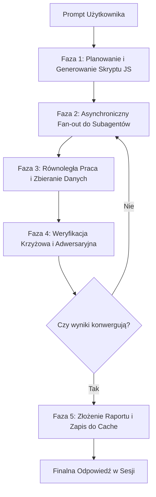
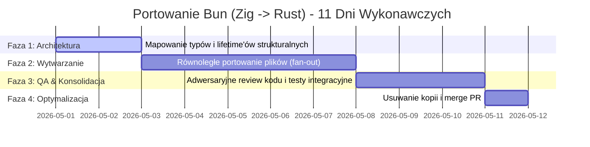

# Dynamic Workflows w Claude Code: Skalowanie orkiestracji wieloagentowej w asynchronicznym runtime

> **Typ:** research-report · **Status:** kanoniczny · **Aktualizacja:** 2026-05-29
> **Rola w korpusie `DOC/`:** Kompendium orkiestracji Dynamic Workflows w Claude Code v2.1.154+ (§1–§14), stanowiące teoretyczno-praktyczny fundament dla wznawialnych i równoległych procesów wytwórczych AI.

> [!abstract] TL;DR
> **Dynamic Workflows** to asynchroniczny tryb orkiestracji w Claude Code v2.1.154+, przeznaczony do wielkoskalowych, długotrwałych zadań programistycznych wykraczających poza możliwości pojedynczej konwersacji. W tym modelu Claude dynamicznie generuje skrypt w JavaScript, który dedykowany runtime wykonuje w tle, powołując do setek równoległych subagentów. Plan działania przenosi się z okna konwersacji bezpośrednio do kodu (zmiennych runtime), co zapobiega degradacji kontekstu i umożliwia adwersaryjną weryfikację krzyżową oraz pełną wznawialność sesji.

---

**Słowa kluczowe:** Dynamic Workflows · subagenci · orkiestracja runtime · fan-out · weryfikacja adwersaryjna · ultracode · wznawialność sesji · token budget · asynchroniczność.

## Spis treści

1. Czym są Dynamic Workflows
2. Model działania — jak to działa pod spodem
3. Workflow a subagenci a skills — kiedy co wybrać
4. Wymagania i dostępność
5. Trzy sposoby uruchomienia workflow
6. Zatwierdzanie planu przed uruchomieniem
7. Monitorowanie przebiegu
8. Zapisywanie workflow do ponownego użycia
9. Ograniczenia i limity
10. Wznawianie po pauzie
11. Koszt i zarządzanie modelem
12. Wyłączanie funkcji
13. Efekty i zastosowania
14. Dobre praktyki (podsumowanie operacyjne)
- Źródła

---

## 1. Czym są Dynamic Workflows

Dynamic Workflows to zaawansowany paradygmat orkiestracji zadań w Claude Code, zaprojektowany z myślą o problemach inżynieryjnych o skali wykraczającej poza możliwości pojedynczej, synchronicznej sesji konwersacyjnej. W tradycyjnym podejściu agentowym każdy krok i wynik pośredni są gromadzone bezpośrednio w oknie kontekstowym modelu, co przy dużych wolumenach danych prowadzi do nieuchronnej degradacji uwagi (*context window degradation*) i utraty rygoru. 

W modelu Dynamic Workflows **plan działania zostaje przełożony bezpośrednio na kod**. Claude analizuje zadanie i dynamicznie generuje skrypt sterujący w języku JavaScript, który następnie jest przekazywany do dedykowanego, wyizolowanego środowiska uruchomieniowego (runtime) działającego asynchronicznie w tle. Runtime wykonuje pętle logiczne, warunki oraz zarządza równoległym powoływaniem subagentów (tzw. fan-out). Wyniki pośrednie, zmienne stanu oraz metryki są przechowywane w pamięci runtime, a do głównego wątku sesji użytkownika trafia wyłącznie zsyntetyzowany, poddany rygorystycznej weryfikacji raport końcowy. 

Rozwiązanie to dedykowane jest długofalowym, złożonym procesom inżynieryjnym (np. głębokim audytom bezpieczeństwa całej bazy kodu, wieloplikowym migracjom architektonicznym czy refaktoryzacji systemów krytycznych), które mogą trwać od kilkunastu minut do wielu dni.

---

## 2. Model działania — jak to działa pod spodem

Przebieb orkiestracji w asynchronicznym środowisku runtime przebiega w sposób w pełni ustrukturyzowany według następującego algorytmu:



1. **Planowanie i Synteza Skryptu (Planning & Scripting):** Na podstawie intencji użytkownika model wiodący projektuje architekturę procesu i generuje imperatywny kod sterujący w JavaScript, określający przepływ sterowania, typy subagentów oraz reguły agregacji.
2. **Równoległe Rozproszenie (Fan-out):** Środowisko uruchomieniowe inicjuje wykonanie skryptu, dynamicznie powołując do życia od kilku do kilkudziesięciu wyspecjalizowanych subagentów pracujących równolegle w izolowanych piaskownicach.
3. **Adwersaryjna Weryfikacja Krzyżowa (Cross-Verification):** Aby zapobiec halucynacjom i jednostronnej interpretacji problemu, runtime implementuje wzorzec recenzji adwersaryjnej. Ustalenia wygenerowane przez jedną grupę agentów są automatycznie przekazywane do niezależnych agentów recenzujących, których celem jest próba obalenia postawionych hipotez. Pętla trwa do momentu osiągnięcia pełnej spójności (konwergencji) danych.
4. **Złożenie i Synteza (Aggregation & Assembly):** Po pomyślnym zakończeniu procesów weryfikacyjnych, surowe dane i cząstkowe artefakty są syntetyzowane w jeden skonsolidowany raport końcowy, który zostaje zaprezentowany użytkownikowi.

> [!tip] Zaleta Architektoniczna
> Runtime na bieżąco monitoruje i zapisuje stan każdego kroku na dysku. W przypadku awarii sieci, braku zasilania lub celowego zatrzymania procesu, praca może zostać wznowiona dokładnie od ostatniego zapisanego punktu kontrolnego (*checkpointing*), bez konieczności ponownego ponoszenia kosztów tokenowych dla już wykonanych etapów.

---

## 3. Workflow a subagenci a skills — kiedy co wybrać

Wielostopniowe zadania w ekosystemie Claude Code mogą być realizowane za pomocą różnych mechanizmów. Kluczowe kryterium wyboru stanowi lokalizacja i forma przechowywania planu wykonawczego.

| Wymiar Porównawczy | Subagenci (Subagents) | Skille (Agent Skills) | Dynamic Workflows |
| :--- | :--- | :--- | :--- |
| **Definicja formalna** | Ad-hoc pracownicy powoływani dynamicznie w locie | Deterministyczne procedury zapisane w Markdown | Imperatywny skrypt JS wykonywany przez runtime |
| **Zarządzanie stanem** | Sesja konwersacyjna (twardy kontekst) | Sesja konwersacyjna (twardy kontekst) | Zmienne środowiska uruchomieniowego (poza chatem) |
| **Sterowanie procesem** | Model wiodący podejmuje decyzje tura po turze | Model wiodący postępuje według reguł skilla | Skrypt JS sztywno kontroluje pętle i warunki |
| **Powtarzalność** | Niska (zależna od fluktuacji kontekstu) | Średnia (zależna od przestrzegania instrukcji) | Bardzo wysoka (deterministyczna logika kodu) |
| **Skalowalność** | Niska (do kilku wywołań w jednej turze) | Średnia (dozwolone ograniczone pod-kroki) | Ekstremalna (od kilkudziesięciu do setek agentów) |
| **Odporność na błędy** | Brak (przerwanie niszczy postęp tury) | Brak (wymaga powtórzenia od checkpointu skilla) | Pełna (wznawialne punkty kontrolne na dysku) |

> [!important] Reguła Decyzyjna
> Wybieraj **Dynamic Workflows** zawsze wtedy, gdy skala zadania wymaga koordynacji więcej niż 5 równoległych procesów badawczych, gdy wolumen danych wejściowych zablokowałby okno kontekstowe lub gdy orkiestracja musi być w pełni powtarzalna i zdatna do audytu.

---

## 4. Wymagania i dostępność

Uruchomienie asynchronicznego runtime'u Dynamic Workflows wymaga spełnienia określonych warunków środowiskowych:

* **Wersja Oprogramowania:** Wymagany klient Claude Code w wersji `v2.1.154` lub nowszej. Weryfikacja: `claude --version`, aktualizacja: `claude update`.
* **Interfejsy Dostępowe:** CLI, oficjalna aplikacja Claude Desktop, dedykowane rozszerzenia IDE (VS Code, JetBrains), tryb headless `claude -p` oraz integracja poprzez Agent SDK.
* **Plany Subskrypcyjne:** Dostępne w planach Pro, Max, Team oraz Enterprise.
* **Integracje Chmurowe (Providers):** Bezpośrednie API Anthropic oraz licencjonowane endpointy Amazon Bedrock, Google Cloud Vertex AI oraz Microsoft Azure Foundry.
* **Infrastruktura Sieciowa:** Stabilne i szerokopasmowe łącze internetowe ze względu na wysokie natężenie jednoczesnych zapytań API (*high-concurrency token throughput*).

### Domyślna Dostępność Funkcji

| Poziom Konta / Plan | Status Domyślny | Procedura Aktywacji |
| :--- | :--- | :--- |
| **Pro** | Wyłączone | Ręczna aktywacja w menu `/config` (pozycja „Dynamic workflows”) |
| **Max** | Włączone | Dostępne natychmiast |
| **Team** | Włączone | Dostępne natychmiast |
| **Enterprise** | Wyłączone | Wymaga globalnej aktywacji przez administratora organizacji w panelu zarządzania |
| **API Direct** | Włączone | Aktywne domyślnie dla autoryzowanych kluczy API |

---

## 5. Trzy sposoby uruchomienia workflow

Użytkownik może zainicjować asynchroniczny przepływ pracy na trzy alternatywne sposoby, zależnie od pożądanego stopnia kontroli nad procesem.

### 5.1. Wbudowany profil `/deep-research`

Służy do błyskawicznego, wieloźródłowego badania zawiłych zagadnień technicznych. Narzędzie uruchamia w tle równoległe zapytania do wyszukiwarek, pobiera treść dokumentacji, krzyżowo weryfikuje fakty i generuje obiektywny raport z precyzyjnymi cytowaniami źródłowymi.

```bash
/deep-research Jakie zmiany zaszły w modelu uprawnień Node.js między v20 a v22?
```

### 5.2. Jawne wywołanie słowem kluczowym `workflow`

Umieszczenie tokenu `workflow` w dowolnym miejscu zapytania przesyłanego do Claude Code instruuje model wiodący do natychmiastowego porzucenia trybu konwersacyjnego na rzecz syntezy skryptu JS i uruchomienia asynchronicznego runtime'u.

```text
Uruchom workflow audytujący każdy endpoint API w src/routes/ pod kątem brakujących kontroli autoryzacji
```

> [!note] Wskazówka CLI
> Jeśli token `workflow` został wyzwolony przypadkowo w zwykłej rozmowie, naciśnięcie kombinacji klawiszy `alt+w` anuluje detekcję triggera dla bieżącego promptu.

### 5.3. Tryb `ultracode` (Autonomiczny)

Tryb najwyższego rygoru operacyjnego, łączący poziom zaangażowania intelektualnego `xhigh` z automatycznym decydowaniem o strukturze procesów. Po jego aktywacji Claude Code samodzielnie ocenia złożoność każdego zadania i w razie potrzeby bez udziału użytkownika projektuje i uruchamia dedykowane Dynamic Workflows.

```text
/effort ultracode
```

W trybie tym pojedyncze, obszerne zapytanie użytkownika może zostać automatycznie podzielone na sekwencyjny ciąg niezależnych przepływów (np. faza analityczna → faza wytwórcza → faza testowa). Powrót do standardowej pracy następuje po wydaniu polecenia `/effort high`.

---

## 6. Zatwierdzanie planu przed uruchomieniem

Bezpieczeństwo i kontrola kosztów są kluczowymi aspektami środowiska wykonawczego. Przed puszczeniem wygenerowanego skryptu JS w ruch, Claude Code prezentuje szczegółową strukturę planowanych faz i oczekuje na decyzję użytkownika.

W interfejsie konsolowym (CLI) dostępne są następujące opcje:
* **Yes, run it:** Zezwala na natychmiastowe uruchomienie runtime'u.
* **Yes, and don't ask again for `<nazwa>` in `<ścieżka>`:** Uruchamia proces i trwale zapisuje regułę pomijania monitu dla tego konkretnego skryptu w bieżącym katalogu roboczym.
* **View raw script:** Otwiera pełny wygenerowany kod JavaScript w wbudowanym edytorze (`Ctrl+G`), umożliwiając jego inspekcję. Naciśnięcie klawisza `Tab` pozwala na modyfikację promptu wejściowego przed ponownym wygenerowaniem.
* **No:** Anuluje cały proces.

### Zachowanie Monitów w zależności od Konfiguracji Uprawnień

| Ustawiony Poziom Uprawnień | Zachowanie Systemowe |
| :--- | :--- |
| **Default / Accept Edits** | Monit pojawia się przed każdym nowym przebiegiem, chyba że zapisano regułę ignorowania monitu |
| **Auto** | Monit pojawia się wyłącznie przy pierwszej inicjalizacji; zatwierdzenie zapisuje regułę globalną w konfiguracji użytkownika. Monity są całkowicie pomijane w trybie `ultracode` |
| **Bypass permissions / headless (`-p`) / SDK** | Całkowity brak monitów. Skrypty są wykonywane natychmiast i bezwarunkowo |

> [!caution] Istotna Uwaga dot. Zabezpieczeń
> Wszystkie subagenty powoływane wewnątrz środowiska wykonawczego Dynamic Workflows dziedziczą poziom uprawnień `acceptEdits` oraz zdefiniowaną listę dozwolonych narzędzi (*allowlist*). Zmiany w plikach są zatwierdzane automatycznie. Jednak operacje wrażliwe (takie jak wywołania powłoki CLI, żądania sieciowe czy niestandardowe narzędzia MCP) spoza zdefiniowanej allowlisty mogą wstrzymać działanie workflow w tle i oczekiwać na interaktywną zgodę użytkownika. Przy długich, asynchronicznych przebiegach zaleca się wcześniejsze skonfigurowanie allowlisty.

---

## 7. Monitorowanie przebiegu

Ponieważ Dynamic Workflows wykonują się asynchronicznie, główna sesja konwersacyjna użytkownika pozostaje w pełni responsywna. Użytkownik może monitorować postęp uruchomionych zadań za pomocą polecenia:

```text
/workflows
```

Polecenie to wyświetla interaktywną listę aktywnych oraz historycznych przepływów. Wybranie konkretnej pozycji otwiera zaawansowany panel diagnostyczny prezentujący status poszczególnych faz, drzewo powołanych subagentów, całkowite zużycie tokenów oraz czas operacyjny.

Jednolinijkowy, dyskretny wskaźnik postępu (progress bar) jest również wyświetlany bezpośrednio pod polem wprowadzania tekstu w terminalu.

### Nawigacja w Panelu Diagnostycznym `/workflows`

| Klawisz | Powiązana Akcja Diagnostyczna |
| :---: | :--- |
| `↑` / `↓` | Przemieszczanie fokusu między fazami i subagentami |
| `Enter` / `→` | Wejście in szczegóły wybranej fazy lub agenta (wyświetlenie promptu, wywołań narzędzi, logów i wyników) |
| `Esc` | Powrót do wyższego poziomu drzewa diagnostycznego |
| `j` / `k` | Płynne przewijanie zawartości logu wybranego subagenta |
| `p` | Wstrzymanie (pauza) lub natychmiastowe wznowienie pracy workflow |
| `x` | Zatrzymanie (kill) wybranego subagenta lub całego przepływu pracy |
| `r` | Wymuszenie restartu wybranego subagenta od stanu czystego |
| `s` | Eksport i zapis wygenerowanego skryptu sterującego na dysku |

---

## 8. Zapisywanie workflow do ponownego użycia

Jeżeli dynamicznie wygenerowany przez Claude'a przepływ pracy okazuje się wysoce efektywny i nadaje się do regularnego powtarzania (np. cykliczny audyt bezpieczeństwa uruchamiany przed każdym commitem do gałęzi release), użytkownik może zapisać go jako trwałe polecenie.

### Procedura zapisu:
1. Wywołaj listę zadań za pomocą `/workflows`.
2. Wskaż pożądany przebieg i naciśnij klawisz `s`.
3. Wybierz lokalizację docelową za pomocą klawisza `Tab`:
   * **Lokalna (.claude/workflows/):** Zapisuje skrypt w katalogu projektu. Kod staje się częścią repozytorium i jest dostępny dla każdego członka zespołu po sklonowaniu gita.
   * **Globalna (~/.claude/workflows/):** Zapisuje skrypt w katalogu domowym użytkownika. Workflow staje się dostępny we wszystkich projektach realizowanych na danej maszynie, pozostając niewidocznym dla innych.
4. Potwierdź klawiszem `Enter`.

Zapisany skrypt staje się natychmiast dostępny jako natywne polecenie slash (`/<nazwa>`) i jest uwzględniany w mechanizmie autouzupełniania komend. W przypadku zbieżności nazw, wersja zdefiniowana lokalnie w projekcie ma priorytet nad wersją globalną.

---

## 9. Ograniczenia i limity

W celu zapewnienia stabilności systemu i ochrony przed niekontrolowanym zużyciem zasobów, asynchroniczny runtime nakłada twarde limity operacyjne:

| Zdefiniowany Limit | Wartość Graniczna | Racjonalizacja Inżynieryjna (Chesterton's Fence) |
| :--- | :--- | :--- |
| **Interaktywność w locie** | Zablokowane wejście użytkownika | Środowisko działa w tle w sposób nieprzerwany. Wszelkie interakcje użytkownika wstrzymałyby proces. Złożone zadania wymagające decyzji człowieka należy dzielić na sekwencję mniejszych, niezależnych workflow. |
| **Bezpośredni dostęp do IO** | Zablokowany dla skryptu wiodącego | Skrypt sterujący JS nie ma prawa bezpośredniego zapisu/odczytu systemu plików ani wykonywania poleceń powłoki. Wszelkie operacje dyskowe i systemowe muszą być delegowane do powoływanych subagentów, co zapewnia pełną kontrolę i bezpieczeństwo. |
| **Współbieżność lokalna** | Maksymalnie 16 agentów równolegle | Ograniczenie narzucone w celu ochrony zasobów lokalnych maszyny programisty (CPU, pamięć RAM) oraz zapobiegania natychmiastowemu wyczerpaniu limitów zapytań na sekundę (RPS) u dostawców LLM. |
| **Głębokość wykonania** | Maksymalnie 1000 agentów na run | Twardy bezpiecznik chroniący przed wpadnięciem skryptu sterującego w nieskończone pętle logiczne, co mogłoby doprowadzić do niekontrolowanego drenażu budżetu tokenowego. |

---

## 10. Wznawianie po pauzie

Zatrzymany lub przerwany workflow (np. w wyniku błędu sieciowego) może zostać wzniesiony ponownie. Runtime analizuje stan zapisany na dysku i stosuje inteligentne wznawianie: agenci, którzy pomyślnie ukończyli swoje zadania, nie są powoływani ponownie, a their wyniki są pobierane z lokalnego cache. Agenci, którzy zostali przerwani w trakcie pracy, są uruchamiani od stanu początkowego.

Wznowienie następuje poprzez interfejs `/workflows` (wybór zadania i naciśnięcie `p`) lub poprzez wydanie polecenia tekstowego modelowi wiodącemu z prośbą o kontynuację przerwanego skryptu.

> [!warning] Granica Sesji
> Mechanizm cache'owania stanu i wznawialności Dynamic Workflows jest ściśle powiązany z **bieżącą sesją Claude Code**. Zamknięcie klienta CLI lub zakończenie sesji powoduje bezpowrotne wyczyszczenie pamięci podręcznej runtime'u. Kolejne uruchomienie tego samego zadania rozpocznie proces od zera.

---

## 11. Koszt i zarządzanie modelem

Dynamic Workflows charakteryzują się bardzo wysokim współczynnikiem zużycia tokenów wejściowych i wyjściowych ze względu na równoległą pracę wielu jednostek. Pojedynczy, zaawansowany przebieg może wygenerować koszty rzędu setek tysięcy tokenów, szybko konsumując limity taryfowe.

### Strategie optymalizacji budżetu tokenowego:

* **Weryfikacja modelu wiodącego:** Przed inicjalizacją dużego zadania sprawdź aktywny model poleceniem `/model`. Wykonywanie rutynowych analiz na najdroższych modelach flagowych powinno być świadomą decyzją.
* **Granulacja modeli w skrypcie:** W treści promptu możesz wyraźnie poinstruować Claude'a, aby w generowanym skrypcie JS przypisał tańsze i mniejsze modele (np. Haiku) do prostych, powtarzalnych etapów (takich jak wstępne parsowanie plików czy ekstrakcja metadanych), rezerwując najpotężniejsze modele wyłącznie do faz syntezy i krytycznego review.
* **Selektywna kontrola operacyjna:** Aktywnie korzystaj z panelu `/workflows` w celu szybkiego przerywania zadań, które zboczyły z zakładanego toru logicznego, co pozwala zapobiec bezproduktywnemu zużyciu tokenów.

---

## 12. Wyłączanie funkcji

W środowiskach korporacyjnych oraz na maszynach o ograniczonych pakietach transferu danych może zajść potrzeba całkowitego zablokowania mechanizmu Dynamic Workflows.

### Metoda 1: Poziom Użytkownika (Lokalny)
* Przełączenie opcji „Dynamic workflows” na status wyłączony w menu konfiguracji `/config`.
* Ręczna edycja pliku konfiguracyjnego użytkownika `~/.claude/settings.json` i dodanie klucza:
  ```json
  "disableWorkflows": true
  ```
* Eksport zmiennej środowiskowej w powłoce systemowej przed uruchomieniem klienta:
  ```bash
  export CLAUDE_CODE_DISABLE_WORKFLOWS=1
  ```

### Metoda 2: Poziom Organizacji (Globalny)
* Wstrzyknięcie wymuszonego parametru `"disableWorkflows": true` w pliku ustawień zarządzanych (*managed settings*) dystrybuowanym na stacje robocze pracowników.
* Zablokowanie funkcji w konsoli administracyjnej organizacji na platformie Anthropic.

Po dezaktywacji wbudowane komendy (np. `/deep-research`) stają się niedostępne, token `workflow` przestaje być interpretowany jako wyzwalacz runtime'u, a profil `ultracode` zostaje usunięty z poziomów wysiłku `/effort`.

---

## 13. Efekty i zastosowania

Zastosowanie Dynamic Workflows pozwala na radykalne skrócenie czasu realizacji zadań inżynieryjnych o najwyższym stopniu złożoności. Zespoły inżynieryjne wykorzystują tę technologię w następujących obszarach:

* **Kompleksowe Audyty Bezpieczeństwa:** Równoległe skanowanie ogromnych repozytoriów pod kątem podatności (np. OWASP Top 10), połączone z adwersaryjną próbą eksploitacji wykrytych luk przez niezależne subagenty.
* **Migracje Architektoniczne:** Automatyczna translacja całych podsystemów między frameworkami (np. migracja API z Express.js do Fastify) z jednoczesnym generowaniem i uruchamianiem testów regresyjnych dla każdego zmodyfikowanego komponentu.
* **Refaktoryzacja Systemów Krytycznych:** Przebiegi optymalizacyjne zorientowane na redukcję złożoności obliczeniowej i pamięciowej, gdzie każdy wygenerowany PR jest recenzowany przez dwóch niezależnych agentów weryfikujących zachowanie kontraktów API.

### Studium Przypadku: Portowanie Bun (Zig → Rust)

Najbardziej spektakularnym dowodem możliwości technologii Dynamic Workflows było eksperymentalne przepisanie kluczowych komponentów runtime'u Bun z języka Zig do Rust.



W ciągu 11 dni roboczych system zarządzany przez Dynamic Workflows przepisał około 750 000 linii skomplikowanego, niskopoziomowego kodu, utrzymując pełną zgodność z istniejącym zestawem testów integracyjnych na poziomie 99,8%. 

Proces opierał się na dedykowanym workflow mapującym reguły zarządzania pamięcią Zig na mechanizm czasu życia (*lifetimes*) w Rust. Następnie setki równoległych subagentów przetłumaczyły poszczególne moduły, a każdy plik wyjściowy był poddawany rygorystycznemu review przez dwóch dedykowanych subagentów-audytorów. Pętla samonaprawcza (auto-fix loop) automatycznie eliminowała błędy kompilatora Rust, doprowadzając build do czystego stanu końcowego.

---

## 14. Dobre praktyki (podsumowanie operacyjne)

Aby zapewnić maksymalną efektywność i zminimalizować niepotrzebne koszty podczas pracy z Dynamic Workflows, należy bezwzględnie wdrożyć następujące zasady:

1. **Inkrementalność na Starcie:** Pierwsze uruchomienia dla nowej bazy kodu realizuj na wąskich, precyzyjnie zdefiniowanych podzadaniach w celu kalibracji zachowania i oceny narzutu tokenowego.
2. **Definicja Allowlisty Uprawnień:** Przed puszczeniem długotrwałego procesu w tle, upewnij się, że wszystkie niezbędne komendy systemowe i narzędzia MCP zostały dodane do konfiguracji uprawnień automatycznych. Pozwoli to zapobiec zablokowaniu pracy w tle przez monit o zgodę.
3. **Precyzyjne Adresowanie Ścieżek:** Ograniczaj zakres skanowania w prompcie wejściowym (np. wskazując konkretne podkatalogi zamiast całego repozytorium). Drastycznie zmniejsza to stopień współbieżności i optymalizuje budżet tokenów.
4. **Strategiczne Dobieranie Modelu:** Wykorzystuj tańsze modele do zadań prostych w skrypcie sterującym, pozostawiając najpotężniejsze jednostki do faz weryfikacji i scalania.
5. **Współdzielenie Zaimplementowanych Przepływów:** Sprawdzone skrypty zapisuj lokalnie w katalogu `.claude/workflows/` projektu. Umożliwi to całemu zespołowi uruchamianie identycznych procedur weryfikacyjnych na ich stacjach roboczych.
6. **Sekwencjonowanie Interaktywne:** Zadania wymagające decyzji człowieka na kluczowych etapach dziel na mniejsze, niezależne odnogi workflow. Unikaj projektowania monolitów wykonawczych bez punktów kontrolnych dla człowieka.

---

## Źródła

1. Anthropic Claude Code Technical Documentation: *Orchestrating subagents at scale with dynamic workflows*. Dostęp online: https://code.claude.com/docs/en/workflows
2. Anthropic Research Blog: *Introducing dynamic workflows in Claude Code* (Wpis z dnia 28 maja 2026 r.). Dostęp online: https://claude.com/blog/introducing-dynamic-workflows-in-claude-code
3. Addy Osmani — *Beyond Vibe Coding: Agentic Workflows and Asynchronous Execution Runtimes* (O'Reilly Media, 2026).

---
*Dokument reprezentuje status Research Preview. Specyfikacja techniczna środowiska uruchomieniowego, struktura komend oraz charakterystyka zużycia tokenów mogą ulec zmianie wraz z kolejnymi aktualizacjami klienta Claude Code.*