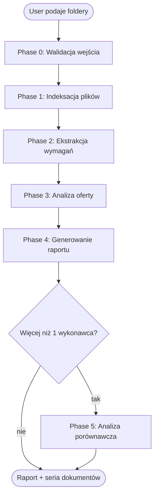

# Analyzing PZP Offers (Weryfikacja oferty w postępowaniu PZP)

## Overview

Systematic verification workflow of a public procurement offer (oferta) against procurement documentation (ogłoszenie + SWZ + OPZ + pisma z odpowiedziami/modyfikacjami). The skill produces a **detailed report plus a series of supporting documents** in Obsidian Flavored Markdown, with per-finding citations of document + rozdział + punkt + strona.

**Core principle:** An analysis is valid only if every conclusion is traceable to a specific excerpt of a specific document in the postępowanie. No conjecture, no domniemanie spełnienia wymagań. Wszystkie modyfikacje SWZ są nadrzędne wobec pierwotnej treści.

**This is a technique skill.** Apply its phases in order and do not skip the indexing step — the whole audit trail rests on it.

> [!important] Aktualna podstawa prawna (stan na 2026-03-30)
> - **Ustawa Pzp:** Dz.U. 2019 poz. 2019; **tekst jednolity: Dz.U. 2024 poz. 1320** z nowelizacjami: 2025 r. poz. 620, 769, 794, 1165, 1173, **1235**; 2026 r. poz. 252.
> - **Nowelizacja 12.07.2026 r.** (Dz.U. 2025 poz. 1235) — wprowadza **certyfikację wykonawców** (nowy art. 128a, zmiany w art. 112 ust. 3, art. 124 ust. 2-4, art. 273 ust. 2). Dla postępowań wszczętych przed 12.07.2026 stosuje się przepisy dotychczasowe.
> - **Ustawa o krajowym systemie cyberbezpieczeństwa (KSC):** Dz.U. 2026 poz. 20 i 252 — dla zamówień ICT sprawdzaj art. 33 ust. 4 (rekomendacje) i art. 67b ust. 15 (dostawcy wysokiego ryzyka).
> - Nie używać przedawnionych sygnatur (np. Dz.U. 2023 poz. 1605).

## When to Use

- User provides path to a folder with ogłoszenie o zamówieniu, SWZ, OPZ, załączniki, oraz pisma z odpowiedziami/modyfikacjami
- User provides path to a folder (or folders) with ofertą wykonawcy (może zawierać `część jawna`, `część niejawna / tajemnica przedsiębiorstwa`, `wadium`)
- User asks: „sprawdź ofertę", „zweryfikuj zgodność z SWZ", „przeanalizuj ofertę wykonawcy", „porównaj oferty", „oceń kompletność oferty"
- User references a sygnatura postępowania (np. `BL-V.2371.3.2026`) and wants formal verification
- User asks for raport, tabelę kontrolną, wskazanie braków, ryzyka odrzucenia

## When NOT to Use

- Postępowania zagraniczne nie objęte polską ustawą PZP (use general contract review instead)
- Wczesna faza planowania zamówienia (przed publikacją SWZ) — brak dokumentacji do weryfikacji
- Zapytania ofertowe podprogowe poza PZP
- Sam przegląd techniczny produktu bez kontekstu postępowania

## Required Inputs — ZAWSZE dopytaj, jeśli brakuje

Before doing anything else, confirm with the user:

1. **`<announcement_dir>`** — absolute path to folder with ogłoszenie o zamówieniu, SWZ, OPZ, załączniki do SWZ, pisma modyfikujące/wyjaśniające
2. **`<offer_dir>`** — absolute path to folder with ofertą wykonawcy. Jeśli wielu wykonawców — ścieżka do folderu zbiorczego, z podfolderami per-wykonawca
3. **`<output_dir>`** — (opcjonalne, default: parent of `<offer_dir>/raport-<sygnatura>-<wykonawca>`) — folder docelowy dla raportów
4. **`<autor_analizy>`** — (opcjonalne, default: wartość z kontekstu `userEmail` w CLAUDE.md / system prompt; dla KG PSP: `claude@kg.straz.gov.pl` lub `mklosinski@kg.straz.gov.pl`) — adres e-mail lub nazwisko osoby odpowiedzialnej za analizę

Jeżeli user nie podał ścieżek: wypisz aktualny drzewostan katalogów nadrzędnych i zapytaj o konkretne foldery. NIE zgaduj.
Jeżeli user nie podał autora analizy: użyj wartości z kontekstu (nie zostawiaj placeholder `<<email>>` w gotowych dokumentach).

## Workflow



### Phase 0: Walidacja wejścia

1. `ls -la` obu folderów; wypisz strukturę (include archives ZIP, `.XAdES`, `.sig`, `.p7s`)
2. Zidentyfikuj dokumenty kluczowe: ogłoszenie, SWZ, OPZ, pisma zmieniające, załączniki
3. **Sprawdź czy `<announcement_dir>` (oraz `<offer_dir>`) zawiera pliki `.md` z notatkami/zadaniami usera** (np. `ZADANIE.md`, `notatki.md`, `pytania.md`, `oczekiwania.md`). Jeśli tak — **przeczytaj je PRZED Phase 1** jako kontekst pomocniczy (prompt analityczny, już zidentyfikowane ryzyka, specyficzne wymagania). Te pliki NIE są dokumentami postępowania (nie cytuje się ich jako źródło prawne), ale wskazują na czym user chce się skupić.
4. Jeśli wykryjesz **archiwum ZIP** (np. `Załącznik nr 1 do OPZ-Tajemnica przedsiębiorstwa.zip`), zapytaj usera: czy rozpakować, czy zawartość już jest w podfolderze?
5. Jeśli wykryjesz **plik podpisu zewnętrznego** (`.XAdES`, `.sig`, `.p7s`):
   - Jeśli **istnieje odpowiadający plik** (np. `X.zip` obok `X.zip.XAdES`) → traktuj jako integralną parę; podpis potwierdza autentyczność archiwum.
   - Jeśli **NIE istnieje odpowiadający plik** → **STOP. Zapytaj usera:** czy (a) brak pliku = błąd kompletacji materiału u usera (trzeba dosłać), czy (b) wykonawca faktycznie nie złożył dokumentu (złożono tylko podpis bez treści — oferta wadliwa). NIE zakładaj odpowiedzi.
6. Utwórz `<output_dir>` jeśli nie istnieje

### Phase 1: Indeksacja plików (ZAWSZE pierwsza — nigdy nie pomijać)

**Cel:** dla każdego pliku w obu folderach utworzyć nazwę + opis zawartości + rolę w postępowaniu.

**Wykonanie:**
- Dla każdego pliku w `<announcement_dir>`: odczytaj (jeśli docx/pdf — konwertuj przez `convert` skill lub wypisz jako attachment), wyprowadź: tytuł właściwy dokumentu, datę, strony, rozdziały/załączniki, kluczowe parametry
- Dla każdego pliku w `<offer_dir>`: analogicznie; dodatkowo oznacz czy `część jawna` / `część niejawna / tajemnica przedsiębiorstwa` / `wadium` / `metadane platformy`
- Produkt: `<output_dir>/index_ogloszenie.md` i `<output_dir>/index_<wykonawca>.md`
- Format — patrz `templates/index-ogloszenie.md` i `templates/index-oferta.md`
- **Każdy plik musi mieć co najmniej 2-3 zdania opisu** z konkretami: daty, kwoty, strony, podmioty, numery, oznaczenia

**Red flag — STOP:** jeśli chcesz skipnąć indeksację bo „wiesz co w tym jest" — to sygnał, że zaczynasz domniemywać. Wróć i odczytaj pliki.

### Phase 2: Ekstrakcja wymagań z dokumentacji postępowania

> [!danger] PRECONDITION CHECK — STOP, jeśli nie zachodzi
> Zanim zaczniesz Phase 2, **bezwzględnie sprawdź**:
> 1. Czy `<output_dir>/index-ogloszenie.md` istnieje i ma opis KAŻDEGO pliku w `<announcement_dir>` (co najmniej 2–4 zdania per plik)?
> 2. Czy `<output_dir>/index-<slug-wykonawcy>.md` istnieje per wykonawca i ma opis KAŻDEGO pliku w `<offer_dir>/<wykonawca>/`?
>
> **Jeśli NIE — wróć do Phase 1.** Pod żadnym pozorem nie rozpoczynaj Phase 2 bez ukończonych indeksów. Brak indeksów = **nieważna analiza** (brak audit trail, niemożliwa kontrola po tobie).
>
> Sposób weryfikacji: `ls <output_dir>/index-*.md` i przeglądanie zawartości — czy wszystkie pliki z folderów wejściowych są zindeksowane.

Z SWZ, OPZ, pism modyfikujących i załączników zbuduj katalog wymagań z kategoryzacją:

- **Wraz z ofertą** — dokument MUSI być złożony z ofertą (brak → wada, możliwie uzupełnialna)
- **Na wezwanie** — dokument składany dopiero po wezwaniu zamawiającego (brak w ofercie ≠ błąd)
- **Fakultatywne** — tylko jeśli dotyczy (np. pełnomocnictwo, zobowiązanie podmiotu trzeciego)

Każde wymaganie opisz: `{nazwa, źródło (dokument+rozdział+punkt+strona), kategoria, opis wymogu, aktualne brzmienie po modyfikacjach}`.

**Kluczowe:** wszystkie modyfikacje/odpowiedzi są nadrzędne wobec pierwotnego brzmienia SWZ w zakresie objętym zmianą. Zawsze pracuj na aktualnym brzmieniu.

### Phase 3: Analiza oferty

Stosuj prompt weryfikacyjny z `verification-prompt.md` (sekcje A–G):
- **A.** Weryfikacja formalna oferty
- **B.** Kompletność dokumentów składanych wraz z ofertą
- **C.** Dokumenty składane na wezwanie (osobne traktowanie)
- **D.** Zgodność merytoryczna z OPZ/SWZ
- **E.** Elementy szczególnie istotne (cena, gwarancja, termin, przedmiotowe środki dowodowe, JEDZ, sankcje)
- **F.** Ryzyko odrzucenia/wezwania (kategorie 1–6)
- **G.** Spójność z ogłoszeniem i modyfikacjami

Dla każdego wymagania z katalogu Phase 2 sprawdź:
1. Czy złożono odpowiedni dokument/oświadczenie?
2. Gdzie konkretnie (plik + strona)?
3. Czy treść potwierdza spełnienie?
4. Cytuj fragment (max 3 zdania) lub wskaż punkt.

**Język:** obiektywny, bez „wydaje się", bez „prawdopodobnie". Jeśli nie można potwierdzić — napisz wprost „nie można potwierdzić na podstawie przekazanych dokumentów".

### Phase 4: Generowanie raportu i serii dokumentów

**KAŻDA analiza MUSI kończyć się serią dokumentów**, nie pojedynczym plikiem. Minimalny zestaw:

| #   | Plik                            | Zawartość                                     |
| --- | ------------------------------- | --------------------------------------------- |
| 0   | `index_ogloszenie.md`           | Indeks dokumentacji postępowania              |
| 0   | `index_<wykonawca>.md`          | Indeks oferty (per wykonawca)                 |
| 1   | `00-podsumowanie-wykonawcze.md` | 1-stronicowe executive summary z rekomendacją |
| 2   | `01-raport-glowny.md`           | Pełny raport z sekcjami I–V wg ZADANIE.md     |
| 3   | `02-tabela-kontrolna.md`        | Macierz wymaganie × dokument × ocena          |
| 4   | `03-braki-i-niezgodnosci.md`    | Znaleziska skategoryzowane (1–7)              |
| 5   | `04-analiza-szczegolowa.md`     | Szczegółowa analiza per sekcja A–G            |
| 6   | `05-ocena-ryzyka.md`            | Klasyfikacja ryzyk wg art. Pzp                |
| 7   | `06-cytaty-i-zrodla.md`         | Wszystkie cytaty z lokalizacją (plik:strona)  |
| 8   | `07-analiza-porownawcza.md`     | Tylko gdy > 1 wykonawca                       |

Wszystkie pliki w **Obsidian Flavored Markdown**:
- Frontmatter z properties (`sygnatura`, `wykonawca`, `data_analizy`, `status`, `tags`)
- Wikilinks między dokumentami (np. `[[02-tabela-kontrolna-galaxy#B. Dokumenty składane WRAZ Z OFERTĄ]]` — pełny nagłówek sekcji, bez anchor do komórek tabel; na wiersz używaj block ID `^wadium` w tekście komórki)
- Callouts dla znalezisk: `> [!warning]`, `> [!danger]`, `> [!success]`, `> [!info]`
- Tagi: `#pzp/analiza`, `#pzp/wykonawca/<slug>`, `#pzp/sygnatura/<slug>`
- Highlights dla parametrów krytycznych: `==cena brutto 18 094 311,06 zł==`
- Block IDs `^ref-XXX` przy kluczowych stwierdzeniach do cross-referencji
- Footnotes dla długich odnośników do dokumentów źródłowych

Szczegółowe templaty: patrz katalog `templates/`.

### Phase 5: Analiza porównawcza (gdy > 1 wykonawca)

Tworzy `07-analiza-porownawcza.md`:
- Tabela wykonawca × kryterium oceny (cena, gwarancja, termin) z punktacją wg wzoru z SWZ
- Tabela wykonawca × braki formalne × ryzyka
- Ranking wstępny (przed wezwaniami) + ranking warunkowy (po uzupełnieniach)
- Wskazanie oferty najkorzystniejszej z ryzykami jej wyboru

## Citation Format (OBLIGATORYJNY)

Każde stwierdzenie o wymaganiu lub niezgodności MUSI mieć cytowanie w formacie:

```
[DOC: <nazwa_pliku>] [Rozdz. <numer>] [ust. <numer>] [pkt <numer>] [lit. <litera>] [str. <numer>]
```

Przykład:
```markdown
> [!warning] Brakujący załącznik
> Wykonawca nie złożył karty katalogowej dla procesora CPU.
> **Wymóg:** `[DOC: Zał nr 1 do SWZ_OPZ.docx] [Część A] [pkt A.1] [str. 4]` — „przedstawić kartę katalogową producenta z wyraźnym wskazaniem modelu i parametrów"
> **Stan faktyczny oferty:** `[DOC: Oferta_KG PSP.pdf] [str. 12]` — karta katalogowa CPU nieobecna
> **Kategoria (F):** wada uzupełnialna (art. 128 ust. 1 Pzp)
```

## Obsidian MD — wymagane formaty per dokument

### Konwencja placeholder-ów w templatach

Wszystkie templaty używają dwóch konwencji oznaczeń:

| Składnia | Znaczenie | Przykład |
|----------|-----------|----------|
| `<<nazwa_pola>>` | **Placeholder do wypełnienia** — wartość pochodzi z dokumentów, kontekstu lub usera | `<<sygnatura>>`, `<<wykonawca>>`, `<<kwota>>` |
| `<<opcja1 \| opcja2 \| opcja3>>` | **Lista wyborów** — agent wybiera jedną opcję adekwatną do przypadku (pipe `\|` = OR) | `<<draft \| review \| final>>`, `<<success \| warning \| danger>>` |
| `<<...>>` | Placeholder otwarty — dłuższy tekst do uzupełnienia | `<<Zdanie-uzasadnienie z cytatem kluczowym.>>` |

**Zasada:** W gotowych dokumentach nie powinno pozostać ŻADNEGO placeholder-a `<<...>>`. Jeśli sekcja nie dotyczy wykonawcy — usuń ją całkowicie lub oznacz `nie dotyczy` z uzasadnieniem.

### Frontmatter (każdy dokument)

```yaml
---
sygnatura: BL-V.2371.3.2026
postepowanie: "B10: HPC dla SOiA"
zamawiajacy: Komenda Główna Państwowej Straży Pożarnej
wykonawca: Galaxy Systemy Informatyczne Sp. z o.o.
data_analizy: 2026-04-21
autor_analizy: claude@kg.straz.gov.pl
typ_dokumentu: raport-glowny
status: draft
tags:
  - pzp/analiza
  - pzp/sygnatura/BL-V-2371-3-2026
  - pzp/wykonawca/galaxy
---
```

### Callouts według kategorii F (ryzyka)

| Kategoria | Callout | Uzasadnienie |
|-----------|---------|--------------|
| F1. Brak nieistotny | `> [!info]` | Informacyjnie |
| F2. Wada uzupełnialna — przedmiotowe ś.d. (art. 107 ust. 2 Pzp, z wyłączeniem ust. 3) | `> [!warning]` | Uwaga, wymaga działania |
| F2. Wada uzupełnialna — podmiotowe ś.d./JEDZ (art. 128 ust. 1 Pzp, z wyłączeniem ust. 3) | `> [!warning]` | Uwaga, wymaga działania |
| F3. Wada wymagająca wezwania do wyjaśnień (art. 223 ust. 1 / 128 ust. 4 Pzp) | `> [!question]` | Pytanie do wykonawcy |
| F3a. Poprawa omyłki (art. 223 ust. 2 pkt 1–3 Pzp) | `> [!note]` | Poprawa z zawiadomieniem |
| F4. Niezgodność treści z warunkami zamówienia (art. 226 ust. 1 pkt 5 Pzp) | `> [!failure]` | Stwierdzona niezgodność |
| F5. Podstawa odrzucenia — art. 226 ust. 1 Pzp (pkt 1–4, 5a, 6–19) | `> [!danger]` | Krytyczne |
| F5w. Podstawa wykluczenia — art. 108/109 Pzp | `> [!danger]` | Krytyczne — sprawdź self-cleaning art. 110! |
| F6. Wymaga dodatkowej analizy prawnej | `> [!abstract]` | Do pogłębionej analizy |
| Spełnione / zgodność potwierdzona | `> [!success]` | OK |
| Nie można potwierdzić na podstawie dokumentów | `> [!abstract]` | Brak podstaw do jednoznacznej oceny |
| Dosłowny cytat z dokumentu źródłowego | `> [!quote]` | Literal cytat |

## Edge Cases — ZAWSZE przestrzegać

1. **Archiwa ZIP**: pliki wewnątrz ZIP są integralną częścią oferty. Zapytaj usera o rozpakowanie; jeśli jest podpis `.XAdES` — to kwalifikowany podpis zewnętrzny, traktuj jako integralny z archiwum.
2. **Tajemnica przedsiębiorstwa**: sprawdź uzasadnienie (art. 18 ust. 3 Pzp, art. 11 ust. 2 uznk). Musi wykazać: (a) charakter techniczny/technologiczny/organizacyjny + wartość gospodarcza, (b) niepowszechność, (c) działania ochronne. Nieskuteczne zastrzeżenie = podstawa ujawnienia.
3. **Konsorcjum / spółka cywilna (art. 58 Pzp)**: sprawdź czy każdy podmiot złożył JEDZ; czy ustanowiono pełnomocnika zgodnie z art. 58 ust. 2 Pzp; czy oświadczenia sankcyjne (Zał. 9) są złożone per podmiot.
4. **Poleganie na zasobach (art. 118 Pzp) — komplet 4 dokumentów z ofertą:**
   - a) **zobowiązanie podmiotu trzeciego** (art. 118 ust. 3 Pzp — Zał. 6) — zakres, sposób, okres udostępnienia, czy podmiot realizuje roboty/usługi,
   - b) **JEDZ podmiotu trzeciego** (art. 125 ust. 5 Pzp),
   - c) **oświadczenia sankcyjne podmiotu trzeciego** (Zał. 10 — art. 5k rozp. 833/2014 + art. 7 ust. 1 ustawy antyrosyjskiej),
   - d) opcjonalnie oświadczenie o przesłankach wykluczenia.
   - Na etapie wezwania (art. 126 Pzp) — także podmiotowe ś.d. podmiotu trzeciego wynikające z art. 119 Pzp.
   - Jeśli zasoby podmiotu trzeciego nie potwierdzają warunków — **art. 122 Pzp: wymiana podmiotu lub wykazanie samodzielnego spełnienia.**
   - **Art. 123 Pzp**: po upływie terminu składania ofert NIE MOŻNA powoływać się na zasoby, na które się nie powoływano w ofercie.
5. **Wadium (art. 97 Pzp)**: sprawdź formę (pieniądz / gwarancja bankowa / ubezpieczeniowa / poręczenie PARP), kwotę (≤3% wartości zamówienia), termin ważności (≥ TZO), beneficjenta (zgodny z SWZ), sygnaturę postępowania w tytule, nieodwołalność, bezwarunkowość, płatność na pierwsze żądanie. Oryginał elektroniczny gwarancji (art. 97 ust. 10). Naruszenie = art. 226 ust. 1 pkt 14 Pzp.
6. **Omyłki w dokumentacji zamawiającego** (np. zła nazwa zamówienia w załączniku): osobno oceń, czy można tym obciążać wykonawcę. Zasadniczo nie.
7. **JEDZ jako PDF-obraz** (bez warstwy tekstu): odnotuj ale nie kwalifikuj automatycznie jako wadę — art. 125 nie narzuca formatu XML.
8. **Brak dokumentu „na wezwanie"** (Zał. 7, 8, 5, 4): NIE KWALIFIKUJ jako braku — wskaż jako „do wezwania" (art. 126 Pzp).
9. **Rozbieżność cena brutto/netto/VAT**: sprawdź arytmetykę; omyłka rachunkowa (art. 223 ust. 2 pkt 2 Pzp) ≠ podstawa odrzucenia. Ale: **błędy w obliczeniu ceny lub kosztu (art. 226 ust. 1 pkt 10 Pzp)** niemożliwe do poprawienia w trybie omyłki = odrzucenie.
10. **Termin związania ofertą (TZO) — art. 220 Pzp**: 90 dni standardowo, 120 dni dla zamówień na roboty budowlane > 20 mln EUR lub dostawy/usługi > 10 mln EUR. Brak zgody na przedłużenie = art. 226 ust. 1 pkt 12 Pzp.
11. **Cyberbezpieczeństwo ICT (dla zamówień HPC, AI, infrastruktury, chmury, oprogramowania) — art. 226 ust. 1 pkt 17 i 19 Pzp**: sprawdź (a) czy oferowane rozwiązanie nie jest objęte rekomendacją art. 33 ust. 4 ustawy KSC (Dz.U. 2026 poz. 20 i 252), (b) czy dostawca nie jest uznany za dostawcę wysokiego ryzyka (art. 67b ust. 15 ustawy KSC), (c) czy wykonawca nie pochodzi z państwa trzeciego bez umowy międzynarodowej UE (pkt 5a).
12. **Wykluczenie + self-cleaning (art. 108–111 Pzp)**: **Przed rekomendacją wykluczenia ZAWSZE sprawdź, czy wykonawca w JEDZ/oświadczeniu przedstawił self-cleaning**. Self-cleaning dotyczy TYLKO art. 108 ust. 1 pkt 1, 2, 5 i art. 109 ust. 1 pkt 2-5, 7-10. Okresy wykluczenia (art. 111 Pzp): 5 / 3 / 2 / 1 rok / okres postępowania — szczegóły w `verification-prompt.md`.
13. **Uzupełnianie środków dowodowych — kiedy NIE MOŻNA:**
    - Przedmiotowe ś.d.: nie stosujemy art. 107 ust. 2 gdy: (a) zamawiający nie przewidział uzupełnienia w ogłoszeniu/dok. zam., (b) ś.d. służy potwierdzeniu zgodności z **kryteriami oceny ofert** (art. 107 ust. 3), (c) oferta i tak podlega odrzuceniu.
    - Podmiotowe ś.d./JEDZ: uzupełnienie wg art. 128 ust. 1, ale NIE MOŻE służyć potwierdzeniu **kryteriów selekcji** (art. 128 ust. 3).
14. **Certyfikacja wykonawców (od 12.07.2026)**: dla postępowań wszczętych po tej dacie — jeśli wykonawca powołuje się na certyfikat (art. 124 ust. 2 Pzp, oświadczenie w JEDZ/art. 273 ust. 2), sprawdź numer, podmiot certyfikujący, okres ważności, zakres. W razie wątpliwości — art. 128a Pzp (wezwanie do wyjaśnień ≥ 5 dni + powiadomienie podmiotu certyfikującego).
15. **Wycofanie oferty przed terminem składania (art. 219 ust. 2 Pzp)**: wykonawca może wycofać ofertę do upływu terminu składania ofert. Oferta wycofana NIE podlega analizie — odnotuj jako „wycofana" i zakończ Phase 3 dla tego wykonawcy. Wadium zwraca się niezwłocznie (art. 98 ust. 2 pkt 1 Pzp).
16. **Omyłki niepowodujące istotnych zmian (art. 223 ust. 2 pkt 3 Pzp) — procedura sprzeciwu:**
    - Zamawiający poprawia samodzielnie, niezwłocznie zawiadamiając wykonawcę, którego oferta została poprawiona.
    - **Wykonawca ma 3 dni** na zakwestionowanie poprawki (art. 223 ust. 3 Pzp); brak odpowiedzi w terminie = zgoda milcząca.
    - Zakwestionowanie poprawki w terminie = **art. 226 ust. 1 pkt 11 Pzp — odrzucenie oferty** (F5).
    - Tę kategorię traktuj jako F3a `[!note]`; jeśli wykonawca nie zgodzi się → eskalacja do F5 `[!danger]`.
17. **Obowiązek podatkowy po stronie zamawiającego (art. 225 Pzp)**: jeśli wybór oferty prowadzi do powstania obowiązku VAT u zamawiającego (np. import usług, WNT), wykonawca MUSI poinformować o tym w ofercie (art. 225 ust. 2); zamawiający dolicza VAT dla celów oceny kryterium ceny (ust. 1). Brak informacji = ryzyko korekty arytmetycznej.
18. **Próg rażąco niskiej ceny (art. 224 ust. 2 Pzp)**: co najmniej **30%** odchylenia od wartości zamówienia + VAT lub średniej arytmetycznej ofert niepodlegających odrzuceniu na podstawie pkt 1, 5a, 10. **Rozróżnienie wariantów wezwania:**
    - **art. 224 ust. 2 pkt 1** (obligatoryjne wezwanie): „zamawiający **zwraca się** o udzielenie wyjaśnień" — gdy odchylenie od wartości ustalonej **przed wszczęciem** lub od średniej ofert; chyba że rozbieżność wynika z okoliczności oczywistych.
    - **art. 224 ust. 2 pkt 2** (fakultatywne wezwanie): „zamawiający **może zwrócić się** o udzielenie wyjaśnień" — gdy odchylenie od wartości **zaktualizowanej** po wszczęciu postępowania (np. istotna zmiana cen rynkowych).
    - Ciężar dowodu na wykonawcy (art. 224 ust. 5 Pzp); brak wyjaśnień lub niewystarczające wyjaśnienia = art. 226 ust. 1 pkt 8 Pzp.

## Common Mistakes

| Błąd | Poprawka |
|------|----------|
| „SWZ wymaga X" bez cytatu | Dodaj `[DOC: plik] [Rozdz. X] [pkt Y] [str. Z]` |
| Analiza jako jeden plik | Zawsze seria 8+ plików per wykonawca |
| Ignorowanie modyfikacji SWZ | Zawsze `grep` pisma z odpowiedziami PRZED analizą |
| Traktowanie „na wezwanie" jak braku | Oddzielna sekcja C w raporcie |
| Pomijanie tajemnicy przedsiębiorstwa | Zawsze wejść do części niejawnej (po zgodzie usera) |
| Plain MD bez callouts | Zawsze Obsidian formatting: frontmatter + callouts + wikilinks |
| Subiektywne „wydaje się" | „Nie można potwierdzić na podstawie przekazanych dokumentów" |
| Skipnięcie indeksu | Indeks jest PIERWSZĄ fazą, przed jakąkolwiek analizą |
| Analiza bez indeksu | UNIEWAŻNIJ analizę, wróć do Phase 1. Phase 2 MUSI zaczynać się od precondition check |
| Pomijanie ZIP/XAdES | Zawsze zapytać o rozpakowanie archiwów |
| Brak klasyfikacji ryzyk (F1–F6) | Każde znalezisko ma kategorię + podstawę prawną |

## Red Flags — STOP and restart

- „Znam SWZ, nie muszę indeksować" — NIE. Indeksuj zawsze.
- „Opis oferty jest taki jak wymaga SWZ" — NIE. Cytuj wymóg i ofertę osobno.
- „To chyba wystarczy" — NIE. Wszystkie punkty A–G mają być przeanalizowane.
- „Jeden plik raportu starczy" — NIE. Seria dokumentów jest obowiązkowa.
- „Pominę archiwum ZIP" — NIE. Zapytaj usera o rozpakowanie.
- „Wykonawca pewnie to uzupełni" — NIE. Weryfikujesz stan faktyczny oferty, nie przyszłe działania.

## Deliverables Checklist — przed zakończeniem

> Dla K wykonawców: **1 indeks ogłoszenia + K × (1 indeks oferty + 7 dokumentów analitycznych) + (1 porównawczy, gdy K ≥ 2)**. Np. 2 wykonawców → 1 + 2×8 + 1 = **18 plików**.

### Dokumenty wspólne (jeden egzemplarz niezależnie od K)

- [ ] `index-ogloszenie.md` utworzony z opisem KAŻDEGO pliku w folderze ogłoszenia (co najmniej 2–4 zdania per plik: tytuł właściwy, data, strony, kluczowe treści)
- [ ] `07-analiza-porownawcza.md` — **tylko gdy K ≥ 2**

### Dokumenty PER WYKONAWCA (powtórzyć dla każdego wykonawcy)

- [ ] `index-<slug-wykonawcy>.md` utworzony z opisem KAŻDEGO pliku w folderze oferty
- [ ] `00-podsumowanie-wykonawcze-<slug-wykonawcy>.md` (max 1 strona)
- [ ] `01-raport-glowny-<slug-wykonawcy>.md` (sekcje I–V wg ZADANIE.md)
- [ ] `02-tabela-kontrolna-<slug-wykonawcy>.md` (wszystkie wymagania × dokumenty)
- [ ] `03-braki-i-niezgodnosci-<slug-wykonawcy>.md` (wg kategorii 1–7)
- [ ] `04-analiza-szczegolowa-<slug-wykonawcy>.md` (sekcje A–G)
- [ ] `05-ocena-ryzyka-<slug-wykonawcy>.md` (wg F1–F6 + podstawy prawne)
- [ ] `06-cytaty-i-zrodla-<slug-wykonawcy>.md` (register cytatów z dokumentów)

### Quality gates (dla KAŻDEGO dokumentu)

- [ ] Frontmatter YAML kompletny: sygnatura, wykonawca, data, tagi, status, typ_dokumentu
- [ ] Każde znalezisko ma: callout + cytat wymogu + cytat stanu faktycznego + kategoria F + podstawa prawna + sugerowane działanie
- [ ] Wikilinks między dokumentami spójne (np. `[[02-tabela-kontrolna-galaxy]]` ↔ `[[06-cytaty-i-zrodla-galaxy]]`); wszystkie cele istnieją
- [ ] Rekomendacja końcowa w jednej z 5 form (patrz `verification-prompt.md` sekcja V)
- [ ] Brak placeholderów `<<...>>` w gotowych dokumentach — wszystkie wypełnione lub usunięte sekcje nieistotne

### Liczba plików per scenariusz

| K wykonawców | Pliki wspólne | Pliki per wyk. (K × 8) | Porównawczy | **Razem** |
|--------------|---------------|-------------------------|-------------|-----------|
| 1 | 1 | 8 | 0 | **9** |
| 2 | 1 | 16 | 1 | **18** |
| 3 | 1 | 24 | 1 | **26** |
| K | 1 | 8K | 1 (jeśli K≥2) | 1 + 8K + (K≥2 ? 1 : 0) |

## Naming Conventions — ZAWSZE przestrzegać

### Zasada ogólna separatorów

**Wszędzie używamy myślnika (`-`) jako separatora w nazwach plików wyjściowych, slugach i wikilinkach.** Podkreślnik (`_`) NIE jest używany w nowo tworzonych plikach. (Wyjątek: istniejące pliki w folderach usera — np. `index_ogloszenie.md` — pozostawiamy bez zmian, ale nowe piszemy z myślnikiem.)

### Slug wykonawcy (`<slug-wykonawcy>`)

Slug tworzony z nazwy wykonawcy wg procedury:

1. **Transliteracja polskich znaków** (zawsze bezstratnie):

    | pol | → | ascii |
    |-----|---|-------|
    | ą | → | a |
    | ć | → | c |
    | ę | → | e |
    | ł | → | l |
    | ń | → | n |
    | ó | → | o |
    | ś | → | s |
    | ź, ż | → | z |

2. Zamień wszystkie litery na małe.
3. **Usuń formy prawne i tytuły:** `Sp. z o.o.`, `S.A.`, `Sp. k.`, `Sp.j.`, `Sp.p.`, `S.K.A.`, `S.C.`, `Sp.z o.o.`, `spółka cywilna`, `spółka akcyjna`, `Ltd.`, `Inc.`, `GmbH`, `AG`.
4. Zamień spacje i znaki `. , & / \ _` na myślnik; skolapsuj wielokrotne myślniki do jednego; usuń myślnik z początku i końca.
5. Zostaw tylko pierwsze **1–2 znaczące słowa** (dla czytelności).

**Przykłady:**
- `GALAXY SYSTEMY INFORMATYCZNE Sp. z o.o.` → `galaxy` (tylko pierwsze słowo, bez formy prawnej)
- `WASKO S.A.` → `wasko`
- `Dell Sp. z o.o.` → `dell`
- `Przedsiębiorstwo Ąćęłńóśźż Sp. z o.o.` → `przedsiebiorstwo-acelnoszz` (transliteracja + 1 słowo znaczące)
- `Asseco Poland S.A.` → `asseco`
- `T-Mobile Polska S.A.` → `t-mobile`
- `Ernst & Young Audyt Polska Sp. k.` → `ernst-young`

### Slug sygnatury (`<slug-sygnatury>`)

Slug tworzony z numeru sprawy zamawiającego:

1. Zamień kropki `.` i ukośniki `/ \` na myślnik.
2. Zamień spacje na myślnik.
3. Pozostaw cyfry, litery i myślniki; usuń pozostałe znaki.

**Przykłady:**
- `BL-V.2371.3.2026` → `BL-V-2371-3-2026`
- `BZP/II/78/2026` → `BZP-II-78-2026`
- `ZP-1/2026` → `ZP-1-2026`

### Nazwy plików wyjściowych (jeden wykonawca)

```
<output_dir>/
├── index-ogloszenie.md
├── index-<slug-wykonawcy>.md
├── 00-podsumowanie-wykonawcze-<slug-wykonawcy>.md
├── 01-raport-glowny-<slug-wykonawcy>.md
├── 02-tabela-kontrolna-<slug-wykonawcy>.md
├── 03-braki-i-niezgodnosci-<slug-wykonawcy>.md
├── 04-analiza-szczegolowa-<slug-wykonawcy>.md
├── 05-ocena-ryzyka-<slug-wykonawcy>.md
└── 06-cytaty-i-zrodla-<slug-wykonawcy>.md
```

### Nazwy plików wyjściowych (wielu wykonawców)

```
<output_dir>/
├── index-ogloszenie.md
├── index-galaxy.md
├── index-wasko.md
├── 00-podsumowanie-wykonawcze-galaxy.md
├── 00-podsumowanie-wykonawcze-wasko.md
├── 01-raport-glowny-galaxy.md
├── 01-raport-glowny-wasko.md
├── ...
└── 07-analiza-porownawcza.md   ← bez slugu, wspólny
```

### Wikilinks

Używaj tej samej nazwy co plik (bez `.md`):
- `[[index-ogloszenie]]` — nie `[[index_ogloszenie]]`
- `[[01-raport-glowny-galaxy]]` — z pełnym slugiem wykonawcy
- `[[02-tabela-kontrolna-galaxy#B. Dokumenty składane WRAZ Z OFERTĄ]]` — nagłówek w pełnym brzmieniu (bez anchor do komórek tabel — Obsidian ich nie resolve'uje; zamiast anchoru na wiersz użyj block ID `^wadium` w komórce opisu)

### Kolejność analizy wielu wykonawców

1. Faza 0–1 RAZEM dla obu: indeksy obok siebie
2. Faza 2 RAZEM (wymagania są wspólne)
3. Faza 3–4 SEKWENCYJNIE per wykonawca (raporty indywidualne)
4. Faza 5 na końcu (porównanie)

## Konwersja plików źródłowych

Dokumenty PDF/DOCX muszą być odczytane **tekstowo**, aby przytoczyć cytaty.

- **DOCX:** użyj skill `convert` (konwersja do MD) lub czytaj bezpośrednio (Read tool radzi sobie z wieloma DOCX)
- **PDF tekstowy:** użyj Read tool z `pages:` lub `pdftotext`
- **PDF obraz (skan):** zapytaj usera o OCR przed analizą lub oznacz w indeksie: „PDF obraz — treść niedostępna tekstowo, analiza ograniczona"
- **XML** (metadane platformy): parsuj tekstowo, wyciągnij sumy kontrolne i listę załączników
- **ZIP** (tajemnica przedsiębiorstwa): zapytaj usera o rozpakowanie; NIE próbuj automatycznego rozpakowania bez zgody — może zawierać informacje poufne. Po rozpakowaniu traktuj jak zwykły katalog
- **XAdES/sig/p7s**: nie zawiera tekstu użytecznego dla analizy — oznacz w indeksie jako „podpis zewnętrzny dla `<plik>`"

## Supporting Files

- `verification-prompt.md` — pełny prompt weryfikacyjny (sekcje A–G, format odpowiedzi I–V, zasady cytowania, podstawy prawne). Reference during Phase 3.
- `templates/index-ogloszenie.md` — szablon indeksu ogłoszenia
- `templates/index-oferta.md` — szablon indeksu oferty
- `templates/00-podsumowanie-wykonawcze.md` — executive summary
- `templates/01-raport-glowny.md` — pełny raport
- `templates/02-tabela-kontrolna.md` — macierz wymagań
- `templates/03-braki-i-niezgodnosci.md` — znaleziska
- `templates/04-analiza-szczegolowa.md` — analiza per A–G
- `templates/05-ocena-ryzyka.md` — klasyfikacja ryzyk
- `templates/06-cytaty-i-zrodla.md` — register cytatów
- `templates/07-analiza-porownawcza.md` — porównanie ofert

## The Iron Law

**Every conclusion must cite a specific document location.** No conjecture, no „it seems", no „probably". Only „`[DOC]` says X, and offer shows Y, therefore Z".

Violating this = worthless analysis.
