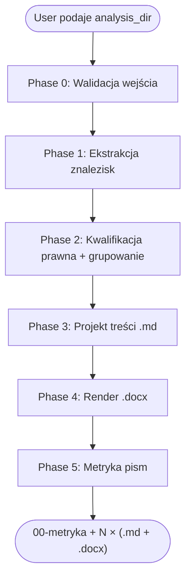

# Drafting PZP Letters (projekt pism proceduralnych PZP)

## Overview

Systematyczny workflow opracowywania pism proceduralnych kierowanych do wykonawcy w postępowaniu PZP na podstawie analizy oferty wygenerowanej skillem `analyzing-pzp-offers`. Skill wytwarza **serię pism** (co najmniej `.md` + `.docx` per pismo) osadzonych w szablonie EZD KG PSP (`wzor_pismo_przewodnie.docx`).

**Core principle:** Każde pismo ma **jedną jednorodną podstawę prawną** (art. Pzp). Nigdy nie mieszać trybu wezwania do wyjaśnień z trybem wezwania do uzupełnienia — to różne instytucje prawne z różnymi terminami i skutkami. Każde twierdzenie normatywne ma cytat — ustawy, SWZ lub oferty z lokalizacją (plik:strona).

**This is a technique skill.** Zaczynaj od Phase 0 (walidacja wejścia) — skill nie ma prawa generować pisma, którego nie ma w danych źródłowych.

> [!important] Aktualna podstawa prawna (stan na 2026-04-21)
> - **Ustawa Pzp:** Dz.U. 2019 poz. 2019; **tekst jednolity: Dz.U. 2024 poz. 1320** z nowelizacjami: 2025 r. poz. 620, 769, 794, 1165, 1173, **1235**; 2026 r. poz. 252.
> - **Nowelizacja 12.07.2026 r.** (Dz.U. 2025 poz. 1235) — wprowadza **certyfikację wykonawców** (nowy art. 128a). Dla postępowań wszczętych przed 12.07.2026 stosuje się przepisy dotychczasowe.
> - **Ustawa KSC:** Dz.U. 2026 poz. 20 i 252 — dla zamówień ICT.
> - Zawsze cytować: „ustawa z dnia 11 września 2019 r. — Prawo zamówień publicznych (Dz.U. 2024 poz. 1320 ze zm.)".

## When to Use

- User dostarcza **folder z raportem** wygenerowanym przez `analyzing-pzp-offers` (zawierający co najmniej `03-braki-i-niezgodnosci-<slug>.md` i `05-ocena-ryzyka-<slug>.md`) i prosi o opracowanie pism.
- User wprost prosi o konkretne pismo („napisz wezwanie do uzupełnienia JEDZ", „przygotuj informację o odrzuceniu oferty na podstawie art. 226 ust. 1 pkt 5").
- User podaje numer sprawy + wykonawcę i chce kolejny krok po analizie oferty.
- User chce projekt zawiadomienia o wyborze / unieważnieniu postępowania.

## When NOT to Use

- User nie ma jeszcze analizy oferty — **uruchom najpierw `analyzing-pzp-offers`** i wróć tu dopiero potem.
- Postępowania zagraniczne poza polskim PZP.
- Pisma nienormatywne (korespondencja bieżąca, zapytania pozaproceduralne) — one piszemy ad hoc, nie z automatu.
- User prosi o pismo, dla którego materiał źródłowy nie daje wystarczających podstaw prawnych — zamiast pisać „pusto", wypisz wprost „brak podstaw do wezwania / odrzucenia" z uzasadnieniem.

## Required Inputs — ZAWSZE dopytaj, jeśli brakuje

1. **`<analysis_dir>`** — absolute path do folderu z raportem analizy oferty. MUSI zawierać `03-braki-i-niezgodnosci-<slug>.md`. Jeśli nie zawiera — STOP, zaproponuj uruchomienie `analyzing-pzp-offers`.
2. **`<output_dir>`** — (opcjonalne, default: `<analysis_dir>/pisma/`) — folder docelowy dla pism.
3. **`<letter_date>`** — (opcjonalne, default: dzisiejsza data z kontekstu `currentDate`) — data pisma.
4. **`<signatory>`** — (opcjonalne, default: z auto-memory użytkownika; dla KG PSP: `Michał Kłosiński, Dyrektor Biura Informatyki i Łączności KG PSP, mł. bryg. mgr inż.`) — osoba podpisująca pismo. **Obligatoryjna adnotacja w metryce** jeśli użyto wartości domyślnej.
5. **`<announcement_dir>`** — (opcjonalne) — folder z oryginalną dokumentacją postępowania, do weryfikacji cytatów oferty/SWZ. Bez niego skill korzysta wyłącznie z cytatów już skatalogowanych w `06-cytaty-i-zrodla-<slug>.md` (jeśli dostępne).

Jeżeli user nie podał żadnej ścieżki — wypisz drzewostan katalogów nadrzędnych i zapytaj o konkretny folder. NIE zgaduj.

## Workflow



### Phase 0 — Walidacja wejścia

1. `ls -la <analysis_dir>` — sprawdź obecność `03-braki-i-niezgodnosci-*.md` i `05-ocena-ryzyka-*.md`.
2. Odczytaj frontmatter obu plików — wyciągnij `sygnatura`, `postepowanie`, `zamawiajacy`, `wykonawca`, `wykonawca_slug`.
3. Jeżeli brak `03-braki-i-niezgodnosci-*.md` → **STOP**. Komunikat: „Nie znaleziono pliku z analizą braków. Uruchom najpierw skill `analyzing-pzp-offers`."
4. Utwórz `<output_dir>` (`mkdir -p`) jeśli nie istnieje.
5. Jeśli nie podano `<signatory>` — użyj wartości z memory użytkownika (dla KG PSP: Michał Kłosiński, DBIŁ, mł. bryg. mgr inż.). Zaznacz ten fakt na liście adnotacji do `00-metryka-pism-<slug>.md`.

### Phase 1 — Ekstrakcja znalezisk

Z `03-braki-i-niezgodnosci-<slug>.md` wyciągnij, dla każdego callouta:
- **kod** (np. K2.1, K4.3, K7.4),
- **kategoria F** (F1, F2, F2p, F3, F3a, F4, F5, F5w, F6) — z nagłówka callouta,
- **cytat wymogu** — pierwsza sekcja „Wymóg:" / „Wymagania:" wewnątrz callouta,
- **cytat stanu faktycznego** — sekcja „Stan faktyczny" / „Stan faktyczny oferty",
- **podstawa prawna** — linia „Podstawa prawna:",
- **sugerowane działanie** — linia „Sugerowane działanie:".

Z `05-ocena-ryzyka-<slug>.md` wyciągnij: macierz prawdopodobieństw scenariuszy (pomaga w ocenie poziomu pewności) i sekwencję prawną (Krok 1–5) — używaj jej jako szablonu kolejności wysyłki pism w metryce.

**Red flag:** Jeśli kuszą cię uproszczenia („wiem co w tym jest") — NIE. Przeczytaj `03-braki-*.md` punkt po punkcie. Skill korzysta wyłącznie z literalnej treści callout-ów.

### Phase 2 — Kwalifikacja prawna i grupowanie

Zastosuj tabelę decyzyjną:

| Kategoria F | Typ pisma | Template | Podstawa prawna | Termin |
|-------------|-----------|----------|-----------------|--------|
| F1 (omyłka pisarska) | Z01 zawiadomienie o poprawie | `Z01-zawiadomienie-poprawa-omylki-pisarskiej.md` | art. 223 ust. 2 pkt 1 Pzp | Informacyjnie |
| F2 (JEDZ/podmiotowe ś.d.) | W01 wezwanie do uzupełnienia | `W01-wezwanie-uzupelnienie-podmiotowe.md` | art. 128 ust. 1 Pzp (z uwzględnieniem ograniczeń art. 128 ust. 3) | min. 5 dni |
| F2p (przedmiotowe ś.d.) | W02 wezwanie do uzupełnienia | `W02-wezwanie-uzupelnienie-przedmiotowe.md` | art. 107 ust. 2 Pzp (z uwzględnieniem wyłączeń art. 107 ust. 3) | min. 5 dni |
| F3 (wyjaśnienie treści oferty) | W03 wezwanie do wyjaśnień | `W03-wezwanie-wyjasnienia-tresci-oferty.md` | art. 223 ust. 1 Pzp | wyznaczony przez Zam. |
| F3 + cena RNC | W05 RNC | `W05-wezwanie-wyjasnienia-razaco-niska-cena.md` | art. 224 Pzp | min. 5 dni |
| F3 + podmiotowe ś.d. | W04 wyjaśnienia podmiotowe | `W04-wezwanie-wyjasnienia-podmiotowe.md` | art. 128 ust. 4 Pzp | min. 5 dni |
| F3 + tajemnica | W06 skuteczność zastrzeżenia | `W06-wezwanie-wyjasnienia-tajemnica.md` | art. 18 ust. 3 Pzp + art. 11 ust. 2 uznk | min. 5 dni |
| F3a (omyłka rachunkowa) | Z02 zawiadomienie | `Z02-zawiadomienie-poprawa-omylki-rachunkowej.md` | art. 223 ust. 2 pkt 2 Pzp | Informacyjnie |
| F3a (omyłka inna — niepowodująca istotnych zmian) | Z03 zawiadomienie | `Z03-zawiadomienie-poprawa-omylki-innej.md` | art. 223 ust. 2 pkt 3 + ust. 3 Pzp | 3 dni na sprzeciw |
| F4 (niezgodność z WZ) | **NAJPIERW** W03 wyjaśnienia; **potem** O01 odrzucenie (po ocenie) | dwa etapy | etap 1: art. 223 ust. 1; etap 2: art. 226 ust. 1 pkt 5 Pzp | — |
| F5 (inna przesłanka odrzucenia) | O01 informacja o odrzuceniu | `O01-informacja-odrzucenie.md` | art. 226 ust. 1 (parametryzowane) | niezwłocznie po decyzji |
| F5w (wykluczenie) | O02 informacja o wykluczeniu (**po sprawdzeniu self-cleaning tylko dla przesłanek objętych art. 110 Pzp**) | `O02-informacja-wykluczenie.md` | art. 108/109 Pzp + art. 5k rozp. 833/2014 + art. 7 ust. 1 ustawy antyrosyjskiej | niezwłocznie po decyzji |
| F6 (analiza prawna) | — (brak pisma; eskalacja) | — | — | — |

**Reguły grupowania (MANDATORY):**
1. Wszystkie F3 tego samego wykonawcy z art. 223 ust. 1 → **jedno** pismo W03 ze wszystkimi żądaniami wypunktowanymi.
2. Wszystkie F2 tego samego wykonawcy z art. 128 ust. 1 → **jedno** pismo W01.
3. Wszystkie F1 (omyłki pisarskie) tego samego wykonawcy → **jedno** pismo Z01 (chyba że omyłka dotyczy wzoru SWZ — wtedy tylko adnotacja w protokole, pismo fakultatywne).
4. Każda F5 / F5w → **osobne** pismo (odrzucenie ≠ wykluczenie to różne instytucje).
5. Pismo W02 (przedmiotowe ś.d.) NIE LEZY z W01 (podmiotowe ś.d.) — osobne pisma, osobne podstawy.
6. Pismo W03 NIE LEZY z W04 (art. 128 ust. 4 dotyczy wyłącznie podmiotowych ś.d.).
7. Pismo W05 (RNC) zawsze osobne — art. 224 Pzp jest samodzielny.
8. Pismo W06 (tajemnica) zawsze osobne.

**Reguły eskalacji:**
- **F4 → najpierw W03, nigdy od razu O01.** Treść W03 musi dać wykonawcy rzeczywistą możliwość wyjaśnienia. O01 pisze się dopiero po ocenie odpowiedzi jako osobną decyzję.
- **F5w → zawsze przed O02 zweryfikować self-cleaning (art. 110 Pzp) — ALE TYLKO dla przesłanek objętych art. 110 ust. 1 Pzp:** dotyczy wyłącznie art. 108 ust. 1 pkt 1, 2, 5 oraz art. 109 ust. 1 pkt 2-5, 7-10. **NIE DOTYCZY:** art. 108 ust. 1 pkt 3 (zaległości podatkowe), pkt 4 (zakaz ubiegania się), pkt 6 (konflikt interesów z konsultacji rynkowych), ust. 2 (beneficjent rzeczywisty); art. 109 ust. 1 pkt 1 (fakultatywne zaległości), pkt 6 (konflikt interesów art. 56 ust. 2); art. 5k rozp. 833/2014 i art. 7 ust. 1 ustawy antyrosyjskiej (sankcje międzynarodowe — self-cleaning niedopuszczalny). Dla przesłanek objętych art. 110 i przedstawionego self-cleaningu — **eskalacja do F6, nie generuj O02 automatycznie**. Dla pozostałych przesłanek — O02 bez analizy self-cleaning.
- **F2p (przedmiotowe ś.d.) → przed W02 sprawdź, czy SWZ przewiduje uzupełnianie (art. 107 ust. 2 Pzp).** Jeśli SWZ milczy — odrzucenie (O01, art. 226 ust. 1 pkt 5) zamiast W02. Wyjątek art. 107 ust. 3: jeśli ś.d. służy kryteriom oceny — zawsze odrzucenie, nigdy uzupełnienie.
- **F2 (podmiotowe ś.d. / JEDZ) → przed W01 sprawdź, czy uzupełnienie nie służy potwierdzeniu kryteriów selekcji (art. 128 ust. 3 Pzp).** Jeśli tak — W01 niedopuszczalne; zamiast tego odrzucenie z art. 226 ust. 1 pkt 2 lit. c lub analogiczne.

### Phase 3 — Projekt treści `.md` pisma

Dla każdego zgrupowanego zbioru znalezisk:

1. **Skopiuj** odpowiedni template z `templates/`.
2. **Wypełnij frontmatter** zgodnie z `templates/_frontmatter-base.md` — wszystkie pola obligatoryjne, żadnych placeholderów `<<…>>` w gotowym pliku.
3. **Treść** ma strukturę (każde pismo):
   - **Adres wykonawcy** (z oferty — formularz ofertowy, JEDZ, KRS). Jeśli nieznany → placeholder `<<adres — uzupełnić przed wysłaniem>>` + adnotacja w metryce.
   - **Sygnatura pisma zamawiającego + data + miejscowość** (Warszawa, `<data pisma>` r.)
   - **Sygnatura postępowania** — dosłowne brzmienie z ogłoszenia.
   - **Wstęp normatywny** — „Działając na podstawie art. … ustawy z dnia 11 września 2019 r. — Prawo zamówień publicznych (Dz.U. 2024 poz. 1320 ze zm.), zwanej dalej «ustawą Pzp» lub «Pzp», Zamawiający niniejszym …".
   - **Stan faktyczny** — per znalezisko: cytat wymogu (SWZ/OPZ/odpowiedzi na pytania) z `[DOC: plik] [Rozdz./pkt] [str.]` + cytat oferty z lokalizacją + ocena prawna.
   - **Żądanie** — punkt po punkcie, w imperatywie normatywnym („Wykonawca jest zobowiązany do: 1) przedłożenia …, 2) wyjaśnienia …").
   - **Termin odpowiedzi** — zgodnie z tabelą decyzyjną + zgodnie z SWZ. Doprecyzuj: „w terminie 5 dni od dnia otrzymania niniejszego wezwania, za pośrednictwem platformy zakupowej <URL platformy>".
   - **Pouczenie o skutkach** — literalny opis skutku (np. „Niezłożenie wyjaśnień lub złożenie wyjaśnień, które nie uzasadniają zgodności treści oferty z wymaganiami SWZ, skutkuje odrzuceniem oferty na podstawie art. 226 ust. 1 pkt 5 Pzp.").
   - **Podpis** — z danych `<signatory>`.
   - **Załączniki** — lista (jeśli dotyczy).
   - **Otrzymują** — wykonawca + a/a.
4. **Output:** plik `.md` w `<output_dir>/<KOD>-<typ>-<slug-wykonawcy>.md` (np. `W03-wyjasnienia-tresci-oferty-wasko.md`).
5. **Cytaty:** każde zdanie normatywne MUSI mieć źródło. Zero „wydaje się", „prawdopodobnie", „można przypuszczać".

### Phase 4 — Render `.docx`

Uruchom `scripts/render_docx.py` dla każdego `.md`:

```bash
python3 <skill_dir>/scripts/render_docx.py \
  --template /Users/mklosinski/Documents/GitHub/Legitymacje_OSP/OBSIDIAN/PROJEKTY/PZP/wzor_pismo_przewodnie.docx \
  --input <output_dir>/W03-wyjasnienia-tresci-oferty-wasko.md \
  --output <output_dir>/W03-wyjasnienia-tresci-oferty-wasko.docx
```

Skrypt:
- Kopiuje szablon.
- Wypełnia zakładki EZD: `ezdSprawaZnak`, `ezdDataPodpisu`, `ezdPracownikNazwa`, `ezdPracownikAtrybut1` (stanowisko), `ezdPracownikAtrybut2` (tytuł), `ezdPracownikAtrybut3` (imię/nazwisko), `ezdAutorWydzialOpis`.
- Podmienia placeholdery tekstowe: `$sygnatura pisma`, `$DataPodpisu`, `$stanowisko`, `$tytuł`, `$imię i nazwisko`, `[adresat]/[jednostka organizacyjna PSP z listy adresatów]`.
- Wstawia treść merytoryczną (wstęp + stan faktyczny + żądanie + termin + pouczenie) do akapitów body po adresacie (zachowuje styl „Normal" z szablonu).
- Uzupełnia sekcje „Załączniki:" i „Otrzymują:".
- NIGDY nie modyfikuje szablonu bazowego.

Szczegóły: `scripts/README-render.md`.

### Phase 5 — Metryka pism

Utwórz `<output_dir>/00-metryka-pism-<slug-wykonawcy>.md`:

```markdown
---
sygnatura_postepowania: BL-V.2371.3.2026
wykonawca: WASKO S.A.
wykonawca_slug: wasko
data_analizy: 2026-04-22
autor: claude@kg.straz.gov.pl
typ_dokumentu: metryka-pism
status: draft
tags:
  - pzp/metryka-pism
  - pzp/sygnatura/BL-V-2371-3-2026
  - pzp/wykonawca/wasko
---

# Metryka pism — WASKO S.A.

> [!warning] Signatory
> Signatory domyślny z memory (Michał Kłosiński, Dyrektor BIŁ KG PSP, mł. bryg. mgr inż.). 
> **Zweryfikuj przed podpisem** — w szczególności przy pismach, które ma podpisać zastępca, pełnomocnik kierownika jednostki lub radca prawny.

## Zestawienie pism

| # | Kod | Typ pisma | Podstawa prawna | Znaleziska | Termin | Pewność | Plik .md | Plik .docx |
|---|-----|-----------|-----------------|------------|--------|---------|----------|-----------|
| 1 | W03 | Wyjaśnienia treści oferty | art. 223 ust. 1 Pzp | K5.1, K5.2, K7.1-K7.6, K4.1, K4.2, K4.3 | 5 dni od doręczenia | wysoki | [[W03-wyjasnienia-tresci-oferty-wasko]] | W03-…docx |
| 2 | W01 | Uzupełnienie JEDZ | art. 128 ust. 1 Pzp | K2.1 | 5 dni od doręczenia | wysoki | [[W01-uzupelnienie-jedz-wasko]] | W01-…docx |
| 3 | Z01 | Poprawa omyłki pisarskiej | art. 223 ust. 2 pkt 1 Pzp | K1.F1.1, K1.F1.2 | Informacyjnie | wysoki | [[Z01-poprawa-omylki-wasko]] | Z01-…docx |

## Rekomendowana sekwencja wysyłki

1. **Krok 1 (równolegle):** Z01 (poprawa omyłek) + W01 (uzupełnienie JEDZ) + W03 (wyjaśnienia).
2. **Krok 2 (po otrzymaniu odpowiedzi WASKO):** ocena wyjaśnień F4 — decyzja o ewentualnym odrzuceniu (O01 art. 226 ust. 1 pkt 5).
3. **Krok 3 (jeśli WASKO najwyżej oceniony):** W07 (dokumenty na wezwanie, art. 126 Pzp, min. 10 dni).

## Powiązania

- [[03-braki-i-niezgodnosci-wasko]]
- [[05-ocena-ryzyka-wasko]]
- [[01-raport-glowny-wasko]]
```

## Citation Format (OBLIGATORYJNY)

Identyczny jak w `analyzing-pzp-offers`:

```
[DOC: <nazwa_pliku>] [Rozdz. <N>] [ust. <N>] [pkt <N>] [lit. <l>] [str. <N>]
```

W treści pisma cytat wygląda tak:

> Zgodnie z treścią SWZ: „8× 3,84 TB NVMe U.2 (RAID0 scratch)" `[DOC: Zał nr 1 do SWZ_OPZ.docx] [Część A] [pkt A.1] [str. 3]`. Wykonawca w ofercie zadeklarował: „8× 3,84 TB NVMe E1.S" `[DOC: Zał nr 1 do SWZ_OPZ_sig.pdf] [str. 3]`.

## Krytyczne reguły — BEZWZGLĘDNE

1. **Jedno pismo = jedna podstawa prawna.** Nigdy art. 223 ust. 1 razem z art. 128 ust. 1. Nigdy art. 107 ust. 2 razem z art. 128 ust. 1. Różne podstawy → różne pisma.
2. **Zero domniemań.** Jeśli materiał nie daje podstawy — „brak podstaw do wezwania / odrzucenia" + uzasadnienie. Nie produkuj pisma pro forma.
3. **F4 → najpierw W03, dopiero potem O01.** Nigdy nie odrzucaj bez uprzedniego umożliwienia wyjaśnień.
4. **F5w → obowiązkowa weryfikacja self-cleaning (art. 110 Pzp) przed O02.** Brak sprawdzenia = podstawa odwołania do KIO.
5. **F2p → weryfikacja SWZ pod kątem art. 107 ust. 2 (czy zamawiający przewidział uzupełnianie).** + weryfikacja art. 107 ust. 3 (wyjątki).
6. **Cytaty literalne.** Wszystko, co jest normatywne (wymóg SWZ, treść oferty, fragment ustawy), cytowane dosłownie z lokalizacją.
7. **Styl prawniczy, formalny.** 3. os. („Zamawiający wzywa"), imperatyw normatywny („Wykonawca jest zobowiązany"). Bez „wydaje się", „prawdopodobnie", „chyba".
8. **Termin w wezwaniu** zgodny z ustawą (art. 107 ust. 2 i art. 128 ust. 1 — min. 5 dni; art. 126 ust. 1 — min. 10 dni; art. 220 ust. 3 — nie krótszy niż 3 dni na przedłużenie TZO).

## Frontmatter dla pism `.md` (szablon)

```yaml
---
sygnatura_postepowania: BL-V.2371.3.2026
postepowanie: "B10: HPC/AI dla SOiA"
zamawiajacy: Komenda Główna Państwowej Straży Pożarnej
wykonawca: WASKO S.A.
wykonawca_slug: wasko
adres_wykonawcy: "ul. Berbeckiego 6, 44-100 Gliwice"
typ_pisma: wezwanie-wyjasnienia-tresci-oferty
kod_pisma: W03
podstawa_prawna:
  - "art. 223 ust. 1 ustawy z dnia 11 września 2019 r. — Prawo zamówień publicznych (Dz.U. 2024 poz. 1320 ze zm.)"
znaleziska_powiazane:
  - K5.1
  - K5.2
  - K7.2
sygnatura_pisma: "BL-V.2371.3.2026.W03"
data_pisma: 2026-04-22
miejscowosc: Warszawa
termin_odpowiedzi: "5 dni od doręczenia"
autor: claude@kg.straz.gov.pl
signatory_stanowisko: "Dyrektor Biura Informatyki i Łączności KG PSP"
signatory_tytul: "mł. bryg. mgr inż."
signatory_imie_nazwisko: "Michał Kłosiński"
signatory_zrodlo: memory  # memory | explicit
status: draft
poziom_pewnosci: wysoki  # wysoki | średni | niski
tags:
  - pzp/pismo/wezwanie
  - pzp/sygnatura/BL-V-2371-3-2026
  - pzp/wykonawca/wasko
---
```

## Naming Conventions

**Slug wykonawcy i slug sygnatury** — identyczne jak w `analyzing-pzp-offers` (transliteracja pl→ascii, lowercase, usunięcie form prawnych, myślnik jako separator).

**Kody pism (prefiksy):**
- `W01`–`W11` — Wezwania
- `Z01`–`Z05` — Zawiadomienia (poprawa omyłki, wybór oferty, unieważnienie)
- `O01`–`O02` — Odrzucenia / wykluczenia

**Pełna nazwa pliku:**

```
<output_dir>/
├── 00-metryka-pism-<slug-wykonawcy>.md
├── W01-uzupelnienie-jedz-<slug-wykonawcy>.md
├── W01-uzupelnienie-jedz-<slug-wykonawcy>.docx
├── W03-wyjasnienia-tresci-oferty-<slug-wykonawcy>.md
├── W03-wyjasnienia-tresci-oferty-<slug-wykonawcy>.docx
├── Z01-poprawa-omylki-<slug-wykonawcy>.md
└── Z01-poprawa-omylki-<slug-wykonawcy>.docx
```

## Callouts w `.md` pism

| Kontekst | Callout |
|----------|---------|
| Cytat dosłowny z ustawy/SWZ/oferty | `> [!quote]` |
| Żądanie wobec wykonawcy (wypunktowane) | `> [!info]` |
| Pouczenie o skutkach | `> [!warning]` |
| Termin odpowiedzi | `> [!important]` |
| Podstawa prawna (opcjonalna sekcja) | `> [!abstract]` |

## Common Mistakes

| Błąd | Poprawka |
|------|----------|
| „Wezwanie do uzupełnienia i wyjaśnień" (mieszana podstawa) | Osobne pisma: W01/W02 do uzupełnienia + W03/W04 do wyjaśnień |
| F4 → natychmiast O01 | F4 → NAJPIERW W03; O01 dopiero po ocenie wyjaśnień |
| Rekomendacja wykluczenia bez sprawdzenia self-cleaning | Zawsze przed O02 sprawdzić JEDZ/oświadczenia pod art. 110 Pzp |
| W02 bez weryfikacji SWZ pod art. 107 ust. 2 | Sprawdź, czy SWZ przewiduje uzupełnianie przedmiotowych ś.d. Jeśli nie → O01 |
| Termin „niezwłocznie" w wezwaniu | Termin konkretny (np. „5 dni od doręczenia") + odwołanie do platformy |
| Cytat bez lokalizacji | Zawsze `[DOC: plik] [str. N]` |
| „Wydaje się, że wykonawca zaniechał…" | „Wykonawca nie załączył dokumentu X, co potwierdza [DOC]…" |
| Pismo pro forma bez podstaw | „Brak podstaw do wezwania / odrzucenia" + uzasadnienie |
| Mieszanie adresata (zamawiający zam. wykonawcy) | Adresat zawsze wykonawca; „a/a" w sekcji „Otrzymują" |
| Placeholder `<<...>>` w gotowym pliku | Wszystkie wypełnione LUB sekcja usunięta jako „nie dotyczy" |
| Brak ostrzeżenia o signatory domyślnym | Obligatoryjny callout `[!warning]` w metryce |

## Red Flags — STOP and restart

- „Napiszę jedno pismo ze wszystkim" — NIE. Rozdziel wg podstawy prawnej.
- „Zintegruję wyjaśnienia + uzupełnienia w jednym piśmie (ekonomika procesowa)" — **NIE. To najczęstsza rationalizacja, która narusza art. 223 ust. 1 w relacji do art. 128 ust. 1 Pzp.** „Ekonomika procesowa" nie uzasadnia mieszania instytucji prawnych — to różne tryby, różne terminy (wezwanie do wyjaśnień wyznaczany przez zamawiającego; uzupełnienie min. 5 dni), różne skutki (wyjaśnienia nie zmieniają treści oferty; uzupełnienie zastępuje / dopełnia dokumenty). Osobne pisma.
- „F4 = odrzucenie, od razu O01" — NIE. Najpierw W03 (wyjaśnienia).
- „JEDZ jest negatywny, wykluczam" — NIE. Sprawdź self-cleaning.
- „SWZ pewnie przewiduje uzupełnianie przedmiotowych ś.d." — NIE. Zweryfikuj literalnie.
- „Termin 3 dni wystarczy" (dla art. 128 ust. 1) — NIE. Min. 5 dni.
- „Cytaty się domyślą" — NIE. Każde zdanie normatywne z lokalizacją.
- „Pominę cytowanie podstawy prawnej, wykonawca ją zna" — NIE. Pismo jest samodzielną czynnością proceduralną.
- „Wstawię wzmiankę o wadium / RNC / wyborze do wezwania W03" — NIE. Każdy z tych trybów jest samodzielny (art. 224, art. 253) i musi być w odrębnym piśmie.

## Supporting Files

- `legal-basis-catalog.md` — katalog podstaw prawnych per typ pisma (heavy reference).
- `letter-types.md` — tabela decyzyjna F→typ+template + reguły grupowania + przykłady.
- `templates/_frontmatter-base.md` — wspólny frontmatter YAML.
- `templates/W01`…`W11`, `Z01`…`Z05`, `O01`, `O02` — 18 templatów pism (9 kompletnych + 9 szkieletów).
- `scripts/render_docx.py` — render `.md` → `.docx` na szablonie EZD.
- `scripts/README-render.md` — dokumentacja skryptu.

## The Iron Law

**Każde pismo proceduralne = jedna podstawa prawna + jedno żądanie (lub zbiór żądań w tej samej instytucji prawnej) + wszystkie cytaty z lokalizacją.**

Mieszanie podstaw, generowanie pism pro forma, odrzucanie bez wyjaśnień — to podstawy odwołań do KIO i błędów proceduralnych. Skill nie ma prawa ich wprowadzać.
