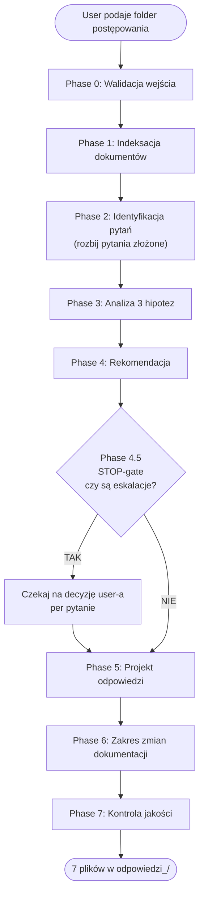

# Odpowiedzi na pytania wykonawców (Pzp)

## Overview

Systematyczny workflow przygotowania **projektu odpowiedzi Zamawiającego** na pytania wykonawców w postępowaniu o udzielenie zamówienia publicznego prowadzonym w reżimie ustawy z dnia 11 września 2019 r. — Prawo zamówień publicznych (Dz.U. 2024 poz. 1320 ze zm.). Skill produkuje komplet plików roboczych: indeks dokumentów, rejestr pytań, analizę w modelu trzech hipotez, finalne odpowiedzi do publikacji, wykaz zmian dokumentacji, raport ryzyk i wersję do akceptacji kierownika zamawiającego.

**Core principle:** Każda odpowiedź ma jednorodną podstawę prawną i zachowuje zasadę równego traktowania wykonawców. Nie można skonstruować odpowiedzi, która faktycznie eliminuje rozwiązania równoważne, uprzywilejowuje konkretnego wykonawcę, narusza pisemność postępowania albo zmienia charakter zamówienia bez kontroli skutków na ogłoszenie i termin składania ofert.

**This is a discipline skill.** Zaczynaj od Phase 0 (walidacja wejścia). Skill nie ma prawa wypisać odpowiedzi „pro forma" — jeżeli materiał nie daje podstaw, treść odpowiedzi brzmi: „Zamawiający podtrzymuje zapisy …" z krótkim uzasadnieniem normatywnym.

> [!important] Aktualna podstawa prawna (stan na 2026-04-27)
> - **Ustawa Pzp:** Dz.U. 2019 poz. 2019; **tekst jednolity: Dz.U. 2024 poz. 1320** z nowelizacjami 2025 r. poz. 620, 769, 794, 1165, 1173, 1235; 2026 r. poz. 252.
> - **Wyjaśnienia treści SWZ:** art. 135 Pzp (≥ progi unijne, DZIAŁ II) / art. 284 Pzp (< progi unijne, DZIAŁ III, tryb podstawowy).
> - **Zmiana SWZ:** art. 137 Pzp (≥ progi unijne) / art. 286 Pzp (< progi unijne).
> - **Pisemność postępowania:** art. 20 Pzp.
> - **Zasady udzielania zamówień:** art. 16 Pzp (przejrzystość, równe traktowanie, proporcjonalność, uczciwa konkurencja).
> - Zawsze cytować: „ustawa z dnia 11 września 2019 r. — Prawo zamówień publicznych (Dz.U. 2024 poz. 1320 ze zm.)".

## When to Use

- User dostarcza **folder postępowania** zawierający SWZ + pytania wykonawców (jeden lub kilka plików: pytania-1.docx, pytania-2.pdf, pytania_wykonawca_X.rtf, treść e-maila skopiowana do `pytania.md` itd.) i prosi o opracowanie odpowiedzi.
- User wprost prosi o konkretną odpowiedź („odpowiedz na pytanie X o równoważność procesora", „przygotuj wyjaśnienia SWZ na pytania z 22 kwietnia").
- User chce ujednolicić odpowiedzi, jeżeli pojawiły się rozbieżności między dwoma turami pytań.
- User chce projekt zbiorczego dokumentu „Wyjaśnienia treści SWZ" do publikacji na platformie zakupowej.

## When NOT to Use

- User nie ma jeszcze SWZ — przygotuj SWZ ręcznie (lub odeślij do zespołu opracowującego SWZ; ten skill nie generuje SWZ od zera).
- Pytanie nie pochodzi od wykonawcy w trybie art. 135 / art. 284 Pzp (np. zapytanie obywatelskie, pytanie kontrolne UZP, prośba o udostępnienie protokołu) — to wymaga osobnego trybu odpowiedzi.
- Odpowiedź wymagałaby istotnej zmiany charakteru zamówienia — eskalacja do **decyzji Zamawiającego** (komisja przetargowa + kierownik), nie automatyczna odpowiedź. (Wykrywane w trakcie — Phase 4.5 STOP-gate; dlatego nie jest to negative trigger pre-aktywacyjny.)
- Postępowania zagraniczne poza polskim Pzp.
- Weryfikacja oferty wykonawcy — użyj `analyzing-pzp-offers`.
- Pisma do wykonawcy (wezwania, odrzucenia) — użyj `drafting-pzp-letters`.

## Required Inputs — ZAWSZE dopytaj, jeśli brakuje

1. **`<folder_pzp>`** — absolute path do folderu postępowania. MUSI zawierać SWZ (lub Zaproszenie / Ogłoszenie) i co najmniej jeden plik z pytaniami wykonawców. Jeśli plików z pytaniami nie ma — STOP, wypisz „Nie znaleziono pliku z pytaniami wykonawców. Wskaż plik (np. `pytania-2026-04-22.docx`)".
2. **`<odpowiedzi_data>`** — (opcjonalne, default: dzisiejsza data z kontekstu `currentDate` w formacie `RRRR-MM-DD`) — używana do nazwy folderu wynikowego `odpowiedzi_<data>`.
3. **`<output_dir>`** — (opcjonalne, default: `<folder_pzp>/odpowiedzi_<data>/`) — folder docelowy.
4. **`<prog_unijny>`** — (opcjonalne, jeśli nieczytelny ze SWZ) — `tak` / `nie`. Decyduje, czy stosować art. 135/137 (≥ progi) czy art. 284/286 (< progi). Jeśli SWZ jasno wskazuje („postępowanie powyżej progów" / „tryb podstawowy") — wnioskuj automatycznie.
5. **`<termin_skladania_ofert>`** — (opcjonalne, ze SWZ) — data + godzina. Krytyczne do oceny, czy pytanie wpłynęło w terminie z art. 135 ust. 2 / art. 284 ust. 2 i czy odpowiedź wymaga przedłużenia terminu.
6. **`<sygnatura_postepowania>`** — (opcjonalne, ze SWZ) — np. `BL-V.2371.3.2026`.

Jeżeli user nie podał `<folder_pzp>` — wypisz drzewostan katalogów nadrzędnych i zapytaj o konkretny folder. NIE zgaduj.

## Workflow



**Exit criteria per faza** (mierzalny artefakt — nie przechodź dalej bez niego):

| Faza | Exit |
| --- | --- |
| 0 | SWZ + pytania potwierdzone (STOP, jeśli brak pytań); `<output_dir>` utworzony; metryka postępowania ustalona. **Utwórz `TodoWrite` z fazami 0–7.** |
| 1 | `00_indeks_dokumentow.md` z tabelą wszystkich dokumentów + oznaczeniem „zawiera Q&A". |
| 2 | `01_rejestr_pytan.md` — każde pytanie z obszarem (słownik) i statusem; pytania złożone rozbite na sub-pytania. |
| 3 | `02_analiza_hipotez.md` — 3 hipotezy per (sub-)pytanie z oceną skutków. |
| 4 | Rekomendowane stanowisko per pytanie + status eskalacji. |
| 4.5 | Wszystkie eskalacje rozstrzygnięte decyzją usera **albo** oznaczone „[w opracowaniu]" (Iron Law — bez zgadywania). |
| 5 | `03_odpowiedzi_dla_wykonawcow.md` — finalne odpowiedzi (formuła Zamawiającego, cytat pytania w całości, bez ujawnienia wykonawcy). |
| 6 | `04_zmiany_dokumentacji.md` — per zmiana: brzmienie stare/nowe + wpływ na termin/ogłoszenie + podstawa prawna. |
| 7 | Checklista jakości ✅ (Definition of Done); `05_raport_ryzyk.md` + `06_wersja_do_akceptacji.md` wytworzone; 0 placeholderów `<<…>>`. |

### Phase 0 — Walidacja wejścia

1. `ls -la <folder_pzp>` — sprawdź obecność SWZ + pytań wykonawców.
2. Jeśli nie znaleziono pytań — STOP. Komunikat: „Nie zidentyfikowano pliku z pytaniami wykonawców. Wskaż konkretny plik."
3. Utwórz `<output_dir>` (`mkdir -p`) jeśli nie istnieje.
4. Z SWZ wyciągnij: `<sygnatura_postepowania>`, `<termin_skladania_ofert>`, `<prog_unijny>` (≥ czy < progu unijnego), `<tryb>`, `<zamawiajacy>`.
5. Jeśli któregoś nie da się ustalić — adnotacja w `00_indeks_dokumentow.md` w sekcji „Decyzje Zamawiającego".

### Phase 1 — Indeksacja dokumentów

Przygotuj `00_indeks_dokumentow.md` zawierający tabelę dokumentów z `<folder_pzp>`:

| Plik | Rodzaj | Data | Znaczenie | Zawiera Q&A |
| --- | --- | --- | --- | --- |

**Rodzaje dokumentów do rozpoznania:**

- SWZ (Specyfikacja Warunków Zamówienia)
- OPZ (Opis Przedmiotu Zamówienia, zwykle jako Załącznik nr 1 do SWZ)
- Projekt umowy / projektowane postanowienia umowy (PPU)
- Formularz ofertowy / formularz cenowy
- Ogłoszenie o zamówieniu (BZP / TED)
- Pytania wykonawców (per tura: `pytania-N-<data>.docx` itp.)
- Wcześniejsze odpowiedzi Zamawiającego (`odpowiedzi-N-<data>.docx`)
- Modyfikacje SWZ (`modyfikacja-N-<data>.docx`)
- Załączniki techniczne (instrukcje, schematy, listy parametrów)
- Notatki, uzasadnienia, opinie, analizy, dokumenty robocze

**Sygnał „zawiera Q&A":** Plik zawiera nazewnictwo „Pytanie nr X / Odpowiedź" / „Pytanie wykonawcy / Wyjaśnienie" / sekcję „Wyjaśnienia treści SWZ".

> [!important] Pełną metodykę indeksacji + mapę dokumentów źródłowych PRAWO znajdziesz w `references/prawo-index.md`. Zawsze zapoznaj się z `references/prawo-index.md` przed Phase 2 — daje natychmiastowy podgląd, gdzie szukać kluczowych przepisów (zasady, OPZ, równoważność, środki dowodowe, terminy, umowy).

### Phase 2 — Identyfikacja pytań wykonawców

Wytwórz `01_rejestr_pytan.md` zawierający tabelę:

| Nr | Wykonawca | Plik źródłowy | Obszar | Dokument | Wymaga zmiany? | Status |
| --- | --- | --- | --- | --- | --- | --- |

**Pole „Obszar"** (jednorodne, słownik kontrolowany):

- `OPZ-parametr` — pytanie o parametr techniczny w OPZ
- `OPZ-rownowaznosc` — pytanie o rozwiązanie równoważne, normy, certyfikaty, znaki towarowe
- `SWZ-tresc` — pytanie o treść SWZ (jednostka redakcyjna, brzmienie)
- `SWZ-formalne` — pytanie formalne (sposób komunikacji, platforma, podpisy)
- `umowa-PPU` — pytanie o projektowane postanowienia umowy
- `kryteria-oceny` — pytanie o kryteria oceny ofert i ich wagi
- `warunki-udzialu` — pytanie o warunki udziału w postępowaniu
- `przedmiotowe-sd` — pytanie o przedmiotowe środki dowodowe (art. 104–107 Pzp)
- `podmiotowe-sd` — pytanie o podmiotowe środki dowodowe (art. 124–128 Pzp)
- `wykluczenie` — pytanie o podstawy wykluczenia (art. 108–111 Pzp + sankcje)
- `termin-skladania` — pytanie o termin składania ofert / związanie ofertą
- `termin-realizacji` — pytanie o termin wykonania zamówienia
- `odbiory-SLA` — pytanie o odbiory, SLA, gwarancje, rękojmię
- `licencje` — pytanie o licencje, prawa autorskie, IP
- `integracja` — pytanie o integrację z istniejącymi systemami
- `cyber-KSC` — pytanie o cyberbezpieczeństwo, KSC
- `inne` — wymaga doprecyzowania

**Pole „Status":**
- `odpowiedź przygotowana` — wszystkie cytaty znalezione, hipotezy przeanalizowane, rekomendacja sformułowana
- `wymaga decyzji Zamawiającego` — rekomendacja istnieje, ale wymaga zatwierdzenia kierownika z uwagi na skutki (zmiana SWZ z wpływem na termin, zmiana ogłoszenia, zmiana kryteriów)
- `wymaga konsultacji technicznej` — pytanie wymaga oceny merytorycznej eksperta technicznego (parametr, integracja, cyberbezpieczeństwo)
- `wymaga konsultacji prawnej` — pytanie generuje ryzyko odwoławcze trudne do oceny przez skill (np. niejednoznaczność interpretacyjna art. 99 ust. 5–6 Pzp)

**Identyfikacja pytań w pliku źródłowym:**

Pytania mogą być oznaczone:
- `Pytanie nr 1`, `Pytanie 1`, `Pyt. 1`
- `1.`, `1)` (wyliczenie numerowane)
- W treści e-maila bez numeracji — w takim wypadku **nadaj numerację skillowi**, np. `Q01`, `Q02`. W rejestrze użyj formatu `Q01-source` (np. `Q01-pytania-2026-04-22`).
- Wykonawcę ustal jeżeli pytania są podpisane (firma, NIP); w wersji publikowanej **nigdy nie ujawniaj** wykonawcy.

**Pytania złożone (wielowątkowe):**

Jeśli **jedno pytanie zawiera kilka odrębnych wniosków** (np. „Wnoszę o zmianę parametru OPZ + przedłużenie terminu + zmianę kary umownej") — **rozbij je na sub-pytania** w rejestrze:

- `Q07a` — wniosek o zmianę parametru OPZ
- `Q07b` — wniosek o przedłużenie terminu
- `Q07c` — wniosek o zmianę kary umownej

Każde sub-pytanie traktuj jako osobną analizę w Phase 3 (osobne 3 hipotezy, osobna rekomendacja). W finalnej odpowiedzi (`03_odpowiedzi_dla_wykonawcow.md`) cytuj **całą treść pytania w jednym bloku** `>`, ale odpowiedź ma **tyle akapitów, ile sub-pytań**, każdy zaczynający się od własnej formuły Zamawiającego (np. „Zamawiający dopuszcza zmianę parametru […]. Zamawiający nie wyraża zgody na zmianę kary umownej […]. Zamawiający dokonuje zmiany terminu składania ofert do dnia […]").

Reguła: **jeden wniosek = jedno rozstrzygnięcie**. Nie łączyć rozstrzygnięć w jedną wieloznaczną formułę.

### Phase 3 — Analiza w modelu trzech hipotez

Dla każdego pytania w `02_analiza_hipotez.md` przeprowadź analizę:

**Hipoteza 1 — odpowiedź negatywna, bez zmiany dokumentacji:**
- skutki prawne,
- skutki dla konkurencyjności (czy zawęża krąg wykonawców),
- skutki dla spójności dokumentacji,
- ryzyko odwoławcze (KIO),
- wpływ na termin składania ofert,
- czy wymaga zmiany SWZ / OPZ / umowy / ogłoszenia.

**Hipoteza 2 — odpowiedź pozytywna, z dopuszczeniem rozwiązania lub zmianą parametru:**
- jak wyżej + dodatkowo: czy zmiana zachowuje cel zamówienia, czy nie obniża istotnych wymagań jakościowych/bezpieczeństwa.

**Hipoteza 3 — odpowiedź kompromisowa, dopuszczająca rozwiązanie warunkowo albo przez doprecyzowanie wymagań:**
- jak wyżej + dodatkowo: na czym polega warunkowość, jakie kryterium równoważności, jakie doprecyzowanie OPZ.

> [!info] Pełną metodykę analizy 3 hipotez (kryteria oceny + przykłady decyzyjne per obszar) znajdziesz w `references/workflow-3-hipotez.md`. Sięgaj tam zawsze, gdy pytanie jest niestandardowe lub ocena pierwszego rzędu nie daje jednoznacznej rekomendacji.

### Phase 4 — Rekomendacja

W `02_analiza_hipotez.md` po trzech hipotezach dodaj sekcję **Rekomendowane stanowisko** z krótkim uzasadnieniem (3–5 zdań). Kryteria preferencji (kolejność malejąca):

1. zabezpiecza interes Zamawiającego,
2. zwiększa lub utrzymuje konkurencyjność,
3. nie obniża istotnych wymagań jakościowych, bezpieczeństwa lub funkcjonalnych,
4. jest spójne z dotychczasową dokumentacją,
5. minimalizuje ryzyko skutecznego odwołania,
6. nie powoduje niekontrolowanej zmiany charakteru zamówienia.

**Reguła konfliktowa:** Jeśli (1) i (2) są w konflikcie — preferuj (1). Jeśli (1) i (3) są w konflikcie — preferuj (3) i wskaż w raporcie ryzyk.

### Phase 4.5 — STOP-gate eskalacji (obowiązkowy)

> [!warning] Skill **NIE kontynuuje** automatycznie do Phase 5, jeżeli którekolwiek pytanie ma status `wymaga decyzji Zamawiającego`, `wymaga konsultacji prawnej` albo `wymaga konsultacji technicznej`.

**Procedura:**

1. Wypisz user-owi listę pytań eskalowanych z konkretnym opisem decyzji do podjęcia (per pytanie):

   ```
   STOP — przed wytworzeniem `03_odpowiedzi_dla_wykonawcow.md` wymagane decyzje/opinie:

   • Q07 [wymaga decyzji Zamawiającego]: Czy dopuszczasz skrócenie terminu realizacji do 75 dni?
     Skutek: zmiana § 2 umowy + przedłużenie terminu składania ofert o 6 dni (art. 137 ust. 6).
   • Q12 [wymaga konsultacji prawnej]: Pytanie o sankcje art. 5k rozp. 833/2014 — sprawa wykluczenia konsorcjum.
   • Q19 [wymaga konsultacji technicznej]: Integracja z EZD — wymaga oceny architekta.
   ```

2. Czekaj na **wyraźne potwierdzenie** user-a per pytanie (decyzja TAK/NIE/inna treść lub wskazanie eksperta).
3. Dopiero po otrzymaniu potwierdzeń — przejdź do Phase 5.

**Reguła Iron Law:** Skill **nie ma prawa wypełnić brakującej decyzji własną rekomendacją** i przedstawić ją jako gotową odpowiedź. Jeżeli user nie podejmie decyzji — pytanie pozostaje w `06_wersja_do_akceptacji.md` jako otwarta decyzja, a w `03_odpowiedzi_dla_wykonawcow.md` ma adnotację „[w opracowaniu — wymaga decyzji Zamawiającego]" zamiast treści odpowiedzi.

Wyjątek: dla pytań eskalowanych do `wymaga konsultacji technicznej`/`prawnej` Skill może wytworzyć **projekt rekomendacji** (np. „Projekt: Zamawiający dopuszcza […]") z wyraźną adnotacją „PROJEKT — wymaga akceptacji eksperta technicznego" — ale wciąż nie publikuje takiego projektu jako finalnej odpowiedzi.

### Phase 5 — Projekt odpowiedzi

W `03_odpowiedzi_dla_wykonawcow.md` napisz finalną odpowiedź per pytanie. Format:

```markdown
## Pytanie nr [numer]

> [pełna, dosłowna treść pytania wykonawcy]

**Odpowiedź:**

Zamawiający [informuje / wyjaśnia / wskazuje / dopuszcza / nie dopuszcza / dokonuje zmiany / podtrzymuje zapisy], że [treść odpowiedzi].

[opcjonalnie: krótkie uzasadnienie normatywne 1–2 zdania, jeśli wymagane przez treść pytania]
```

> [!important] Wymagany styl, formuły wprowadzające oraz kompletna lista zwrotów zakazanych — `references/style-guide.md`. Czytaj zawsze przed Phase 5. Niezgodność stylu = wadliwa odpowiedź proceduralna.

**Reguły obligatoryjne:**

1. **Pytanie cytuj w całości** w bloku cytatu Markdown (`>`). Bez parafrazy. Bez skracania.
2. **Każda odpowiedź zaczyna się od formuły Zamawiającego** (zob. `references/style-guide.md`).
3. **Bez ujawnienia wykonawcy w wersji publikowanej** — chyba że Zamawiający wymaga inaczej (adnotacja w `06_wersja_do_akceptacji.md`).
4. **Bez komentarzy doradczych** — odpowiedź jest czynnością proceduralną, nie konsultacją.
5. **Spójność terminologiczna z SWZ, OPZ i umową** — nie wprowadzaj nowych pojęć w odpowiedzi.
6. **Bez tworzenia nowych, niekontrolowanych wymagań** — jeżeli odpowiedź wymusza nowe wymaganie, MUSI być zsynchronizowana z `04_zmiany_dokumentacji.md`.

### Phase 6 — Zakres wymaganej zmiany dokumentacji

W `04_zmiany_dokumentacji.md` per każda odpowiedź skutkująca zmianą dokumentacji wypisz:

```markdown
### Zmiana #N — wynika z odpowiedzi na pytanie nr [numer]

**Dokument:** [SWZ / OPZ / Załącznik nr X / Projekt umowy / Formularz ofertowy / Ogłoszenie]
**Jednostka redakcyjna:** [Rozdział X.Y / § N ust. M / pkt N lit. a / Tabela N wiersz M]

**Dotychczasowe brzmienie:**

> „[…]"

**Nowe brzmienie:**

> „[…]"

**Wpływ na termin składania ofert:** [TAK — przedłużenie do dd.mm.rrrr godz. HH:MM / NIE]
**Wymaga zmiany ogłoszenia:** [TAK — Sekcja [N] / NIE]
**Podstawa prawna zmiany SWZ:** [art. 137 Pzp (≥ progi) / art. 286 Pzp (< progi)]
```

**Reguły terminowe (krytyczne):**

- **Postępowanie ≥ progi unijne (art. 135–137 Pzp):**
  - Pytanie wpłynęło **co najmniej 14 dni** przed terminem składania ofert → odpowiedź **niezwłocznie, nie później niż 6 dni** przed terminem (art. 135 ust. 2).
  - Pytanie wpłynęło **co najmniej 7 dni** przed terminem (procedura przyspieszona z art. 138 ust. 2 pkt 2) → odpowiedź **nie później niż 4 dni** przed terminem (art. 135 ust. 2).
  - Pytanie wpłynęło później → Zamawiający **nie ma obowiązku** odpowiedzieć ani przedłużyć terminu (**art. 135 ust. 5**) — ale może (i często powinien dla zachowania równego traktowania, art. 16).
  - Zamawiający spóźnił się z wyjaśnieniami w terminie z ust. 2 → **OBLIGATORYJNE przedłużenie terminu składania ofert** o czas niezbędny (**art. 135 ust. 3**) — sankcja ustawowa za spóźnienie.
  - Zmiana SWZ istotna dla sporządzenia oferty → **OBLIGATORYJNE przedłużenie terminu** o czas niezbędny (**art. 137 ust. 6** — bez ustawowego minimum dni).
  - Zmiana SWZ powodująca zmianę ogłoszenia → przekazanie ogłoszenia korygującego do UPUE (**art. 137 ust. 4**) + zakaz udostępnienia zmiany SWZ przed publikacją w DUUE z wyjątkiem 48h (**art. 137 ust. 5**).
  - Zmiana prowadziłaby do istotnej zmiany charakteru zamówienia → **unieważnienie postępowania** na podstawie art. 256 (**art. 137 ust. 7**).
- **Postępowanie < progi unijne, tryb podstawowy (art. 284 Pzp):**
  - Pytanie wpłynęło **nie później niż 4 dni** przed upływem terminu składania odpowiednio ofert albo ofert podlegających negocjacjom (jednolity termin dla wszystkich trybów art. 275) → odpowiedź **niezwłocznie, nie później niż 2 dni** przed terminem (art. 284 ust. 2).
  - Pytanie wpłynęło później → brak obowiązku (**art. 284 ust. 4**).
  - Zamawiający spóźnił się z wyjaśnieniami → **OBLIGATORYJNE przedłużenie terminu** (**art. 284 ust. 3**).
  - Zmiana SWZ istotna dla sporządzenia oferty → **OBLIGATORYJNE przedłużenie terminu** (**art. 286 ust. 3**).
  - Zmiana SWZ powodująca zmianę ogłoszenia → publikacja w BZP (**art. 286 ust. 9**, art. 267 ust. 2 pkt 6).

> [!warning] Każda zmiana mająca wpływ na krąg wykonawców (zniesienie wymagania, dopuszczenie równoważności, zmiana terminu realizacji) **prawie zawsze** wymaga przedłużenia terminu składania ofert. W razie wątpliwości — przedłuż.

> [!important] **Granica zmian SWZ (art. 137 ust. 7).** Jeżeli zmiana prowadziłaby do **istotnej zmiany charakteru zamówienia** w porównaniu z pierwotnie określonym — w szczególności do znacznej zmiany zakresu — Zamawiający **NIE może** dokonać zmiany SWZ, lecz unieważnia postępowanie (art. 256 Pzp). Granica „istotnej zmiany charakteru" = test KIO. Eskalacja: `wymaga konsultacji prawnej` + `wymaga decyzji Zamawiającego`.

### Phase 7 — Kontrola jakości i wytworzenie pozostałych plików

**Definition of Done — lista kontrolna przed zapisaniem** (skill nie deklaruje „gotowe" bez wszystkich ✅):

- [ ] Każda odpowiedź zaczyna się od formuły Zamawiającego.
- [ ] Każde pytanie zostało przytoczone w całości (cytat blokowy `>`).
- [ ] Odpowiedzi nie są sprzeczne z wcześniejszymi odpowiedziami (sprawdź `<folder_pzp>` pod kątem `odpowiedzi-*.docx` / `wyjasnienia-*.docx`).
- [ ] Każda zmiana dokumentacji wskazana jest w `04_zmiany_dokumentacji.md` z dotychczasowym i nowym brzmieniem.
- [ ] Wskazano wpływ zmian na termin składania ofert i na ogłoszenie.
- [ ] Odpowiedzi nie ujawniają źródła zapytania (chyba że Zamawiający wymaga inaczej — adnotacja w `06_wersja_do_akceptacji.md`).
- [ ] Zachowana jednolita terminologia z SWZ, OPZ i umową.
- [ ] Odpowiedzi nie tworzą nowych, niekontrolowanych wymagań poza zmianami z `04_zmiany_dokumentacji.md`.
- [ ] Odpowiedzi nie zmieniają charakteru zamówienia bez wskazania skutków.
- [ ] Wszystkie pliki wynikowe zapisane w `<output_dir>` z numeracją 00–06.
- [ ] Brak zwrotów zakazanych z `references/style-guide.md`.
- [ ] Brak placeholderów `<<…>>` w plikach finalnych (00–06).

**Następnie wytwórz:**

- `05_raport_ryzyk.md` — ryzyka prawne, proceduralne, techniczne, odwoławcze + sposób ograniczenia.
- `06_wersja_do_akceptacji.md` — zbiorczy dokument dla kierownika zamawiającego / komisji przetargowej:
  - liczba pytań,
  - liczba odpowiedzi pozytywnych / negatywnych / kompromisowych,
  - liczba odpowiedzi wymagających zmiany dokumentacji,
  - lista decyzji wymagających zatwierdzenia,
  - rekomendacja co do przedłużenia terminu składania ofert.

## Format wyniku — pliki w `<output_dir>`

| Plik | Treść | Czytelnik docelowy |
| --- | --- | --- |
| `00_indeks_dokumentow.md` | Indeks dokumentów postępowania | komisja przetargowa |
| `01_rejestr_pytan.md` | Tabela pytań z metadanymi | komisja, kierownik |
| `02_analiza_hipotez.md` | Analiza 3 hipotez per pytanie | komisja (wewnętrznie) |
| `03_odpowiedzi_dla_wykonawcow.md` | Finalne odpowiedzi do publikacji | wszyscy wykonawcy |
| `04_zmiany_dokumentacji.md` | Wykaz zmian SWZ/OPZ/umowy/ogłoszenia | komisja, BIŁ, BF |
| `05_raport_ryzyk.md` | Ryzyka i sposób ograniczenia | kierownik, radca prawny |
| `06_wersja_do_akceptacji.md` | Krótkie podsumowanie + lista decyzji | kierownik zamawiającego |

> [!important] Templates dla każdego z 7 plików — w `templates/`. Zaczynaj od skopiowania szablonu i wypełniania pól. NIE pisz od zera, jeśli template istnieje.

## Citation Format (OBLIGATORYJNY)

Każde twierdzenie normatywne ma cytat z lokalizacją:

```
[DOC: <nazwa_pliku>] [Rozdz. <N>] [§ <N>] [ust. <N>] [pkt <N>] [lit. <l>] [str. <N>]
```

W treści analizy hipotez i odpowiedzi:

> Zgodnie z OPZ: „[…]" `[DOC: Załącznik nr 1 do SWZ_OPZ.docx] [Część A] [pkt A.1] [str. 3]`. Wykonawca w pytaniu wskazuje: „[…]" `[DOC: pytania-2026-04-22.docx] [pyt. 7] [str. 4]`. Podstawa prawna: art. 99 ust. 4 ustawy z dnia 11 września 2019 r. — Prawo zamówień publicznych (Dz.U. 2024 poz. 1320 ze zm.).

W finalnej odpowiedzi do wykonawców (`03_odpowiedzi_dla_wykonawcow.md`) **nie używaj** cytatów `[DOC: …]` — stosuj normatywne odesłania (np. „pkt A.1 OPZ", „§ 5 ust. 3 projektu umowy"). Cytaty `[DOC: …]` zostawiaj w plikach roboczych (00, 01, 02, 04, 05).

## Mapowanie pytań na artykuły Pzp

**Załaduj `references/pzp-articles-map.md`** dla pełnej mapy obszar→artykuły (OPZ, równoważność, ś.d., wykluczenie, kryteria, umowa, wadium). Rdzeń terminowy (najczęstszy) poniżej:

| Obszar | Kluczowe artykuły | Uwaga |
| --- | --- | --- |
| Wyjaśnienia treści SWZ — termin | art. 135 / art. 284 | sprawdź czy ≥/< progi unijne |
| Zmiana SWZ | art. 137 / art. 286 | sprawdź wpływ na ogłoszenie |
| Termin składania ofert | **art. 135 ust. 3** / **art. 137 ust. 6** / **art. 284 ust. 3** / **art. 286 ust. 3** | przedłużenie obligatoryjne (zmiana SWZ istotna albo spóźnienie z wyjaśnieniami) |
| Równoważność / OPZ | art. 99 ust. 4–6 / art. 101–102 | obligatoryjne dopuszczenie równoważnych przy znaku towarowym / normie |

## Krytyczne reguły — BEZWZGLĘDNE

1. **Każda odpowiedź zaczyna się od formuły Zamawiającego.** Lista formuł (kompletna w `references/style-guide.md`, oparta na benchmarku faktycznych odpowiedzi KG PSP — częstotliwość per formuła z 37 odpowiedzi w postępowaniu BL-V.2371.4.2026):
   - „Zamawiający wskazuje, że …" (najczęstsza w KG PSP, ~30×)
   - „Zamawiający wyjaśnia, iż …"
   - „Zamawiający nie wyraża zgody na zmianę wymagania" / „… na dodanie …" / „… na wprowadzenie …" / „… na zastąpienie …" (odmowa modyfikacji)
   - „Zamawiający informuje, że …"
   - „Zamawiający dopuszcza …"
   - „Zamawiający nie dopuszcza …" (odmowa dopuszczenia konkretnego rozwiązania)
   - „Zamawiający potwierdza, że …" (potwierdzenie interpretacji)
   - „Zamawiający wymaga …"
   - „Zamawiający dokonuje zmiany …" / „Zamawiający dokonuje modyfikacji …"
   - „Zamawiający podtrzymuje zapisy …"

   **Reguła wyboru odmowy:** „nie wyraża zgody na zmianę" — gdy wykonawca wnosi o modyfikację warunku; „nie dopuszcza" — gdy wykonawca wnosi o dopuszczenie konkretnego rozwiązania; „podtrzymuje zapisy" — neutralne.

2. **Zero ujawnienia wykonawcy w wersji publikowanej.** W rejestrze (`01_rejestr_pytan.md`) — wykonawca może być wskazany do celów wewnętrznych. W odpowiedziach do publikacji (`03_odpowiedzi_dla_wykonawcow.md`) — anonimowo („Pytanie nr 7", bez nazwy).

3. **Spójność z wcześniejszymi odpowiedziami.** Jeżeli pytanie dotyczy kwestii już rozstrzygniętej — sprawdź wcześniejsze tury. W razie rozbieżności:
   - wskaż rozbieżność w `05_raport_ryzyk.md`,
   - zaproponuj bezpieczne ujednolicenie stanowiska,
   - **nie twórz odpowiedzi sprzecznej** z wcześniejszymi wyjaśnieniami bez wyraźnego sprostowania (odrębna formuła „Zamawiający dokonuje sprostowania wyjaśnień z dnia […]").

4. **Pisemność i pełnomocnictwo (art. 20 Pzp).** Odpowiedzi muszą być publikowane na platformie zakupowej / stronie postępowania. Skill produkuje wyłącznie projekt do publikacji — nigdy nie wysyła samodzielnie.

5. **Zasada równego traktowania wykonawców (art. 16 pkt 1 Pzp).** Odpowiedź pozytywna jednemu wykonawcy obowiązuje wszystkich. Skill NIE generuje odpowiedzi spersonalizowanych dla różnych wykonawców na to samo pytanie.

6. **Równoważność (art. 99 ust. 5–6, art. 101).** Jeśli OPZ wskazuje znak towarowy / normę / rozwiązanie konkretne, MUSI dopuszczać równoważność z opisem kryteriów. Skill nie ma prawa wytworzyć odpowiedzi, która faktycznie eliminuje rozwiązania równoważne, chyba że jest to obiektywnie uzasadnione (i prawidłowo opisane w OPZ).

7. **Przedmiotowe środki dowodowe (art. 107).** Przed odpowiedzią dopuszczającą uzupełnienie — sprawdź, czy SWZ przewiduje uzupełnianie (art. 107 ust. 2) i czy ś.d. nie służy kryterium oceny (art. 107 ust. 3 — uzupełnianie wykluczone).

8. **Podmiotowe środki dowodowe (art. 128).** Uzupełnienie tylko w trybie art. 128 ust. 1 (min. 5 dni). Wyjątek art. 128 ust. 3 (selekcja) — uzupełnianie wykluczone.

9. **Wykluczenie i self-cleaning (art. 110).** Tylko dla przesłanek z art. 110 ust. 1. NIE dotyczy: art. 108 ust. 1 pkt 3, 4, 6, ust. 2; art. 109 ust. 1 pkt 1, 6; sankcji międzynarodowych (art. 5k rozp. 833/2014, art. 7 ustawy antyrosyjskiej).

10. **Termin składania ofert.** Każda zmiana SWZ istotna dla sporządzenia oferty → obligatoryjne przedłużenie (**art. 137 ust. 6** ≥ progi / **art. 286 ust. 3** < progi). Spóźnienie Zamawiającego z wyjaśnieniami → obligatoryjne przedłużenie (**art. 135 ust. 3** ≥ progi / **art. 284 ust. 3** < progi). W razie wątpliwości — przedłuż.

11. **Granica zmian SWZ.** Zmiany prowadzące do istotnej zmiany charakteru zamówienia (art. 137 ust. 7) → **unieważnienie postępowania** (art. 256), nie zmiana SWZ. Eskalacja prawna obligatoryjna.

## Common Mistakes

| Błąd | Poprawka |
| --- | --- |
| „Dziękujemy za pytanie. Wyjaśniamy, że…" | Bezpośrednio od formuły: „Zamawiający wyjaśnia, że…". Bez podziękowań. |
| „Powyższe rozwiązanie jest technicznie wykonalne i zgodne z wymaganiami SWZ" | Konkretnie i normatywnie: „Zamawiający dopuszcza rozwiązanie polegające na X pod warunkiem zachowania parametru Y na poziomie nie niższym niż Z." |
| „Sugerujemy, aby Wykonawca…" | „Zamawiający informuje, że…" — Zamawiający nie sugeruje, on rozstrzyga. |
| „Dla uniknięcia wątpliwości…" | Skreśl. Odpowiedź albo coś rozstrzyga, albo nie. Frazy redundantne tylko otwierają pole interpretacyjne. |
| Odpowiedź dłuższa niż 5 zdań | Skróć. Odpowiedź urzędowa jest jednoznaczna i zwięzła. Uzasadnienia merytoryczne idą do `02_analiza_hipotez.md`. |
| Mieszanie w jednej odpowiedzi rozstrzygnięć dotyczących SWZ + umowy + OPZ | Jeśli pytanie obejmuje wiele dokumentów — odpowiedź ma 2–3 akapity, każdy zaczynający się od formuły, np. „Zamawiający informuje, że w zakresie OPZ […]. W zakresie projektu umowy Zamawiający dokonuje zmiany […]." |
| Brak wskazania, czy zmiana wpływa na termin / ogłoszenie | Każda zmiana dokumentacji w `04_zmiany_dokumentacji.md` MUSI mieć pole „Wpływ na termin" i „Wymaga zmiany ogłoszenia". |
| Ujawnienie wykonawcy w wersji publikowanej | W `03_odpowiedzi_dla_wykonawcow.md` — bezosobowe „Pytanie nr 7". Wykonawca tylko w roboczym `01_rejestr_pytan.md`. |
| Cytaty parafrazowane | W bloku `>` zawsze pełna, dosłowna treść pytania. |
| Odpowiedź pozytywna na pytanie o równoważność bez kryteriów równoważności | Doprecyzuj kryteria w `04_zmiany_dokumentacji.md` (zmiana OPZ). Nie zostawiaj „dopuszcza rozwiązania równoważne" bez katalogu kryteriów. |
| Sprzeczność z poprzednią turą Q&A bez sprostowania | Zawsze sprawdź wcześniejsze odpowiedzi. Sprostowanie ma własną formułę. |
| Brak adnotacji o decyzji wymagającej zatwierdzenia | Status `wymaga decyzji Zamawiającego` w `01_rejestr_pytan.md` + lista decyzji w `06_wersja_do_akceptacji.md`. |

## Anti-Rationalization — blokady na drogi-na-skróty

Riposta = **blokada, nie sugestia**.

| Wymówka | Riposta (blokada) |
| --- | --- |
| „Pytanie po terminie z art. 135 ust. 2 — pomijam" | Odrzucono. Sprawdź z perspektywy równego traktowania (art. 16 pkt 1) — brak obowiązku ≠ zakaz; często należy odpowiedzieć. |
| „Dopuszczę rozwiązanie X tylko temu wykonawcy" | Odrzucono. Każda odpowiedź pozytywna obowiązuje **wszystkich** (art. 16 pkt 1). |
| „Wystarczy odpowiedzieć w mailu" | Odrzucono. Pisemność postępowania (art. 20) + równe traktowanie = publikacja na platformie zakupowej. |
| „Skopiuję odpowiedź z innego postępowania" | Odrzucono. Każde postępowanie ma własną SWZ; analogia = inspiracja, nie gotowa treść. |
| „Pominę zmianę OPZ — wszyscy zrozumieją" | Odrzucono. Bez pisemnej zmiany OPZ wykonawcy opierają się na pierwotnym brzmieniu. |
| „Sprzeczność z wcześniejszą turą — udam, że jej nie ma" | Odrzucono. Sprostowanie z formułą „Zamawiający dokonuje sprostowania wyjaśnień z dnia […]". |
| „Dopuszczę produkt Y, bo wykonawca go zaproponował" | Odrzucono. Albo dopuszczasz wszystkie spełniające kryteria równoważności (z katalogiem), albo żadnego. |
| „Parametr SLA — odpowiem ad hoc" | Odrzucono. SLA, integracja, cyberbezpieczeństwo = `wymaga konsultacji technicznej` → eskalacja (Phase 4.5). |
| „Wypełnię brakującą decyzję własną rekomendacją" | Odrzucono. Iron Law Phase 4.5 — bez decyzji pytanie zostaje „[w opracowaniu]", nie zgadujesz za Zamawiającego. |

## Naming Conventions

**Folder wynikowy:** `<folder_pzp>/odpowiedzi_<RRRR-MM-DD>/` — pliki `00_…`–`06_…` jak w sekcji „Format wyniku" (numeracja `_` zachowana zgodnie z istniejącą konwencją plików roboczych).

**Numeracja pytań:** `Q01`, `Q02` itd. (z prefiksem `Q` aby uniknąć konfliktu z punktami SWZ). Jeśli pytania pochodzą z wielu plików — kontynuuj numerację (`Q01–Q05` z `pytania-1.docx`, `Q06–Q09` z `pytania-2.docx`).

**Frontmatter plików roboczych** — wzorzec w każdym `templates/0N_*.md`. Pola obligatoryjne: `sygnatura_postepowania`, `postepowanie`, `zamawiajacy`, `data_wyjasnien`, `typ_dokumentu` (indeks-dokumentow | rejestr-pytan | analiza-hipotez | odpowiedzi-publikacja | zmiany-dokumentacji | raport-ryzyk | akceptacja), `status`, `autor`, `prog_unijny` (tak|nie), `podstawa_prawna_terminu`, `tags` (`pzp/wyjasnienia`, `pzp/sygnatura/<slug>`).

## Supporting Files — reguły ładowania (Progressive Disclosure)

Reguła aktywacji L3: **imperatyw, nie decyzja modelu.**

| Warunek | Instrukcja |
| --- | --- |
| Przed **Phase 1** (indeksacja) | Załaduj `references/prawo-index.md` (mapa dokumentów źródłowych PRAWO: ustawa, regulamin KG PSP, szablony umów, zasady redakcji). |
| **Phase 3** — pytanie niestandardowe / brak jednoznacznej rekomendacji | Załaduj `references/workflow-3-hipotez.md` (metodyka 3 hipotez per obszar) i `references/pzp-articles-map.md` (pełna mapa artykułów). |
| Przed **Phase 5** (projekt odpowiedzi) | Załaduj `references/style-guide.md` (formuły, zwroty zakazane, przykłady). |
| **Phase 1, 3, 5, 7** — generujesz plik wynikowy | Skopiuj odpowiedni `templates/0N_*.md` (00–06) i wypełniaj pola. |

## Output (na zakończenie pracy)

Krótkie podsumowanie do user-a: liczba dokumentów i pytań (per plik źródłowy); rozkład odpowiedzi (pozytywne / negatywne / kompromisowe / podtrzymanie); liczba zmian dokumentacji; lista plików 00–06; lista decyzji Zamawiającego (z `06_wersja_do_akceptacji.md`); rekomendacja przedłużenia terminu składania ofert (TAK/NIE + nowa data).

## The Iron Law

**Każda odpowiedź = jednorodna podstawa prawna + jednoznaczne rozstrzygnięcie + cytat pytania w całości + spójność z dotychczasową dokumentacją + wskazanie skutku dla termin/ogłoszenie/dokumentacja.**

Odpowiedzi pro forma, parafrazowanie pytań, ukryte zmiany OPZ, sprzeczność z poprzednią turą Q&A, ujawnienie wykonawcy w wersji publikowanej — to podstawy odwołań do KIO i błędów proceduralnych. Skill nie ma prawa ich wprowadzać.
