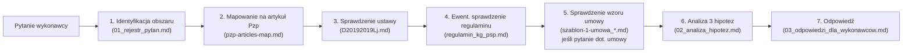

# Indeks dokumentów źródłowych PRAWO

Mapa **bazy wiedzy normatywnej** używanej przez skill `odpowiedzi-pytania` przy ocenie pytań wykonawców. Wszystkie pliki w `/Users/sq13pl/Documents/GH/Legitymacje_OSP/OBSIDIAN/PROJEKTY/PZP/PRAWO/`.

Jeśli pracujesz z innego komputera lub repo — sprawdź najpierw, czy ten katalog istnieje. Jeśli nie — eskaluj do user-a po lokalizację bazy.

## Szybka tabela

| Plik | Rodzaj | Rozmiar | Kiedy zaglądać |
| --- | --- | --- | --- |
| [`D20192019Lj.md`](#ustawa-pzp) | Ustawa Pzp (tekst jednolity) | ~742 KB / 11 516 linii | każde pytanie wymagające podstawy prawnej |
| [`regulamin_kg_psp.md`](#regulamin-kg-psp) | Regulamin wewnętrzny KG PSP | ~95 KB | pytania o procedurę wewnętrzną, parafowanie umowy, komisję przetargową |
| [`index_pzp.md`](#indeks-pzp) | Indeks dokumentów PZP w MOC | ~6 KB | szybkie odnalezienie powiązanych szablonów |
| [`zasady_redakcji.md`](#zasady-redakcji-ztp) | Zasady techniki prawodawczej (§ 54–63) | ~7 KB | pytania o jednostki redakcyjne SWZ/umowy/regulaminu |
| [`szablon-1-umowa_dostawa.md`](#szablon-umowy-dostawa) | Wzór umowy — dostawa | ~13 KB | pytania o klauzule umowne dla dostaw |
| [`szablon-1-umowa_usluga.md`](#szablon-umowy-usuga) | Wzór umowy — usługa | ~17 KB | pytania o klauzule umowne dla usług |
| [`wniosek_pow_130.md`](#wniosek-130k) | Wzór wniosku ≥ 130 000 zł | ~13 KB | pytania o tryb wszczęcia postępowania pełnego |
| [`wniosek_mniej_130.md`](#wniosek-130k) | Wzór wniosku < 130 000 zł | ~6 KB | pytania o procedurę uproszczoną |

---

## Ustawa Pzp

**Plik:** `D20192019Lj.md`
**Identyfikator:** ustawa z dnia 11 września 2019 r. — Prawo zamówień publicznych (Dz.U. 2024 poz. 1320 ze zm.)
**Pełna nazwa cytowania:** „ustawa z dnia 11 września 2019 r. — Prawo zamówień publicznych (Dz.U. 2024 poz. 1320 ze zm.)"

### Struktura (DZIAŁY i ROZDZIAŁY)

| Dział | Zakres | Istotne dla Q&A |
| --- | --- | --- |
| **DZIAŁ I** — Przepisy ogólne | art. 1–98 | **Zasady (art. 16–17), komunikacja (art. 61–67), dokumentowanie (art. 71–82)** |
| **DZIAŁ II** — Postępowanie ≥ progi unijne | art. 99–265 | **OPZ (art. 99–103), środki dowodowe (art. 104–128), wykluczenie (art. 108–111), wyjaśnienia/zmiana SWZ (art. 135–138), oceny i poprawa omyłek (art. 223–226)** |
| **DZIAŁ III** — Postępowanie < progi (tryb podstawowy) | art. 266–310 | **Wyjaśnienia/zmiana SWZ (art. 284–286)** |
| **DZIAŁ IV** — Szczególne instrumenty | art. 311–393 | umowa ramowa, DSZ, konkurs, usługi społeczne |
| **DZIAŁ V** — Zamówienia sektorowe | art. 394–438 | postępowania sektorowe |
| **DZIAŁ VI** — Obronność i bezpieczeństwo | art. 439–469 | tylko dla zamówień objętych art. 7 pkt 28 |
| **DZIAŁ VII** — Umowa | art. 431–472 | **klauzule obligatoryjne (art. 433, 436, 439), waloryzacja, podwykonawstwo** |
| **DZIAŁ VIII** — Środki ochrony prawnej | art. 505–590 | KIO, skarga do sądu |
| DZIAŁ IX — Pozasądowe rozwiązywanie sporów | art. 591–595 | mediacja, koncyliacja |
| DZIAŁ X — Kontrola | art. 596–622 | UZP, RIO, NIK |
| DZIAŁ XI — Organy właściwe | art. 467–504 | UZP, KIO, Prezes UZP |
| DZIAŁ XII — Kary pieniężne | art. 620–624 | sankcje administracyjne |
| DZIAŁ XIII — Przepisy końcowe | art. 625–632 | wejście w życie |

### Najczęściej cytowane artykuły (per obszar pytania)

| Obszar | Artykuł | Krótki opis |
| --- | --- | --- |
| Zasady udzielania zamówień | **art. 16** | przejrzystość, równe traktowanie, proporcjonalność, uczciwa konkurencja |
| Pisemność postępowania | **art. 20** | postępowanie pisemne; komunikacja przez platformę |
| OPZ | **art. 99** | szczegółowość, dokładność, zrozumiały sposób; ust. 4–6 — równoważność |
| Normy / certyfikaty | **art. 101** | obligatoryjne dopuszczenie norm równoważnych |
| Etykiety / certyfikaty | **art. 102** | dopuszczenie etykiet równoważnych |
| Przedmiotowe ś.d. | **art. 104–107** | art. 107 ust. 2 — uzupełnianie, ust. 3 — wykluczenie uzupełniania dla kryteriów oceny |
| Wykluczenie | **art. 108–109** | obligatoryjne i fakultatywne podstawy wykluczenia |
| Self-cleaning | **art. 110** | tylko dla wskazanych przesłanek |
| Warunki udziału | **art. 112–117** | proporcjonalność, sposób oceny |
| Podmiotowe ś.d. | **art. 124–128** | art. 128 ust. 1 — uzupełnianie min. 5 dni; ust. 3 — wykluczenie uzupełniania dla selekcji |
| Termin składania ofert | **art. 132** | min. terminy w trybie przetargu nieograniczonego (≥ progi) |
| **Wyjaśnienia SWZ ≥ progi** | **art. 135** | obowiązek odpowiedzi; ust. 2 pkt 1 — 6 dni; pkt 2 — 4 dni |
| Sankcja za spóźnienie z wyjaśnieniami | **art. 135 ust. 3** | obligatoryjne przedłużenie terminu |
| Brak obowiązku odpowiedzi | **art. 135 ust. 5** | gdy pytanie wpłynęło później |
| Publikacja wyjaśnień bez ujawnienia źródła | **art. 135 ust. 6** | obligatoryjna anonimizacja |
| **Zmiana SWZ ≥ progi** | **art. 137** | publikacja zmiany; ust. 6 — obligatoryjne przedłużenie terminu; ust. 7 — granica zmian (unieważnienie z art. 256) |
| Aukcja elektroniczna | art. 227–238 | gdy SWZ przewiduje aukcję |
| **Kryteria oceny ofert** | **art. 239–253** | nie zmieniać po wszczęciu, chyba że art. 137 |
| **Wyjaśnienia treści oferty** | **art. 223** | ust. 1 — wyjaśnienia, ust. 2 — poprawa omyłek |
| **Rażąco niska cena** | **art. 224** | min. 5 dni na wyjaśnienia |
| **Odrzucenie oferty** | **art. 226** | katalog przesłanek |
| Termin związania ofertą | **art. 220** | min. 30/60/90/120 dni; przedłużenie min. 3 dni |
| Wadium | art. 97–98 | wniesienie, formy, zwrot |
| **Wyjaśnienia SWZ < progi** | **art. 284** | ust. 2 — odpowiedź nie później niż 2 dni przed terminem |
| **Zmiana SWZ < progi** | **art. 286** | przedłużenie terminu, jeśli niezbędne |
| Klauzule obligatoryjne umowy | **art. 433, 436, 439** | termin zapłaty, kary umowne, waloryzacja |
| Zmiana umowy | art. 454–455 | istotne i nieistotne zmiany |
| Środki ochrony prawnej | art. 505–590 | KIO, terminy odwołania |

### Workflow wyszukiwania

1. Najpierw określ **obszar pytania** (z `01_rejestr_pytan.md`).
2. W tabeli wyżej znajdź artykuł.
3. `grep -n "^### Art\. <numer>" D20192019Lj.md` aby znaleźć linię.
4. Przeczytaj artykuł + ewentualne kolejne (art. 99 → 100 → 101 → 102 → 103 to spójna grupa o OPZ).

---

## Regulamin KG PSP

**Plik:** `regulamin_kg_psp.md`
**Identyfikator:** Regulamin planowania i udzielania zamówień publicznych w Komendzie Głównej Państwowej Straży Pożarnej
**Status:** projekt (wersja 2026-04). Uchyla decyzję nr 36 Komendanta Głównego PSP z 22 maja 2024 r.

### Struktura (15 rozdziałów)

1. Przepisy ogólne — § 1–4 (zakres, definicje, zasady)
2. Planowanie zamówień publicznych — plan zamówień
3. Przygotowanie postępowania — wniosek, OPZ, oszacowanie wartości
4. Zasady sporządzania, uzgadniania i podpisywania umów — **§ 18 (parafowanie projektu umowy)**
5. Zasady sporządzania SWZ, Zaproszenia, Ogłoszenia
6. Wszczęcie i prowadzenie postępowania
7. Zasady powołania i pracy komisji przetargowej
8. Postępowania < progów ustawowych (§ 2 ust. 1 pkt 2 lit. b i c)
9. Postępowania współfinansowane ze środków europejskich
10. Pozostałe czynności i zakończenie procedury
11. **Realizacja umowy — § 51–52**
12. Roczne sprawozdania o udzielonych zamówieniach
13. Odpowiedzialność za postępowanie
14. Odstępstwa od regulaminu
15. Postanowienia końcowe

### Kiedy cytować Regulamin (a nie tylko ustawę)

- Pytanie o podział kompetencji w KG PSP (komisja, kierownik, BIŁ, BF, Biuro Prawne).
- Pytanie o tryb wewnętrzny (parafowanie, akceptacja, podpisy).
- Pytanie o procedurę poniżej 130 000 zł (procedura uproszczona).
- Pytanie o zasady realizacji umowy w KG PSP (§ 51–52).
- Pytanie o roczne sprawozdania.

**Uwaga:** Regulamin jest aktem wewnętrznym i NIE może być powoływany jako podstawa prawna wobec wykonawcy. W odpowiedzi powołuj **wyłącznie ustawę Pzp**. Regulamin zostaje w `02_analiza_hipotez.md` jako wsparcie wewnętrzne.

---

## Indeks PZP

**Plik:** `index_pzp.md`
**Funkcja:** indeks dokumentów PZP w bazie MOC. Linki Obsidian (wikilinks) do wszystkich szablonów i dokumentów.

### Workflow

Plik typu „witryna" — z niego skacz do konkretnego dokumentu (np. `[[regulamin_kg_psp]]`, `[[szablon-1-umowa_dostawa]]`).

Zawiera:
- Spis dokumentów regulujących PZP w KG PSP.
- Strukturę regulaminu.
- Wzory wniosków (≥/< 130 000 zł).
- Wzory umów (dostawa / usługa).
- Workflow postępowania (mermaid).
- Checklist przed wszczęciem postępowania.

---

## Zasady redakcji ZTP

**Plik:** `zasady_redakcji.md`
**Identyfikator:** Zasady techniki prawodawczej, § 54–63 (oznaczanie i systematyzacja przepisów)
**Podstawa:** Rozporządzenie Prezesa Rady Ministrów

### Hierarchia jednostek redakcyjnych

```
artykuł (art.) → ustęp (ust.) → punkt (pkt) → litera (lit.) → tiret → podwójne tiret
rozdział → oddział → dział → tytuł (→ księga → część w kodeksie)
```

### Schemat powoływania przepisu

```
„art. 99 ust. 4 pkt 1 lit. a tiret pierwsze ustawy z dnia 11 września 2019 r. — Prawo zamówień publicznych (Dz.U. 2024 poz. 1320 ze zm.)"
```

### Kiedy używać

- Pytanie o brzmienie konkretnej jednostki redakcyjnej SWZ.
- Pytanie o numerację paragrafów umowy.
- Stylizacja `04_zmiany_dokumentacji.md` — pole „Jednostka redakcyjna" ma być zgodne z ZTP.

---

## Szablon umowy — dostawa

**Plik:** `szablon-1-umowa_dostawa.md`
**Funkcja:** wzór umowy na dostawę / dostawy (jednorazowe i sukcesywne).

### Struktura paragrafów

| § | Tytuł | Krytyczne klauzule |
| --- | --- | --- |
| § 1 | Przedmiot umowy i zasady realizacji | wniesienie, koszt i ryzyko Wykonawcy, protokół odbioru |
| § 2 | Czas trwania umowy | data / wyczerpanie kwoty |
| § 3 | Osoby upoważnione do realizacji | dane przedstawicieli stron |
| § 4 | Wartość umowy | wartość maksymalna, ceny jednostkowe |
| § 5 | Warunki płatności | termin (z art. 433 pkt 1 Pzp — max 30 dni) |
| § 6 | Kary umowne | zwłoka, niezgodność jakościowa, odstąpienie |
| § 7+ | Gwarancja, rękojmia, klauzule szczególne | zależnie od przedmiotu |

### Kiedy używać

Pytanie o klauzule umowne dla dostaw — porównaj projekt umowy w `<folder_pzp>` ze wzorem KG PSP.

---

## Szablon umowy — usługa

**Plik:** `szablon-1-umowa_usluga.md`
**Funkcja:** wzór umowy na usługę / usługę powtarzającą się / usługę ciągłą.

### Struktura paragrafów

Analogiczna do umowy dostawy, z różnicami:
- § 1 — usługa jednorazowa / powtarzająca / ciągła
- § 6 — kary umowne za zwłokę i jakość usługi
- klauzule SLA mogą być w §§ 7–10 (zależnie od projektu)

### Kiedy używać

Pytanie o klauzule SLA, gwarancje wykonania, terminy realizacji usług ciągłych.

---

## Wniosek ≥ 130 000 zł

**Plik:** `wniosek_pow_130.md`
**Identyfikator:** Załącznik nr 2 do Regulaminu — Wniosek o wszczęcie postępowania
**Próg:** zamówienie ≥ 130 000 zł netto (pełna procedura ustawowa)

### Zawiera

- Dane Zamawiającego.
- Przedmiot zamówienia.
- Wartość szacunkowa (art. 28–36 ustawy Pzp).
- OPZ jako załącznik.
- Warunki udziału.
- Kryteria oceny ofert.
- Termin realizacji.
- Skład komisji przetargowej.

### Kiedy cytować

Pytanie o procedurę wewnętrzną wszczęcia postępowania (rzadko publikowane wykonawcom, raczej w `02_analiza_hipotez.md`).

---

## Wniosek < 130 000 zł

**Plik:** `wniosek_mniej_130.md`
**Identyfikator:** Załącznik nr 3 do Regulaminu — Wniosek o wszczęcie postępowania (procedura uproszczona)
**Próg:** zamówienie < 130 000 zł (oraz < 80 000 zł / 50 000 zł dla projektów UE)

### Zawiera

- Procedurę uproszczoną (min. 3 wykonawców).
- Bez stosowania ustawy Pzp.
- Z zachowaniem zasad: celowość, oszczędność, najlepsze efekty.

### Kiedy cytować

W tym skillu **rzadko** — pytania w odpowiedziach na pytania wykonawców dotyczą postępowań prowadzonych w reżimie ustawy. Procedura uproszczona zwykle nie generuje pytań formalnych.

---

## Workflow integracji bazy PRAWO ze skillem



## Zasady cytowania w plikach skilla

**W plikach roboczych (01, 02, 04, 05):**

```
[DOC: D20192019Lj.md] [art. 135 ust. 2 pkt 1] — obowiązek odpowiedzi nie później niż 6 dni przed terminem
[DOC: regulamin_kg_psp.md] [§ 18] — parafowanie projektu umowy
[DOC: szablon-1-umowa_dostawa.md] [§ 5 ust. 1] — termin płatności
```

**W odpowiedziach do publikacji (03):**

```
„zgodnie z art. 135 ust. 2 pkt 1 ustawy Pzp"
„zgodnie z brzmieniem § 5 ust. 1 projektu umowy"
„zgodnie z pkt A.1 OPZ"
```

NIE używaj `[DOC: …]` w `03_odpowiedzi_dla_wykonawcow.md` — wykonawca nie potrzebuje wiedzieć, jak Zamawiający zorganizował swoją bazę wiedzy. Stosuj normatywne odesłania.

## Aktualizacja bazy

Jeśli ustawa Pzp zostanie znowelizowana — sprawdź:
1. Czy plik `D20192019Lj.md` w PRAWO/ został zaktualizowany (data w frontmatterze, nowe Dz.U.).
2. Czy frontmatter w SKILL.md tego skilla wymaga zmiany sekcji „Aktualna podstawa prawna".

Skill **nie aktualizuje** bazy PRAWO automatycznie — to robi BIŁ KG PSP / BF WZP po publikacji ujednoliconego tekstu w Dz.U.
