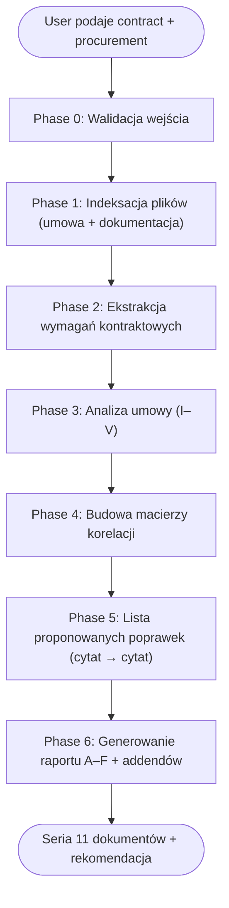

# Weryfikacja projektu umowy w reżimie PZP (kontrola przed podpisaniem)

## Overview

Systematyczny workflow pogłębionej analizy projektu umowy (lub projektowanych postanowień umowy — PPU) w postępowaniu PZP z perspektywy zamawiającego publicznego. Skill wytwarza **serię dokumentów analitycznych w Obsidian Flavored Markdown**, których centralnym produktem jest `05-proponowane-poprawki-<slug-sprawy>.md` — **dla każdej wykrytej wady: cytat obecnego brzmienia + cytat proponowanego brzmienia + uzasadnienie prawne/operacyjne**.

**Core principle:** Każde ustalenie ma podstawę w konkretnej jednostce redakcyjnej projektu umowy (§ / ust. / pkt / lit. / załącznik) i konkretnym dokumencie postępowania. Nie „wydaje się", nie „prawdopodobnie". Albo cytat + wniosek, albo „nie można potwierdzić na podstawie przekazanych dokumentów". Wszystkie modyfikacje SWZ / odpowiedzi na pytania są **nadrzędne** wobec pierwotnego brzmienia SWZ i OPZ w zakresie objętym zmianą; to samo dotyczy projektu umowy — wersja po modyfikacjach jest wiążąca.

**This is a technique skill.** Stosuj fazy kolejno — nie wolno pominąć Phase 1 (indeksacja). Bez audit trail analiza nie ma wartości przy kontroli / sporze / odwołaniu do KIO.

> [!important] Aktualna podstawa prawna (stan na 2026-04-22)
> **Ustawa Pzp:** tekst jednolity **Dz.U. 2024 poz. 1320** ze zm. (nowele 2025 poz. 620/769/794/1165/1173/1235; 2026 poz. 252). Autorytatywny tekst w repo: [[D20192019Lj]] — **każdy cytat art. Pzp weryfikuj literalnie** przeciw temu plikowi.
> **Pełny katalog podstaw prawnych umowy** (art. 431–465 Pzp, k.c., RODO, KSC, pr.aut., ustawa o terminach zapłaty) — **załaduj `references/legal-basis-catalog.md`** przed Phase 2.

## When to Use

- User przekazuje projekt umowy (`.docx` / `.pdf` / `.md`) + folder z dokumentacją postępowania (SWZ, OPZ, oferta, pisma z odpowiedziami) i prosi o weryfikację przed podpisaniem.
- User pisze: „sprawdź projekt umowy", „zweryfikuj wzór umowy", „przeanalizuj PPU", „czy umowa jest zgodna z SWZ", „czy można podpisać w tej wersji", „audyt umowy przed zawarciem", „kontrola umowy w reżimie PZP".
- User wskazuje, że trwa etap **po wyborze oferty, przed podpisaniem umowy** — klasyczny moment do kontroli kontraktowej.
- User wskazuje sygnaturę postępowania i prosi o ocenę gotowości do podpisania umowy.
- User chce listę konkretnych poprawek z cytatami oryginału i proponowanym brzmieniem — **to kluczowa funkcja skilla**.

## When NOT to Use

- Umowy poza reżimem PZP (np. umowy cywilnoprawne nieobjęte PZP, umowy wewnętrzne jednostki, darowizny, porozumienia międzygminne) — użyj ogólnej analizy kontraktowej.
- Umowy już zawarte — tu wchodzi w grę analiza aneksu, zmiany umowy (art. 454–455 Pzp) albo odstąpienia (art. 456 Pzp), co wymaga odrębnego podejścia.
- Analiza samego SWZ / OPZ bez projektu umowy — tu użyj `analyzing-pzp-offers` jeśli chodzi o ofertę, albo wykonaj samodzielny audyt SWZ (inna metodyka).
- Generowanie pism do wykonawcy (informacja o wyborze, wezwania) — to robi `drafting-pzp-letters`.
- Wstępny szkic umowy przed publikacją SWZ (tu robimy redakcję konstrukcyjną, a nie weryfikację formalną).

## Required Inputs — ZAWSZE dopytaj, jeśli brakuje

Zanim rozpoczniesz cokolwiek innego, potwierdź z userem:

1. **`<contract_path>`** — absolute path do pliku projektu umowy (`.docx` / `.pdf` / `.md`) **albo** folderu zawierającego wyłącznie projekt umowy wraz z załącznikami do umowy.
2. **`<procurement_dir>`** — absolute path do folderu z dokumentacją postępowania: SWZ, OPZ, ogłoszenie, pisma z wyjaśnieniami i zmianami SWZ, oferta wybranego wykonawcy (formularz ofertowy + załączniki), harmonogram, załączniki techniczne/proceduralne/odbiorowe.
3. **`<output_dir>`** — (opcjonalne, default: `<procurement_dir>/weryfikacja-umowy-<slug-sygnatury>-<yyyy-mm-dd>/`) — folder docelowy dla raportów.
4. **`<autor_analizy>`** — (opcjonalne, default z kontekstu `userEmail` w CLAUDE.md / auto-memory; dla KG PSP: `claude@kg.straz.gov.pl` lub `mklosinski@kg.straz.gov.pl`).
5. **`<analysis_dir>`** — (opcjonalne) — folder z uprzednią analizą oferty (raport z `analyzing-pzp-offers`). Jeśli dostępny — wykorzystaj `03-braki-i-niezgodnosci-*.md` i `06-cytaty-i-zrodla-*.md` jako materiał referencyjny i spójnościowy.
6. **`<zadania_md>`** — (opcjonalne) — plik `.md` z indywidualnymi uwagami usera (np. „zwróć uwagę na klauzulę gwarancji", „sprawdź, czy waloryzacja jest zgodna z ofertą"). Traktować jako pomocniczy prompt, nie jako dokument postępowania.

Jeżeli user nie podał ścieżek: wypisz aktualny drzewostan katalogów nadrzędnych i zapytaj o konkretne foldery. **NIE zgaduj.**

Jeżeli brak wyraźnego wskazania pliku umowy — **zapytaj usera o konkretny plik**. Przykład: folder `PROJEKTY/PZP/xxx/` może zawierać wiele wersji umowy; zawsze potwierdź, którą analizujesz.

## Workflow



**Exit criteria per faza** (mierzalny artefakt — nie przechodź dalej bez niego):

| Faza | Exit |
| --- | --- |
| 0 | `<contract_path>` jednoznacznie potwierdzony (STOP przy wielu wersjach); dokumenty kluczowe w `<procurement_dir>` rozpoznane; `<output_dir>` utworzony. **Utwórz `TodoWrite` z fazami 0–6.** |
| 1 | `index-umowa.md` (każdy § + załącznik) + `index-dokumentacja-postepowania.md` (każdy plik ≥2–3 zdania). |
| 2 | Katalog wymagań kontraktowych z źródłem (dokument+rozdz.+str.) i brzmieniem po modyfikacjach. |
| 3 | Każde znalezisko sklasyfikowane (P1–P7 + R1–R4) z cytatem i podstawą prawną zweryfikowaną przeciw [[D20192019Lj]]. |
| 4 | `04-macierz-korelacji-<slug>.md` — zapis umowy ↔ dokument ↔ status (≥10 obszarów). |
| 5 | `05-proponowane-poprawki-<slug>.md` — per P-XXX: cytat oryginału + pełne brzmienie proponowane + uzasadnienie (kluczowy produkt). |
| 6 | Komplet 11 dokumentów (Definition of Done) + jednoznaczna rekomendacja w `07-wnioski-koncowe`; 0 placeholderów `<<…>>`. |

### Phase 0 — Walidacja wejścia

1. `ls -la` na obu ścieżkach; wypisz strukturę (włącznie z załącznikami ZIP, XAdES, podpisami zewnętrznymi).
2. Potwierdź, że `<contract_path>` wskazuje konkretny plik lub folder z projektem umowy — jeżeli znalazłeś kilka plików z wyglądu kandydujących (np. „Umowa wersja 3.docx", „Umowa_po_uwagach_radcy.docx"), **STOP. Zapytaj usera**, który jest wersją wiążącą do analizy.
3. Zidentyfikuj obecność dokumentów kluczowych w `<procurement_dir>`:
   - **Obligatoryjnie:** ogłoszenie, SWZ, OPZ, projektowane postanowienia umowy (PPU) w pierwotnym brzmieniu — jeśli istnieje odrębnie od projektu umowy — często oznaczane jako „Załącznik nr X do SWZ — wzór umowy" / „Załącznik — PPU".
   - **Jeżeli dotyczy:** oferta (formularz ofertowy + karta oceny oferowanych parametrów), pisma z wyjaśnieniami i modyfikacjami SWZ (chronologicznie), harmonogram, załączniki techniczne, protokoły negocjacji (dla trybów negocjacyjnych), informacja o wyborze oferty.
4. Jeżeli `<contract_path>` wskazuje `.docx` / `.pdf` — konwertuj przez skill `convert` do `.md` (patrz Phase 1) **zanim** rozpoczniesz Phase 2.
5. Sprawdź czy `<procurement_dir>` zawiera pliki z notatkami usera (`ZADANIE.md`, `notatki.md`, `uwagi.md`, `oczekiwania.md`) — jeśli tak, **przeczytaj je PRZED Phase 2**. Te pliki NIE są dokumentami postępowania (nie cytujesz ich jako źródło prawne), ale wskazują na czym user chce się skupić.
6. Jeżeli wykryjesz **archiwum ZIP** (np. z załącznikami): zapytaj usera o rozpakowanie albo czy zawartość jest już w podfolderze.
7. Jeżeli wykryjesz **plik podpisu zewnętrznego** (`.XAdES`, `.sig`, `.p7s`) bez pliku źródłowego — **STOP. Zapytaj usera**, czy to błąd kompletacji materiału, czy faktyczny brak podpisywanego dokumentu.
8. Utwórz `<output_dir>` jeśli nie istnieje (`mkdir -p`).

### Phase 1 — Indeksacja plików (ZAWSZE pierwsza — nigdy nie pomijać)

**Cel:** dla każdego pliku tworzysz rekord: nazwa + typ + rola w postępowaniu + kluczowe parametry (strony, daty, kwoty, podmioty).

**Wykonanie:**

- **Index A — `<output_dir>/index-umowa.md`** — szczegółowy rozkład projektu umowy z listą paragrafów/ustępów/punktów i załączników. Dla każdego paragrafu: tytuł i jednozdaniowe streszczenie. Dla każdego załącznika: czy faktycznie fizycznie istnieje w przekazanym materiale, czy tylko zawołany w treści umowy.
- **Index B — `<output_dir>/index-dokumentacja-postepowania.md`** — spis całej dokumentacji postępowania (ogłoszenie, SWZ, OPZ, pisma, oferta, harmonogram). Dla każdego pliku co najmniej 2–3 zdania opisu: tytuł właściwy, data, wersja, strony, kluczowe parametry.

Format indexów — patrz `templates/index-umowa.md` i `templates/index-dokumentacja-postepowania.md`.

**Red flag — STOP:** jeżeli chcesz pominąć indeksację bo „umowa jest krótka" — to sygnał, że zaczynasz domniemywać. Wróć i odczytaj pliki.

### Phase 2 — Ekstrakcja wymagań kontraktowych z dokumentacji postępowania

> [!danger] PRECONDITION CHECK — STOP, jeśli nie zachodzi
> Zanim zaczniesz Phase 2, **bezwzględnie sprawdź**:
> 1. Czy `<output_dir>/index-umowa.md` istnieje i ma opis KAŻDEGO paragrafu projektu umowy oraz KAŻDEGO załącznika?
> 2. Czy `<output_dir>/index-dokumentacja-postepowania.md` istnieje i ma opis KAŻDEGO pliku w `<procurement_dir>`?
>
> **Jeśli NIE — wróć do Phase 1.** Pod żadnym pozorem nie rozpoczynaj Phase 2 bez ukończonych indeksów. Brak indeksów = **nieważna analiza** (brak audit trail).

Zbuduj **katalog wymagań kontraktowych** wynikających z dokumentacji postępowania. Dla każdej kategorii poniżej odszukaj w SWZ/OPZ/PPU/ofercie źródło wymogu i zapisz w `<output_dir>/wymagania-kontraktowe.md` (plik roboczy, niekoniecznie produkcyjny):

| Obszar kontraktowy | Typowe źródło | Co sprawdzić |
|--------------------|---------------|--------------|
| Strony umowy + reprezentacja | Ogłoszenie, SWZ, oferta (formularz) | Zgodność nazw, NIP, REGON, KRS, umocowania |
| Przedmiot umowy | SWZ Rozdz. „Opis przedmiotu zamówienia", OPZ | Zakres rzeczowy, zakres usług, ilość, części |
| Termin realizacji | SWZ Rozdz. „Termin wykonania", harmonogram, oferta | Daty graniczne, etapy, kamienie milowe |
| Wynagrodzenie i płatności | SWZ Rozdz. „Wynagrodzenie / płatności", oferta (cena) | Model rozliczeń (ryczałt / obmiar / jednostkowe), terminy płatności, przedpłaty |
| Kary umowne | SWZ Rozdz. „Kary umowne" / PPU | Wysokość, zdarzenia, cap, zasady naliczania |
| Odbiory | SWZ + OPZ „Warunki odbioru", harmonogram | Procedury, terminy, dokumenty odbiorowe, kryteria akceptacji |
| Gwarancja / rękojmia / SLA | SWZ, OPZ, oferta (okres gwarancji) | Okres, zakres, czas reakcji, czas naprawy |
| Zabezpieczenie NWU (art. 449–453 Pzp — rozdz. 2) | SWZ „Zabezpieczenie" | Wysokość (art. 452 ust. 2: ≤ 5% ceny brutto; ust. 3: ≤ 10% z uzasadnieniem), formy (art. 450), zwrot (art. 453) |
| Waloryzacja (art. 439 Pzp) | SWZ, PPU — dla umów > 6 miesięcy | Klauzula wskaźnika, częstotliwość, cap (maksymalna wartość zmiany) |
| Zmiany umowy (art. 454–455 Pzp) | PPU „Zmiany umowy" | Katalog dopuszczalnych zmian — **obligatoryjny** |
| Odstąpienie / wypowiedzenie | PPU „Odstąpienie" | Zgodność z art. 456 Pzp (4 przesłanki — NIE obejmują upadłości) + k.c. |
| Podwykonawstwo (art. 462–465 Pzp + art. 437 dla RB) | SWZ, PPU, oferta („Wykaz podwykonawców") | Zgoda zamawiającego; bezpośrednia zapłata (art. 465); solidarność z art. 647¹ § 5 k.c. |
| Zaliczki i płatności częściowe (art. 442, 443, 447 Pzp) | PPU | art. 442 zaliczki; art. 443 dla umów > 12 m-cy (dostawy/usługi); art. 447 dla RB > 12 m-cy |
| RODO / bezpieczeństwo | SWZ, OPZ, wymogi KSC (jeśli ICT) | Umowa powierzenia art. 28 RODO, klauzule TOM |
| Prawa autorskie / licencje | SWZ, OPZ, oferta (jeśli IT/projekt) | Pola eksploatacji, przeniesienie/licencja |
| Tajemnica przedsiębiorstwa + poufność | SWZ, oferta | Zakres zobowiązań, okres |
| Załączniki do umowy | SWZ lista, PPU | Czy wszystkie wymienione + czy fizycznie istnieją |

Każde wymaganie opisz: `{obszar, źródło (dokument + rozdział/punkt + strona), treść wymogu, wersja aktualna po modyfikacjach}`.

**Kluczowe:** wszystkie modyfikacje SWZ / odpowiedzi na pytania wykonawców są **nadrzędne** wobec pierwotnej wersji SWZ/OPZ w zakresie objętym zmianą. Pracuj wyłącznie na aktualnym brzmieniu. Wersja PPU z załącznika do SWZ po modyfikacjach wiąże wersję projektu umowy przedkładaną do podpisu.

### Phase 3 — Analiza umowy (sekcje I–V z references/verification-prompt.md)

Zastosuj pełny prompt analityczny z `references/verification-prompt.md`. Analiza przebiega w 5 sekcjach:

- **I. Analiza formalna dokumentu** — tytuł, strony, reprezentacja, NIP/REGON, struktura (§/ust./pkt/lit.), numeracja, odesłania, definicje, terminologia, nazwy dokumentów powiązanych, nazwy załączników, kwoty, daty, jednostki.
- **II. Analiza pod kątem Pzp** — zgodność z art. 431–465 Pzp, **klauzule niedopuszczalne w PPU (art. 433)**, czas trwania (art. 434 — co do zasady oznaczony; > 4 lat wymaga uzasadnienia świadczeniami ciągłymi/powtarzającymi się i konkretnymi warunkami), obligatoryjne postanowienia (art. 436 — 4 pkt), podwykonawstwo w RB (art. 437 — 7 pkt), zatrudnienie na umowę o pracę (art. 438 — dla art. 95 ust. 1), waloryzacja (art. 439), płatności częściowe dla umów > 12 m-cy (art. 443) i RB > 12 m-cy (art. 447), zabezpieczenie NWU (art. 449–453), **katalog zmian umowy (art. 454–455)**, odstąpienie (art. 456 — wyłącznie 4 przesłanki ustawowe), niepodleganie obejściu zasad konkurencyjności / przejrzystości / równego traktowania (art. 16 Pzp), proporcjonalność kar umownych (art. 484 § 2 k.c.), spójność z dokumentacją postępowania i ofertą.
- **III. Analiza spójności wewnętrznej** — czy definicje są konsekwentnie używane, czy obowiązki stron wzajemnie pokryte, czy etapy odbiorowe skorelowane z kamieniami milowymi płatności, czy kary umowne powiązane ze zdarzeniami z harmonogramu i obowiązkami, czy postanowienia końcowe nie osłabiają wcześniejszych obowiązków.
- **IV. Analiza korelacji z dokumentacją postępowania** — macierz: zapis umowy ↔ odpowiadający zapis w SWZ/OPZ/ofercie/harmonogramie/załącznikach ↔ status (zgodne / częściowo zgodne / niezgodne / brak regulacji).
- **V. Ocena ryzyk kontraktowych** — per ryzyko: źródło, dotknięty zapis, możliwy skutek, poziom istotności (krytyczne/istotne/umiarkowane/drobne), rekomendacja ograniczenia.

**Każde znalezisko klasyfikujesz wg:**

| Kod | Kategoria problemu | Przykład |
|-----|-------------------|----------|
| **P1** | Formalny | Błąd w nazwie strony, zła numeracja, brak daty |
| **P2** | Prawny (k.c., inne ustawy) | Klauzula sprzeczna z k.c., z RODO, z ustawą o prawie autorskim |
| **P3** | Pzp | Klauzula abuzywna (art. 433), sprzeczna z katalogiem zmian (art. 455), brak waloryzacji (art. 439) |
| **P4** | Redakcyjny | Błędne odesłanie wewnętrzne, literówka wpływająca na interpretację, błędna nazwa załącznika |
| **P5** | Logiczny (spójność wewnętrzna) | Sprzeczność dwóch paragrafów, definicja niezgodna z użyciem |
| **P6** | Operacyjny | Procedura niewykonalna w praktyce, brak mechanizmu egzekwowania |
| **P7** | Brak korelacji z dokumentacją | Termin z umowy ≠ termin z oferty, parametr z umowy ≠ parametr z OPZ |

**Poziomy ryzyka:**

| Kod | Poziom | Konsekwencja |
|-----|--------|--------------|
| **R1** | Krytyczne | Uniemożliwia podpisanie lub nieważność z mocy prawa; obligatoryjna korekta przed podpisem |
| **R2** | Istotne | Znaczące ryzyko sporu / nieskutecznej egzekucji; korekta przed podpisem rekomendowana silnie |
| **R3** | Umiarkowane | Ryzyko interpretacyjne lub operacyjne; korekta zalecana |
| **R4** | Drobne | Wady redakcyjne / czytelnościowe bez wpływu na wykonalność; do rozważenia |

### Phase 4 — Macierz korelacji dokumentów

Utwórz `<output_dir>/04-macierz-korelacji-<slug-sygnatury>.md` (format: `templates/04-macierz-korelacji.md`).

Dla KAŻDEJ jednostki redakcyjnej projektu umowy, która odwołuje się do dokumentu postępowania (SWZ, OPZ, oferta, pisma), wpisz wiersz:

| Zapis umowy | Dokument powiązany | Odpowiadający zapis | Status | Opis rozbieżności | Rekomendacja |
|-------------|---------------------|---------------------|--------|-------------------|--------------|

Statusy: `zgodne` / `częściowo zgodne` / `niezgodne` / `brak regulacji`.

**Pokryj co najmniej:**

1. Przedmiot umowy ↔ OPZ
2. Termin wykonania ↔ SWZ „Termin wykonania" + oferta + harmonogram
3. Wynagrodzenie ↔ oferta (formularz ofertowy) + SWZ „Wynagrodzenie"
4. Kary umowne ↔ PPU (Załącznik do SWZ) + odpowiedzi na pytania
5. Gwarancja / SLA ↔ OPZ + oferta (deklarowany okres)
6. Odbiory ↔ OPZ + załączniki odbiorowe
7. Waloryzacja ↔ PPU + SWZ
8. Zabezpieczenie ↔ SWZ
9. Podwykonawcy ↔ oferta („Wykaz podwykonawców") + SWZ
10. Załączniki do umowy ↔ SWZ „Załączniki do umowy"

### Phase 5 — Proponowane poprawki (cytat oryginału → cytat proponowanego brzmienia)

**To jest kluczowy produkt tego skilla.** Utwórz `<output_dir>/05-proponowane-poprawki-<slug-sygnatury>.md` (format: `templates/05-proponowane-poprawki.md`).

Dla KAŻDEJ wady wykrytej w Phase 3 (kategorie P1–P7) utwórz osobny blok:

```markdown
### P-XXX [Krótka nazwa poprawki]

**Kategoria:** P[1–7] | **Poziom ryzyka:** R[1–4]

**Jednostka redakcyjna:** § N ust. M pkt K lit. L umowy / „Załącznik nr Y do umowy"

**Obecne brzmienie:**
> [!quote] Cytat z projektu umowy (§ N ust. M)
> „[...DOKŁADNY cytat obecnego brzmienia — kopiuj literalnie...]"

**Problem:**
[Opis: co konkretnie jest niewłaściwe. Odróżnij: sprzeczność z ustawą / sprzeczność z SWZ / sprzeczność wewnętrzną / ryzyko interpretacyjne / błąd redakcyjny.]

**Proponowane brzmienie:**
> [!success] Propozycja nowego brzmienia (§ N ust. M)
> „[...pełny tekst proponowany do wstawienia w miejsce obecnego...]"

**Uzasadnienie:**
- **Prawne:** [konkretna podstawa: art. 433 ust. 1 Pzp / art. 353¹ k.c. / orzecznictwo KIO (ze wskazaniem sygnatury)]
- **Dokumentacja postępowania:** [odwołanie do cytatu z SWZ/OPZ/oferty w formacie `[DOC: plik] [Rozdz. N] [str. N]` z literalnym cytatem]
- **Operacyjne:** [wpływ na wykonalność, odbiór, rozliczenie, kontrolę; co zagraża, jeśli nie wprowadzimy poprawki]
- **Alternatywa (jeśli dotyczy):** [druga możliwa redakcja, jeżeli istnieje kilka interpretacji równolegle bezpiecznych]
```

**Reguły:**

1. **Zawsze cytat literalny obecnego brzmienia** — nie parafrazuj. Kopiuj dokładnie, z zachowaniem interpunkcji i ewentualnych błędów. Cytuj całe zdanie / ustęp, z kontekstem (nie wyrywaj z kontekstu).
2. **Proponowane brzmienie musi być pełne i wstawialne** — tak, żeby można było skopiować do projektu umowy bez dalszej pracy redakcyjnej. Nie pisz „dodać klauzulę o waloryzacji" — pisz całą klauzulę.
3. **Zachowuj styl redakcyjny** projektu umowy (polski urzędowy, terminologia z ustawy Pzp + OPZ). Nie wprowadzaj anglicyzmów.
4. **Uzasadnienie prawne MUSI wskazywać konkretny artykuł Pzp / k.c. / innej ustawy**, z datą publikacji aktualnego tekstu jednolitego (zob. blok „Aktualna podstawa prawna" na początku tego SKILL.md).
5. **Jeżeli poprawka wynika z niespójności z SWZ/OPZ/ofertą** — cytuj dokument źródłowy z lokalizacją (plik + Rozdz. + str.).
6. **Jeżeli wariantowe** — przedstaw opcję A i opcję B z wyjaśnieniem, którą user jako zamawiający powinien preferować.
7. **Sortowanie + numeracja** (dwa kroki):
   - Plik `05-proponowane-poprawki` jest **grupowany sekcjami wg poziomu ryzyka** (R1 → R2 → R3 → R4) — tak strukturyzowany jest template.
   - Wewnątrz każdej grupy R-* poprawki są uszeregowane **wg kolejności paragrafów umowy** (rosnąco: § 1 → § 2 → § 15 → załączniki).
   - Numeracja P-001, P-002, … jest **ciągła przez cały plik** (nie restartowana w każdej sekcji R) — tak, by wikilinki `[[05-proponowane-poprawki#P-042]]` były unikalne.
   - Przykład kolejności: P-001 (R1 w § 2) → P-002 (R1 w § 7) → P-003 (R2 w § 3) → P-004 (R2 w § 5) → P-005 (R3 w § 1) → P-006 (R3 w § 9) → P-007 (R4 w § 4).
8. **Grupuj** poprawki dotyczące tego samego paragrafu razem w obrębie tej samej sekcji R (np. jeśli § 7 ma 3 problemy R2, to P-0XX, P-0XX+1, P-0XX+2 w sekcji R2).

### Phase 6 — Generowanie raportu A–F + addendów

**KAŻDA analiza MUSI kończyć się serią dokumentów**, nie pojedynczym plikiem. Minimalny zestaw:

| # | Plik | Zawartość | Mapowanie na format A–F z promptu |
|---|------|-----------|----------------------------------|
| 0a | `index-umowa.md` | Struktura projektu umowy | — |
| 0b | `index-dokumentacja-postepowania.md` | Indeks dokumentacji | — |
| 1 | `00-podsumowanie-wykonawcze-<slug-sygnatury>.md` | 1–2 strony executive summary z ogólną oceną + rekomendacją | **A. Ocena ogólna + F. Wnioski końcowe (skrót)** |
| 2 | `01-raport-glowny-<slug-sygnatury>.md` | Pełny raport — wprowadzenie + sekcje I–V z analizy | **A + F (pełne)** |
| 3 | `02-tabela-ustalen-krytycznych-<slug-sygnatury>.md` | Tabela ustaleń (nr / jedn. / opis / rodzaj / ryzyko / korekta) | **B** |
| 4 | `03-analiza-szczegolowa-<slug-sygnatury>.md` | 15 obszarów: strony, definicje, przedmiot, obowiązki, terminy, odbiory, wynagrodzenie, kary, gwarancja, RODO, prawa autorskie, zmiany, odstąpienie, załączniki, zgodność z dok. post. | **C** |
| 5 | `04-macierz-korelacji-<slug-sygnatury>.md` | Zapis umowy ↔ dokument powiązany ↔ odpowiadający zapis ↔ status | **D** |
| 6 | `05-proponowane-poprawki-<slug-sygnatury>.md` | Per P-XXX: cytat oryginału + cytat propozycji + uzasadnienie | **E** (kluczowy produkt) |
| 7 | `06-ocena-ryzyk-<slug-sygnatury>.md` | Ryzyka: źródło / zapis / skutek / istotność / rekomendacja | **V → osobne rozbudowanie** |
| 8 | `07-wnioski-koncowe-<slug-sygnatury>.md` | 5 pytań z promptu z jednoznacznymi odpowiedziami | **F** (pełne) |
| 9 | `08-cytaty-i-zrodla-<slug-sygnatury>.md` | Register wszystkich cytatów (plik + str. + treść) | — |

Wszystkie pliki w **Obsidian Flavored Markdown**:

- Frontmatter z properties (`sygnatura`, `postepowanie`, `zamawiajacy`, `wykonawca`, `data_analizy`, `autor_analizy`, `typ_dokumentu`, `status`, `tags`).
- Wikilinks między dokumentami (np. `[[05-proponowane-poprawki-<slug>#P-015]]`, `[[04-macierz-korelacji-<slug>]]`).
- Callouts dla znalezisk: `> [!danger]` R1 krytyczne, `> [!warning]` R2 istotne, `> [!info]` R3 umiarkowane, `> [!note]` R4 drobne, `> [!success]` zgodność potwierdzona, `> [!quote]` literalne cytaty, `> [!abstract]` wymagana dalsza analiza prawna.
- Tagi: `#pzp/weryfikacja-umowy`, `#pzp/sygnatura/<slug>`, `#pzp/poziom-ryzyka/<R1-R4>`, `#pzp/kategoria-problemu/<P1-P7>`.
- Highlights dla parametrów krytycznych: `==termin realizacji: 2026-12-31==`, `==wynagrodzenie 2 450 000,00 zł brutto==`.
- Block IDs `^P-XXX` przy każdej poprawce do cross-referencji.
- Footnotes przy długich odnośnikach do dokumentów źródłowych.

Szczegółowe templaty — katalog `templates/`.

## Citation Format (OBLIGATORYJNY)

### Cytowanie umowy

```
§ <N> ust. <M> pkt <K> lit. <L> umowy
```

Przykład: `§ 7 ust. 3 pkt 2 lit. a umowy` — wskazuje jednoznacznie położenie.

Dla załączników do umowy: `Załącznik nr <N> do umowy — <nazwa> — pkt <M> / str. <K>`.

### Cytowanie dokumentów postępowania

```
[DOC: <plik>] [Rozdz. <N>] [ust. <N>] [pkt <N>] [lit. <l>] [str. <N>]
```

**Przykład złożenia cytatów** (pełna struktura bloku poprawki — zob. Phase 5 + `templates/05-proponowane-poprawki.md`): obecne brzmienie `§ 4 ust. 1 umowy` „…termin do dnia 31 grudnia 2026 r." vs `[DOC: Oferta.pdf] [str. 2]` + `[DOC: SWZ.pdf] [Rozdz. IV] [pkt 3] [str. 14]` „10 miesięcy od daty zawarcia" → kategoria **P7+P5 | R2**, podstawa art. 436 pkt 2 + art. 454 ust. 1 Pzp.

## Obsidian MD — wymagane formaty per dokument

**Załaduj `references/format-obsidian.md`** w Phase 6 — konwencja placeholderów `<<…>>`, frontmatter dokumentów, callouts per poziom ryzyka (R1 `[!danger]` → R2 `[!warning]` → R3 `[!info]` → R4 `[!note]`; `[!quote]` cytat, `[!success]` zgodność/propozycja).

## Edge Cases + Common Mistakes

**Załaduj `references/edge-cases.md`** w Phase 3 — 18 przypadków brzegowych (art. 433 klauzule abuzywne, art. 436/437 obligatoryjne postanowienia, art. 439 waloryzacja > 6 m-cy, art. 449–453 zabezpieczenie NWU, art. 454–456 zmiany/odstąpienie, art. 28 RODO, pr.aut. IT, KSC, sankcje międzynarodowe) + tabela Common Mistakes.

## Anti-Rationalization — blokady na drogi-na-skróty

Riposta = **blokada, nie sugestia**.

| Wymówka | Riposta (blokada) |
|---------|-------------------|
| „Umowa krótka, pominę indeksowanie" | Odrzucono. Brak indeksu = brak audit trail = nieważna analiza. Zawsze Phase 1. |
| „Znam strukturę umów PZP, nie czytam projektu" | Odrzucono. Domniemanie ≠ analiza. Czytaj literalnie. |
| „Pewnie zgodne z SWZ" | Odrzucono. Cytuj obie strony i porównaj (macierz korelacji). |
| „Modyfikacje SWZ pominę — pewnie bez wpływu" | Odrzucono. Chronologicznie WSZYSTKIE pisma; wersja po modyfikacjach wiąże. |
| „Wystarczy lista poprawek ogólnie" | Odrzucono. Seria 11 dokumentów obligatoryjna. |
| „Napiszę «dodać klauzulę waloryzacji»" | Odrzucono. Pełny tekst klauzuli gotowy do wklejenia — nie opis. |
| „Brak załącznika = pewnie błąd techniczny" | Odrzucono. Zapytaj usera (R1/R2). Nie zakładaj „pewnie są u zamawiającego". |
| „Rekomendacja: warto rozważyć" | Odrzucono. Jednoznacznie: konieczne / rekomendowane / do rozważenia + uzasadnienie. |
| „Cytat sparafrazuję, sens zostaje" | Odrzucono. Cytat literalny z jednostką redakcyjną (§ N ust. M), weryfikowany przeciw [[D20192019Lj]]. |

## Definition of Done (Deliverables Checklist) — przed zakończeniem

Skill nie deklaruje „gotowe" bez kompletu poniższych — brak któregokolwiek = analiza niezakończona.

### Dokumenty obligatoryjne (seria 11 plików)

- [ ] `index-umowa.md` — rozkład projektu umowy (każdy § + każdy załącznik)
- [ ] `index-dokumentacja-postepowania.md` — spis całości dokumentacji z opisami (każdy plik co najmniej 2–3 zdania)
- [ ] `00-podsumowanie-wykonawcze-<slug>.md` — 1–2 strony executive summary
- [ ] `01-raport-glowny-<slug>.md` — pełny raport (sekcje I–V)
- [ ] `02-tabela-ustalen-krytycznych-<slug>.md` — tabela B
- [ ] `03-analiza-szczegolowa-<slug>.md` — 15 obszarów (C)
- [ ] `04-macierz-korelacji-<slug>.md` — macierz D
- [ ] `05-proponowane-poprawki-<slug>.md` — **kluczowy** produkt, per P-XXX: cytat oryg. + cytat propozycji + uzasadnienie
- [ ] `06-ocena-ryzyk-<slug>.md` — ryzyka kontraktowe (sekcja V)
- [ ] `07-wnioski-koncowe-<slug>.md` — odpowiedzi na 5 pytań z promptu
- [ ] `08-cytaty-i-zrodla-<slug>.md` — register cytatów (weryfikowany przeciwko [[D20192019Lj]])

### Quality gates (dla KAŻDEGO dokumentu)

- [ ] Frontmatter YAML kompletny (sygnatura, postepowanie, zamawiajacy, wykonawca, data_analizy, autor_analizy, typ_dokumentu, status, tags)
- [ ] Wszystkie znaleziska mają: callout + cytat obecnego brzmienia + kategoria P1-P7 + poziom R1-R4 + podstawa prawna + [jeżeli w pliku `05-*`] propozycja nowego brzmienia + uzasadnienie
- [ ] Wikilinks między dokumentami spójne; wszystkie cele istnieją
- [ ] Brak placeholderów `<<...>>` w gotowych dokumentach
- [ ] Każdy cytat z projektu umowy ma jednostkę redakcyjną (§ N ust. M pkt K lit. L)
- [ ] Każdy cytat z dokumentacji postępowania ma format `[DOC: plik] [Rozdz. N] [str. M]`
- [ ] Rekomendacja końcowa w `07-wnioski-koncowe` jednoznaczna (tak/nie w 5 pytaniach)
- [ ] Wszystkie proponowane brzmienia w `05-proponowane-poprawki` są gotowe do wklejenia (pełny tekst, nie „należy dodać")

### Quality gates — specyficzne dla umowy

- [ ] Sprawdzono art. 433 Pzp (4 pkt — klauzule niedopuszczalne w PPU) — każda kara umowna, każda klauzula odpowiedzialności
- [ ] Sprawdzono art. 436 Pzp (4 obligatoryjne postanowienia: termin, warunki zapłaty, łączny cap kar, dla > 12 m-cy — kary podwykonawcze + mała klauzula waloryzacyjna)
- [ ] Sprawdzono art. 439 Pzp (pełna waloryzacja dla umów > 6 m-cy na roboty/dostawy/usługi)
- [ ] Sprawdzono art. 437 Pzp (dla roboty budowlane — 7 pkt obligatoryjnych dot. podwykonawstwa)
- [ ] Sprawdzono art. 449–453 Pzp (zabezpieczenie NWU: formy art. 450, cap 5% art. 452 ust. 2, zwrot art. 453)
- [ ] Sprawdzono art. 454–455 Pzp (katalog dopuszczalnych zmian umowy)
- [ ] Sprawdzono art. 456 Pzp (odstąpienie — wyłącznie 4 ustawowe przesłanki z ust. 1 pkt 1 + pkt 2 lit. a-c)
- [ ] Sprawdzono art. 442 Pzp (zaliczki) i art. 443 Pzp (płatności częściowe dla umów > 12 m-cy)
- [ ] Sprawdzono art. 462–465 Pzp (podwykonawstwo) + art. 647¹ § 5 k.c. (solidarna odpowiedzialność) — jeśli dotyczy
- [ ] Sprawdzono art. 28 RODO (jeśli dotyczy — przetwarzanie danych)
- [ ] Sprawdzono pr.aut. art. 41, 50, 74 (jeśli dotyczy — IT / projekty)
- [ ] Sprawdzono KSC art. 33, 67b (jeśli dotyczy — ICT)
- [ ] Sprawdzono spójność terminów w umowie ↔ harmonogramie ↔ ofercie
- [ ] Sprawdzono spójność wynagrodzenia w umowie ↔ ofercie (formularz ofertowy)
- [ ] Sprawdzono wszystkie odesłania wewnętrzne („zgodnie z § N", „w myśl ust. M") — brak błędnych odesłań
- [ ] Sprawdzono spis załączników ↔ faktyczne istnienie załączników w materiale
- [ ] Sprawdzono zgodność nazw, dat, NIP, REGON, kwot we wszystkich miejscach

## Naming Conventions — ZAWSZE przestrzegać

### Zasada ogólna separatorów

**Wszędzie myślnik (`-`) jako separator.** Podkreślnika NIE używamy w nowo tworzonych plikach.

### Slug sygnatury postępowania

Taki sam jak w `analyzing-pzp-offers`:

1. Zamień kropki `.` i ukośniki `/ \` na myślnik.
2. Zamień spacje na myślnik.
3. Pozostaw cyfry, litery i myślniki.

**Przykłady:**

- `BL-V.2371.3.2026` → `BL-V-2371-3-2026`
- `BZP/II/78/2026` → `BZP-II-78-2026`

### Slug wykonawcy (dla raportów per wykonawca)

Identyczny jak w `analyzing-pzp-offers`:

- transliteracja polskich znaków → ascii,
- do małych liter,
- usunąć formy prawne (`Sp. z o.o.`, `S.A.`, `GmbH`, …),
- zamienić separatory na `-`,
- zostaw 1–2 pierwsze znaczące słowa.

**Przykłady:**

- `WASKO S.A.` → `wasko`
- `GALAXY SYSTEMY INFORMATYCZNE Sp. z o.o.` → `galaxy`

### Nazwy plików wyjściowych

```
<output_dir>/
├── index-umowa.md
├── index-dokumentacja-postepowania.md
├── 00-podsumowanie-wykonawcze-<slug-sygnatury>.md
├── 01-raport-glowny-<slug-sygnatury>.md
├── 02-tabela-ustalen-krytycznych-<slug-sygnatury>.md
├── 03-analiza-szczegolowa-<slug-sygnatury>.md
├── 04-macierz-korelacji-<slug-sygnatury>.md
├── 05-proponowane-poprawki-<slug-sygnatury>.md
├── 06-ocena-ryzyk-<slug-sygnatury>.md
├── 07-wnioski-koncowe-<slug-sygnatury>.md
└── 08-cytaty-i-zrodla-<slug-sygnatury>.md
```

**Uwaga:** raporty nie mają slug-a wykonawcy — weryfikujemy projekt umowy dla konkretnej sygnatury, niezależnie od tego czy mamy oferty wielu wykonawców. Wykonawca wchodzi jako metadana w frontmatter i w treści, gdy porównujemy z ofertą.

### Wikilinks

- `[[index-umowa]]`, `[[05-proponowane-poprawki-<slug-sygnatury>#P-012]]`
- Nagłówki sekcji w pełnym brzmieniu, bez anchor do komórek tabel
- Block IDs `^P-XXX` przy każdej proponowanej poprawce do cross-referencji z macierzy i tabeli ustaleń

## Integracja — KG PSP i inne skille

**Załaduj `references/kg-psp-integration.md`** gdy działasz w vault KG PSP — weryfikacja cytatów Pzp przeciw [[D20192019Lj]], porównanie z szablonami umów (dostawa/usługa), obieg parafowania (§18: kierownik komórki → Biuro Prawne → Biuro Finansów), zasady redakcji ZTP, powiązania z `analyzing-pzp-offers` (materiał z `<analysis_dir>`) i `drafting-pzp-letters` (rekomendacja pism po weryfikacji).

## Konwersja plików źródłowych

- **DOCX** (najczęstsze dla projektów umów): użyj skill `convert` lub Read tool (Read tool obsługuje DOCX).
- **PDF tekstowy:** Read tool z `pages:` lub `pdftotext`.
- **PDF obraz / skan:** zapytaj usera o OCR; oznacz w indeksie „PDF obraz — treść niedostępna tekstowo, analiza ograniczona do metadanych".
- **MD:** Read tool bezpośrednio.
- **ZIP:** zapytaj usera o rozpakowanie; nie próbuj automatycznie.
- **XAdES / .sig / .p7s:** oznacz w indeksie jako „podpis zewnętrzny do `<plik>`".

## Supporting Files — reguły ładowania (Progressive Disclosure)

Reguła aktywacji L3: **imperatyw, nie decyzja modelu.** Ładuj plik gdy zachodzi warunek.

| Warunek | Instrukcja |
|---------|-----------|
| Przed **Phase 2** | Załaduj `references/legal-basis-catalog.md` (art. 431–465 Pzp, k.c., RODO, KSC, pr.aut.). |
| **Phase 3** (analiza); prompt używany do **Phase 6** | Załaduj `references/verification-prompt.md` (sekcje I–V + format A–F raportu) **oraz** `references/edge-cases.md` (18 przypadków + Common Mistakes). |
| **Phase 6** (raport) | Załaduj `references/format-obsidian.md` (frontmatter, callouts) i odpowiedni `templates/0N-*.md` / `templates/index-*.md` per generowany plik. |
| Działasz w **vault KG PSP** | Załaduj `references/kg-psp-integration.md` (weryfikacja [[D20192019Lj]], szablony, parafowanie §18, ZTP, integracja skilli). |

**Templaty (`templates/`):** `index-umowa`, `index-dokumentacja-postepowania`, `00-podsumowanie-wykonawcze` … `08-cytaty-i-zrodla` — po jednym wg generowanego dokumentu (Phase 6).

## The Iron Law

**Każda rekomendacja poprawki MUSI zawierać:**

1. **Dokładną lokalizację** w projekcie umowy (§ N ust. M pkt K lit. L).
2. **Literalny cytat obecnego brzmienia** (nie parafraza).
3. **Propozycję pełnego nowego brzmienia** (gotową do wklejenia, nie „należy dodać").
4. **Uzasadnienie prawne** (konkretny artykuł Pzp / k.c. / RODO / KSC / pr.aut.) z aktualnym publikatorem.
5. **Odniesienie do dokumentacji postępowania** (cytat z SWZ/OPZ/oferty/pism) — jeśli poprawka wynika z korelacji.

Naruszenie tej zasady = analiza bez wartości. Zamawiający musi móc przenieść rekomendację 1:1 do projektu umowy.
